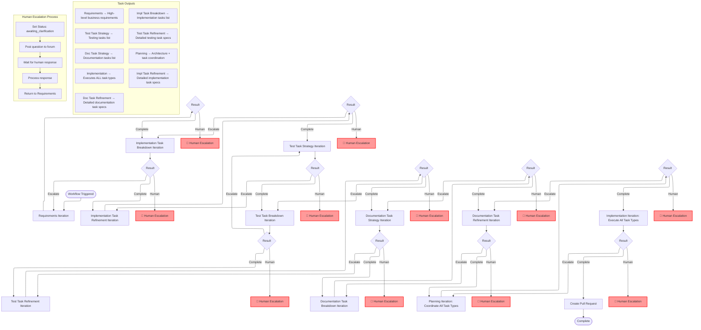

```mermaid
%%{init: {"flowchart": {"defaultRenderer": "elk"}} }%%
flowchart TD
    Start([Workflow Triggered]) --> Requirements[Requirements Iteration]
    Requirements --> ReqsResult{Result}
    
    ReqsResult -->|Complete| ImplTaskBreakdown[Implementation Task Breakdown Iteration]
    ReqsResult -->|Human| HumanEsc1[🙋 Human Escalation]
    
    ImplTaskBreakdown --> ImplTaskResult{Result}
    ImplTaskResult -->|Complete| ImplTaskRefinement[Implementation Task Refinement Iteration]
    ImplTaskResult -->|Escalate| Requirements
    ImplTaskResult -->|Human| HumanEsc2[🙋 Human Escalation]
    
    ImplTaskRefinement --> ImplRefineResult{Result}
    ImplRefineResult -->|Complete| TestTaskStrategy[Test Task Strategy Iteration]
    ImplRefineResult -->|Escalate| ImplTaskBreakdown
    ImplRefineResult -->|Human| HumanEsc3[🙋 Human Escalation]
    
    TestTaskStrategy --> TestStratResult{Result}
    TestStratResult -->|Complete| TestTaskBreakdown[Test Task Breakdown Iteration]
    TestStratResult -->|Escalate| ImplTaskRefinement
    TestStratResult -->|Human| HumanEsc4[🙋 Human Escalation]
    
    TestTaskBreakdown --> TestBreakResult{Result}
    TestBreakResult -->|Complete| TestTaskRefinement[Test Task Refinement Iteration]
    TestBreakResult -->|Escalate| TestTaskStrategy
    TestBreakResult -->|Human| HumanEsc5[🙋 Human Escalation]
    
    TestTaskRefinement --> TestRefineResult{Result}
    TestRefineResult -->|Complete| DocTaskStrategy[Documentation Task Strategy Iteration]
    TestRefineResult -->|Escalate| TestTaskBreakdown
    TestRefineResult -->|Human| HumanEsc6[🙋 Human Escalation]
    
    DocTaskStrategy --> DocStratResult{Result}
    DocStratResult -->|Complete| DocTaskBreakdown[Documentation Task Breakdown Iteration]
    DocStratResult -->|Escalate| TestTaskRefinement
    DocStratResult -->|Human| HumanEsc7[🙋 Human Escalation]
    
    DocTaskBreakdown --> DocBreakResult{Result}
    DocBreakResult -->|Complete| DocTaskRefinement[Documentation Task Refinement Iteration]
    DocBreakResult -->|Escalate| DocTaskStrategy
    DocBreakResult -->|Human| HumanEsc8[🙋 Human Escalation]
    
    DocTaskRefinement --> DocRefineResult{Result}
    DocRefineResult -->|Complete| Planning[Planning Iteration: Coordinate All Task Types]
    DocRefineResult -->|Escalate| DocTaskBreakdown
    DocRefineResult -->|Human| HumanEsc9[🙋 Human Escalation]
    
    Planning --> PlanResult{Result}
    PlanResult -->|Complete| Implementation[Implementation Iteration: Execute All Task Types]
    PlanResult -->|Escalate| DocTaskRefinement
    PlanResult -->|Human| HumanEsc10[🙋 Human Escalation]
    
    Implementation --> ImplResult{Result}
    ImplResult -->|Complete| CreatePR[Create Pull Request]
    ImplResult -->|Escalate| Planning
    ImplResult -->|Human| HumanEsc11[🙋 Human Escalation]
    
    CreatePR --> End([Complete])
    
    %% What Each Iteration Produces
    subgraph TaskOutputs["Task Outputs"]
        direction TB
        T1[Requirements → High-level business requirements]
        T2[Impl Task Breakdown → Implementation tasks list]
        T3[Impl Task Refinement → Detailed implementation task specs]
        T4[Test Task Strategy → Testing tasks list]
        T5[Test Task Refinement → Detailed testing task specs]
        T6[Doc Task Strategy → Documentation tasks list]
        T7[Doc Task Refinement → Detailed documentation task specs]
        T8[Planning → Architecture + task coordination]
        T9[Implementation → Executes ALL task types]
    end
    
    %% Human Escalation Process
    subgraph HumanProcess["Human Escalation Process"]
        direction TB
        H1[Set Status: awaiting_clarification]
        H2[Post question to forum]
        H3[Wait for human response]
        H4[Process response]
        H5[Return to Requirements]
        H1 --> H2 --> H3 --> H4 --> H5
    end
    
    %% Styling
    classDef humanEscalation fill:#ff9999,stroke:#ff0000,stroke-width:2px
    class HumanEsc1,HumanEsc2,HumanEsc3,HumanEsc4,HumanEsc5,HumanEsc6,HumanEsc7,HumanEsc8,HumanEsc9,HumanEsc10,HumanEsc11 humanEscalation
```