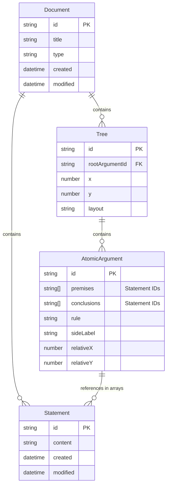

# Platform Responsibilities: Platform Layer vs Proof Editor Core vs Language Layers

## Overview

This document delineates responsibilities across three layers in our architecture:
- **Platform Layer**: Implementation adapters for host platform features (VS Code, React Native, etc.)
- **Proof Editor Core**: Core proof functionality (platform-agnostic)
- **Language Execution Environment**: JavaScript runtime where user-defined logic code executes via LSP

Platform abstraction is an implementation detail that enables code reuse. Both VS Code and React Native provide sufficient capabilities - the abstraction layer simply handles implementation differences while maintaining focus on core architectural concerns (statement flows, data persistence, proof structure).

## Three-Layer Architecture

### Design Principle: Focus on Core Architecture
Platform capabilities are sufficient for all requirements. The real architectural work involves core system design: statement flows, data persistence, proof structure, and LSP integration. Platform abstraction is a clean implementation pattern, not an architectural concern.

### Layer Boundaries  
- **Platform Layer**: Implementation adapters for settings, file management, UI framework, spatial interaction APIs, input handling
- **Proof Editor Core**: Statement flow management, physical tree structure, spatial navigation, proof structure, document format (platform-agnostic)
- **Language Execution Environment**: JavaScript runtime executing user-defined logic in sandboxed V8 Isolates via LSP protocol

## Comprehensive Responsibility Table

| Concept | Platform Layer | Proof Editor Core | Language Execution Environment | Notes |
|---------|---------|-------------------|----------------|-------|
| **Data Storage** |
| YAML file reading/writing | | ✓ | | Proof Editor handles .proof files |
| Statement entities (id, content) | | ✓ | | Core manages statement identity |
| Statement array management | | ✓ | | Core tracks premise/conclusion arrays |
| Atomic argument data structure | | ✓ | | Core manages argument templates |
| Atomic argument metadata | | ✓ | | Core handles rule names, timestamps, etc. |
| Tree positions in document | | ✓ | | Core manages spatial organization |
| Individual position overrides | | ✓ | | Core allows manual positioning |
| Validation state per atomic argument | ✓ | | | Platform stores validation results |
| Version history tracking | ✓ | | | Platform manages document versions |
| Statement flow tracking | | ✓ | | Core manages physical statement movement |
| **Statement Array Management** |
| Statement creation | | ✓ | | Core creates statement entities |
| Statement content editing | | ✓ | | Core updates statement content |
| Statement array tracking | | ✓ | | Core maintains premise/conclusion arrays |
| Statement ID generation | | ✓ | | Core ensures unique IDs |
| Order preservation | | ✓ | | Core maintains array order |
| Statement flow connections | | ✓ | | Core manages positional connections |
| **Visual Rendering** |
| Canvas management (pan/zoom) | ✓ | | Platform provides viewport |
| Mini-map rendering | ✓ | | Platform provides document overview |
| Auto-fit view | ✓ | | Platform fits content to viewport |
| Atomic argument selection | ✓ | | Platform handles selection state |
| Statement highlighting | ✓ | | Platform shows statement usage |
| Physical tree layout | | ✓ | | Core calculates spatial positioning |
| Statement flow visualization | | ✓ | | Core determines flow representation |
| Drawing atomic arguments | | ✓ | JavaScript execution environment defines visual style |
| Implication line style | | ✓ | User JavaScript code chooses lines, turnstiles, etc. |
| Premise/conclusion visual arrangement | | ✓ | User JavaScript code decides layout |
| Side label rendering | | ✓ | User JavaScript code determines position/style |
| Connection visualization | | ✓ | User JavaScript code draws lines between connected statements |
| Text formatting within atomic arguments | | ✓ | User JavaScript code handles symbols, wrapping |
| Validation visual indicators | ✓ | | Platform renders colored borders |
| What to highlight as errors | | ✓ | Language identifies problems |
| **Interaction** |
| Mouse events (click, drag) | ✓ | | | Platform captures events |
| Touch events (tap, pinch, swipe) | ✓ | | | Platform handles touch input |
| Keyboard event capture | ✓ | | | Platform handles key input |
| Spatial interaction APIs | ✓ | | | Platform provides spatial input abstraction |
| Atomic argument selection | | ✓ | | Core handles selection logic |
| Branch from conclusion | | ✓ | | Core creates statement flow connections |
| Create independent atomic argument | | ✓ | | Core creates unconnected arguments |
| Navigate between atomic arguments | | ✓ | | Core handles spatial navigation |
| Navigate to statement usage | | ✓ | | Core jumps through statement flow |
| Tree position dragging | | ✓ | | Core moves tree spatial positions |
| Atomic argument deletion | | ✓ | | Core removes from statement flow |
| Statement deletion rules | | ✓ | User JavaScript code decides if unused statements can be deleted |
| Valid branching locations | | ✓ | User JavaScript code defines where new arguments can be created |
| Context menu options | | ✓ | User JavaScript code provides domain actions |
| **Text Editing** |
| Text input handling | ✓ | | Platform provides text fields |
| Cursor/selection management | ✓ | | Platform handles text selection |
| LaTeX escape sequences (\\forall → ∀) | ✓ | | Platform provides text replacement |
| Symbol palette UI | ✓ | | Platform provides palette interface |
| Symbol palette contents | | ✓ | User JavaScript code defines available symbols |
| **Logic & Validation** |
| Statement content parsing | | ✓ | User JavaScript code understands logical notation |
| Inference rule validation | | ✓ | User JavaScript code checks validity |
| Real-time validation infrastructure | ✓ | | Platform triggers JavaScript execution via LSP |
| Validation timing | ✓ | | Platform decides when to execute user JavaScript |
| Validation rules | | ✓ | User JavaScript code implements logic |
| Completion suggestions | | ✓ | User JavaScript code provides next steps |
| Error messages | | ✓ | User JavaScript code explains problems |
| Quick fixes | | ✓ | User JavaScript code suggests corrections |
| **Layout** |
| Position calculation framework | | ✓ | | Core provides spatial algorithms |
| Tree positioning | | ✓ | | Core stores tree locations |
| Atomic argument relative positions | | ✓ | | Core computes spatial relationships |
| Standard layout algorithms | | ✓ | | Core provides layout algorithms |
| Physical tree structure | | ✓ | | Core manages tree spatial organization |
| Default layout selection | | ✓ | User JavaScript code chooses layout |
| Custom layout implementation | | ✓ | User JavaScript code can override |
| Layout spacing parameters | | ✓ | User JavaScript code defines gaps |
| Spatial navigation | | ✓ | | Core handles 2D tree traversal |
| **File Format** |
| YAML schema definition | ✓ | | Platform defines structure |
| Serialization/deserialization | ✓ | | Platform handles I/O |
| Statement persistence | ✓ | | Platform saves statement table |
| Custom metadata fields | | ✓ | Language LSP adds domain fields |
| Version migration | ✓ | | Platform updates old files |
| Export infrastructure | ✓ | | Platform provides export system |
| Export formatting | | ✓ | Language LSP styles exports |
| **Commands & Operations** |
| Undo/redo infrastructure | ✓ | | Platform provides history |
| Undoable operation tracking | ✓ | | Platform records changes |
| Operation granularity | | ✓ | Language LSP defines undo units |
| Copy/paste infrastructure | ✓ | | Platform handles clipboard |
| Paste behavior | | ✓ | Language LSP implements paste logic |
| Find/replace infrastructure | ✓ | | Platform searches text |
| Find scope | | ✓ | Language LSP defines searchable items |
| Refactoring operations | | ✓ | Language LSP implements refactoring |
| **UI Components** |
| WebView management | ✓ | | | VS Code provides webview infrastructure |
| Command palette | ✓ | | | VS Code provides command UI |
| Status bar | ✓ | | | VS Code provides UI space |
| Status bar content | | | ✓ | Language LSP provides status text |
| Tree view panel | ✓ | | | VS Code provides panel infrastructure |
| Tree view content | | | ✓ | Language LSP defines what to show |
| Breadcrumb navigation | ✓ | | | VS Code shows location |
| Split view management | ✓ | | | VS Code handles multiple views |
| **Document Management** |
| Document types (working/presentation) | ✓ | | Platform manages modes |
| Presentation mode UI | ✓ | | Platform provides clean view |
| Template storage | ✓ | | Platform stores templates |
| Template content | | ✓ | Language LSP provides templates |
| Tab management | ✓ | | Platform handles multiple docs |
| Tab naming | ✓ | | Platform auto-names documents |
| **Performance** |
| Viewport culling | ✓ | | Platform optimizes rendering |
| Konva.js management | ✓ | | Platform integrates renderer |
| Spatial indexing (RTree) | ✓ | | Platform provides fast lookups |
| Render batching | ✓ | | Platform optimizes draws |
| Large document handling | ✓ | | Platform manages scale |
| **Configuration** |
| Font settings | ✓ | | | VS Code manages typography |
| Keyboard shortcuts | ✓ | | | VS Code handles rebinding |
| Default shortcuts | | | ✓ | Language LSP suggests shortcuts |
| Theme/appearance | ✓ | | | VS Code provides theming |
| Language-specific settings | ✓ | | | VS Code settings.json for all preferences |
| User/workspace settings | ✓ | | | VS Code manages settings hierarchy |
| **Future Features** |
| Collaboration infrastructure | ✓ | | Platform syncs changes |
| Analysis script runtime | ✓ | | Platform executes scripts |
| Analysis script content | | ✓ | Users write scripts |
| Custom logic definitions | | ✓ | Language LSP extensibility |

## Key Architectural Changes with Statement Flow Model

### Statement Flow-Based Architecture
- **Statements** are first-class entities managed by Core, with IDs and content
- **Atomic arguments** contain Statement arrays directly for premise/conclusion connections
- **Connections** exist when AtomicArg1.conclusions[i] equals AtomicArg2.premises[j] via Statement identity
- **Physical tree structure** managed by Core with spatial positioning and layout
- No separate connections table needed - Statement identity at positions creates connections

### Statement Flow Management
- **Physical flow**: Core tracks actual statement movement between atomic arguments
- **Spatial positioning**: Core manages 2D positioning of trees and nodes
- **Branch creation**: Core creates statement flow connections when branching
- **Independent creation**: Core creates unconnected arguments with new ordered sets

### Data Flow
1. User types statements → Core creates/updates Statement entities
2. Statement gets unique ID → Core manages statement identity references  
3. Atomic arguments contain Statement arrays → Core maintains physical relationships
4. Shared Statements create implicit connections → Core determines spatial flow
5. Core provides spatial structure → Platform renders via spatial interaction APIs
6. Core sends logical structure to Language LSP → LSP provides validation and intelligence

## Design Principles

1. **Core manages statement flow** - Statement arrays, positional connections, spatial structure
2. **Platform provides interaction APIs** - Spatial input, rendering, file operations
3. **Language LSP provides semantic meaning** - What's valid, how to display logically  
4. **Core is logic-agnostic** - Manages physical structure without understanding meaning
5. **Platform is structure-agnostic** - Provides APIs without understanding proof structure
6. **Language LSP is logic-aware** - Understands and validates proof semantics
7. **Clear separation of concerns** - Physical structure vs interaction APIs vs language semantics
8. **LSP Integration** - Language features delivered through standard protocol

## LSP Integration Points

The Language Server Protocol provides the interface between platform and language features:

1. **Validation Pipeline**: Platform serializes structure → LSP validates → Platform displays diagnostics
2. **Intelligence Features**: Platform maps positions → LSP provides completions/hovers → Platform renders UI
3. **Custom Requests**: Platform sends proof-specific requests → LSP analyzes structure → Platform updates visualization

For detailed LSP integration specifications, see [LSP Integration](./language/lsp-integration.md).

## ERD Update

The key insight: Connections are not stored - they're derived from Statement identity at positions (AtomicArg1.conclusions[i] = AtomicArg2.premises[j]).

## Key Platform Features We Leverage Through Abstraction

### Settings and Configuration [PLATFORM ABSTRACTED]
#### VS Code Implementation
- **Settings.json**: All user preferences stored in VS Code's settings system
- **Workspace settings**: Project-specific configurations
- **Settings UI**: VS Code's built-in settings editor
- **Settings sync**: Cross-device preference synchronization

#### React Native Implementation
- **AsyncStorage**: User preferences stored in device storage
- **App-level settings**: Global configuration management
- **Settings UI**: Custom React Native settings screens
- **Cloud sync**: Optional iCloud/Google Drive preference sync

### File Management [PLATFORM ABSTRACTED]
#### VS Code Implementation
- **File Explorer**: Integration with VS Code's file explorer
- **File watching**: Automatic reload when .proof files change
- **Auto-save**: Leverage VS Code's auto-save functionality
- **File encoding**: VS Code handles text encoding

#### React Native Implementation
- **Document picker**: Native file selection interface
- **File monitoring**: React Native file system watching
- **Auto-save**: Background save on app state changes
- **File encoding**: UTF-8 handling through React Native File System

### Editor Infrastructure [PLATFORM ABSTRACTED]
#### VS Code Implementation
- **Multi-tab editing**: Multiple proof documents
- **Split editors**: Side-by-side proof comparison
- **Editor groups**: Organize proof documents
- **Tab management**: VS Code handles document switching

#### React Native Implementation
- **Stack navigation**: Multiple proof documents in navigation stack
- **Split view**: Tablet-optimized side-by-side viewing
- **Tab bar**: Native tab interface for document organization
- **Navigation**: React Navigation handles document switching

### Search and Navigation [PLATFORM ABSTRACTED]
#### VS Code Implementation
- **Global search**: Find across all proof files using VS Code's search
- **Quick Open**: Ctrl+P to open proof files
- **Go to Symbol**: Navigate within proof documents (via LSP)
- **Find/Replace**: Text search within proofs

#### React Native Implementation
- **Search interface**: Native search bar with proof file indexing
- **Quick access**: Touch-optimized file picker with recent files
- **Symbol navigation**: Touch interface for LSP-based navigation
- **Find/Replace**: Mobile-optimized search and replace interface

### Version Control Integration [PLATFORM ABSTRACTED]
#### VS Code Implementation
- **Git integration**: Built-in version control for proofs
- **Diff viewing**: Compare proof versions
- **Source control panel**: Manage proof changes
- **Git blame**: Track proof authorship

#### React Native Implementation
- **Git sync**: Background sync with remote repositories
- **Visual diff**: Touch-optimized diff viewing
- **Commit interface**: Mobile-friendly commit UI
- **History view**: Touch-based history browsing

### Platform Ecosystem [PLATFORM ABSTRACTED]
#### VS Code Implementation
- **Live Share**: Real-time proof collaboration
- **Remote development**: Work on proofs remotely
- **Theme system**: Consistent appearance with user's theme
- **Extension marketplace**: Discoverability and updates

#### React Native Implementation
- **Real-time sync**: WebSocket-based collaboration
- **Cloud integration**: Work with cloud-stored proofs
- **Theme system**: Native theme support with dark/light modes
- **App store**: Distribution through mobile app stores

### Accessibility Infrastructure [PLATFORM ABSTRACTED]
#### VS Code Implementation
- **Screen reader support**: NVDA, JAWS, VoiceOver compatibility
- **High contrast themes**: Visual accessibility
- **Keyboard navigation**: Full keyboard access
- **ARIA labels**: Semantic markup for assistive technologies

#### React Native Implementation
- **VoiceOver/TalkBack**: Native screen reader support
- **High contrast**: Platform accessibility theme support
- **Touch navigation**: Accessibility-aware touch navigation
- **Accessibility labels**: React Native accessibility props

### Developer Experience [PLATFORM ABSTRACTED]
#### VS Code Implementation
- **Debug console**: For LSP development and troubleshooting
- **Output panel**: Extension logging and diagnostics
- **Problems panel**: Validation errors and warnings
- **Extension host**: Sandboxed execution environment

#### React Native Implementation
- **Debug mode**: React Native debugging tools
- **Logging**: Native logging with Flipper integration
- **Error boundaries**: React error handling and reporting
- **Development tools**: React Native development environment

## Benefits of Platform Abstraction Architecture

### For Users
- **Familiar interfaces**: Leverage platform-specific UX patterns users already know
- **Cross-platform consistency**: Same proof functionality across VS Code and mobile
- **Device flexibility**: Work on proofs using desktop or mobile as appropriate
- **Platform-native features**: Inherit platform strengths (VS Code extensions, mobile notifications)

### For Development
- **Code reuse**: 90%+ of core functionality shared across platforms
- **Platform leverage**: Each platform vendor maintains their infrastructure
- **Focused development**: We build proof-specific features, not platform infrastructure
- **Future-proof**: New platforms (web, desktop native) easily supported

### For Enterprise
- **Multi-platform deployment**: Support users on preferred platforms
- **Reduced training**: Users can use existing platform knowledge
- **Standards compliance**: Inherit each platform's accessibility and security features
- **Cost efficiency**: Single codebase serves multiple deployment targets

### For Research and Education
- **Accessibility**: Reach users on mobile devices for field work
- **Collaboration**: Desktop users can collaborate with mobile users
- **Flexibility**: Instructors can choose best platform for teaching context
- **Future growth**: Easy expansion to new platforms as needs evolve