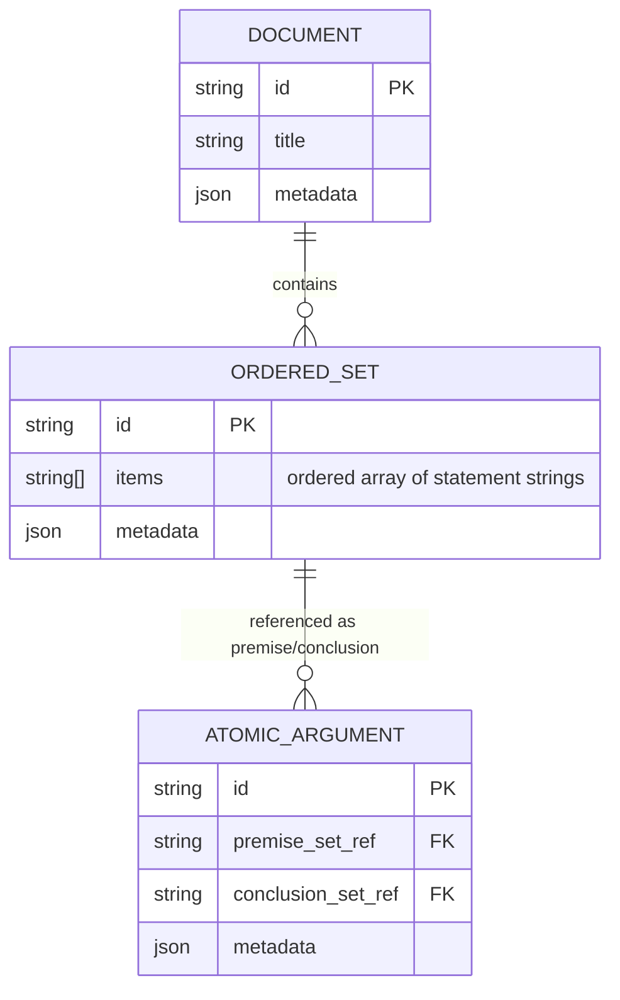

# Conceptual Data Model [CORE]

For all domain definitions, see [Key Terms](../03-concepts/key-terms.md).

## Core Principle: Ordered Set-Based Connections

Connections exist through shared ordered set objects. When atomic arguments share the SAME ordered set reference, they are connected.

## Data Structure



No CONNECTION table needed - connections emerge from shared ordered set references.

## Implementation Notes

- **Ordered Sets**: Entities with IDs, contain ordered arrays of statement strings
- **Atomic Arguments**: Reference OrderedSet IDs (nullable)
- **Connections**: No separate entities - discovered through shared references
- **Arguments/Trees**: Computed by traversing connections

## Key Operations

**Creating Connections**: New atomic argument's premise set reference = parent's conclusion set reference (same object)

**Discovering Connections**: Check reference equality between atomic arguments' ordered sets

## What We Store vs Compute

**Stored**: Ordered sets, atomic arguments, documents
**Computed**: Connections, arguments, trees

## Example: Building a Proof

```
Step 1: First atomic argument created
Stored data:
- OrderedSets: {
    os1: {id: "os1", items: ["A", "A→B"]},
    os2: {id: "os2", items: ["B"]}
  }
- AtomicArgument aa1: {
    premiseSetRef: "os1",
    conclusionSetRef: "os2"
  }

Step 2: Branch operation creates new atomic argument
New data added:
- OrderedSets: {
    os3: {id: "os3", items: ["C"]}
  }
- AtomicArgument aa2: {
    premiseSetRef: "os2",      ← SAME reference as aa1's conclusion!
    conclusionSetRef: "os3"
  }

The connection is implicit: 
- aa1.conclusionSetRef === aa2.premiseSetRef (both are "os2")
- They share the SAME ordered set object
- Therefore aa1 → aa2 connection exists automatically.
```

