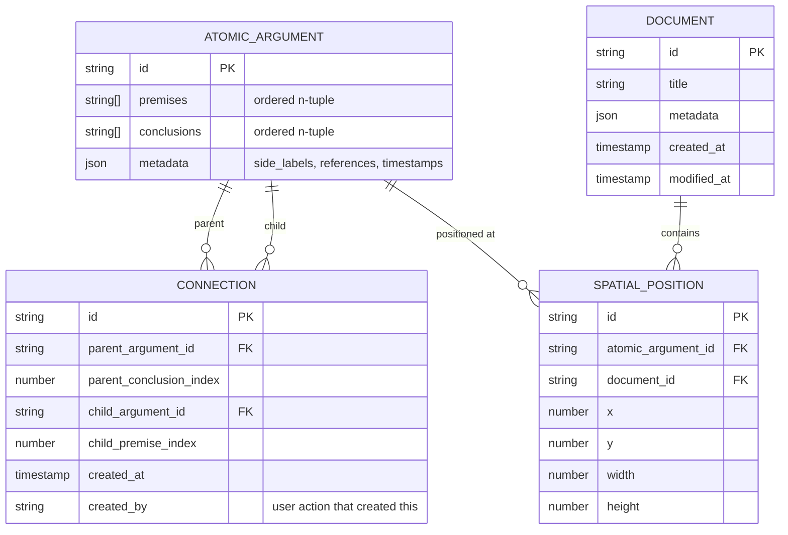
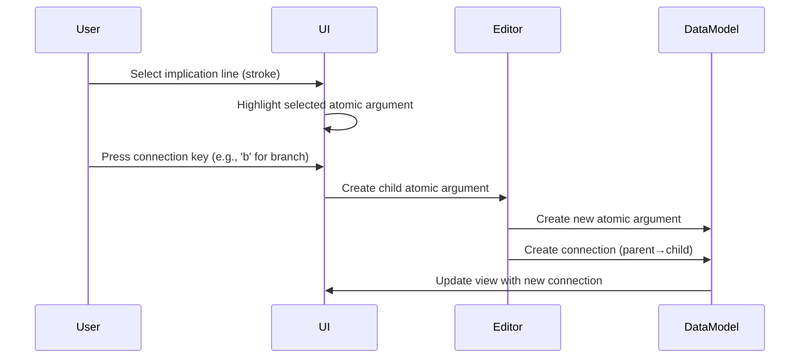

# Conceptual Data Model

## Overview

This document bridges domain concepts and their technical implementation. It shows how the pure logical concepts (atomic arguments as relations, connections as parent-child relationships, trees as maximal connected components) map to concrete data structures.

**Note**: This is a technical design document. For pure domain concepts, see [DDD Glossary](../03-concepts/ddd-glossary.md).

## Core Principle: Intentional Construction

The data model reflects a fundamental insight: **connections are intentional acts of logical construction**, not discovered patterns. When a user creates a connection, they are explicitly stating that a specific conclusion from one atomic argument functions as a specific premise in another.

## Entity Relationship Model



## Conceptual Entities

### Atomic Argument (Logical Layer)
A relation between two ordered n-tuples of strings:
- **Premises**: First n-tuple (may be empty)
- **Conclusions**: Second n-tuple (may be empty)
- **Side labels**: Optional text annotations
- **Implication line (stroke)**: The visual element that users interact with to create connections

The implication line is crucial - it's the **focusable element** that users select when creating connections.

### Connection (Intentional Relationship)
Represents an **explicit user decision** about logical flow:
- Links a specific conclusion from the parent to a specific premise in the child
- Created through user interaction (keyboard commands on selected stroke)
- Represents the philosophical concept: "this conclusion IS this premise"
- NOT discovered through string matching - purely intentional

### Document (Workspace)
The canvas containing positioned atomic arguments:
- Provides spatial context for editing
- Maintains document-level metadata
- References atomic arguments through spatial positions

### Argument (Computed View)
A path-complete set of atomic arguments connected through parent-child relationships. Computed by traversing the connection graph.

### Argument Tree (Computed View)
The maximal connected component containing all atomic arguments reachable through connections. Discovered through graph analysis.

## Interaction Model



## Key Design Principles

### 1. Connections are References, Not Matches
Connections are stored as parent-child references:
- No string matching algorithm runs during normal operation
- Connections persist even if string content changes
- Each connection represents a user's intentional decision

### 2. The Stroke as First-Class UI Element
The implication line (stroke) is:
- The focusable element for connection operations
- The visual representation of the atomic argument
- The interaction point for creating branches

### 3. Keyboard-Driven Connection Creation
Users create connections through:
- Selecting a stroke (implication line)
- Using keyboard commands to branch
- Explicitly choosing where to connect

## What We Store vs What We Compute

### We Store (User-Created):
- **Atomic Arguments**: The logical content
- **Connections**: Explicit parent-child relationships with index mappings
- **Documents**: Workspace metadata
- **Spatial Positions**: Where things appear on screen

### We Compute (Emergent):
- **Arguments**: Path-complete subsets
- **Argument Trees**: Maximal connected components
- **Tree Properties**: Roots, leaves, depth

## Example: Building a Proof

```
Step 1: User creates first atomic argument
┌─────────────────────┐
│ A                   │
│ A→B                 │
│ ─────── [MP]        │  ← User can select this stroke
│ B                   │
└─────────────────────┘

Step 2: User selects stroke and presses 'b' to branch
┌─────────────────────┐
│ A                   │
│ A→B                 │
│ ─────── [MP]        │
│ B                   │
└─────────────────────┘
          ↓
    [Connection created]
          ↓
┌─────────────────────┐
│ B                   │  ← B copied from parent's conclusion
│ B→C                 │
│ ─────── [MP]        │
│ C                   │
└─────────────────────┘

Stored Connection:
{
  parent_argument_id: "aa-001",
  parent_conclusion_index: 0,  // "B"
  child_argument_id: "aa-002",
  child_premise_index: 0,      // "B"
  created_at: 1703001000,
  created_by: "branch_command"
}
```

## Design Rationale

### Why Store Connections Explicitly?
1. **Intentionality**: Connections represent user decisions, not discovered patterns
2. **Performance**: O(1) lookup for parent-child traversal
3. **Precision**: Track exactly which conclusion connects to which premise
4. **Flexibility**: Support future features like connection metadata, confidence scores

### Why Not String Matching?
1. **User Intent**: Connections are created, not discovered
2. **Ambiguity**: Same string might appear in multiple places
3. **Mutability**: String edits shouldn't break connections
4. **Performance**: Avoid O(n²) string comparisons

### Why Separate Position from Logic?
1. **Reusability**: Same proof in multiple documents
2. **Clean Architecture**: Logic independent of presentation
3. **Multiple Views**: Different spatial arrangements of same proof

## Summary

This data model reflects the true nature of the Proof Editor: a tool for **intentionally constructing** logical arguments through explicit parent-child relationships. Connections are not discovered through string matching but created through deliberate user actions. The system stores these intentional relationships and computes the emergent tree structures that result.