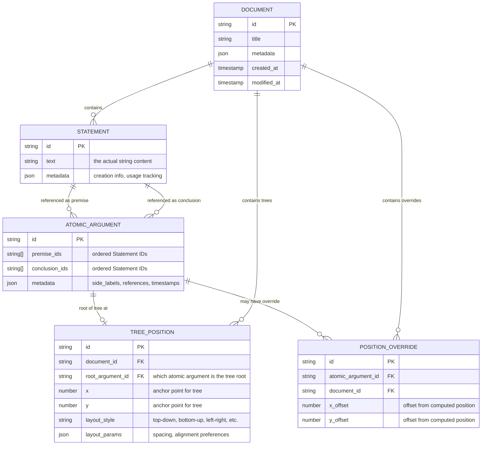
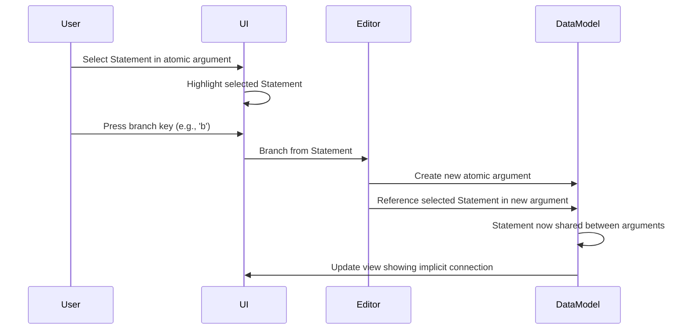

# Conceptual Data Model

## Overview

This document bridges domain concepts and their technical implementation. It shows how the pure logical concepts (atomic arguments as relations, connections as parent-child relationships, trees as maximal connected components) map to concrete data structures.

**Note**: This is a technical design document. For pure domain concepts, see [DDD Glossary](../03-concepts/ddd-glossary.md).

## Core Principle: Statement-Based Construction

The data model reflects a fundamental insight: **connections exist through shared Statements**. When a user creates a connection, they are establishing that a Statement appearing as a conclusion in one atomic argument also functions as a premise in another. Statements are first-class entities that maintain logical relationships.

## Entity Relationship Model

**Terminology Note**: The philosopher describes premises and conclusions as "ordered n-tuples of strings." In our implementation, `string[]` (string array) is the exact representation of an ordered n-tuple - it maintains order and allows variable length where n can be 0, 1, 2, or any number of elements.



**Key Insight**: No CONNECTION table! Connections emerge naturally from shared Statement references. When an atomic argument references a Statement as a conclusion and another references that same Statement as a premise, a connection exists implicitly.

## Conceptual Entities

### Statement (Content Layer)
The fundamental unit of logical content:
- **Text**: The actual string content
- **Identity**: Unique ID that survives text edits
- **Relationships**: Tracks which atomic arguments reference it
- **Reusability**: Can appear in multiple atomic arguments

### Atomic Argument (Logical Layer)
A relation between two ordered n-tuples of Statements:
- **Premises**: Ordered references to Statement entities (may be empty)
- **Conclusions**: Ordered references to Statement entities (may be empty)
- **Side labels**: Optional text annotations
- **Implication line (stroke)**: The visual element that users interact with to create connections

The implication line is crucial - it's the **focusable element** that users select when creating connections. Atomic arguments don't contain text directly - they reference Statement entities.

### Connection (Implicit Relationship)
Connections are **implicit relationships** that exist when atomic arguments share Statements:
- No separate entity needed - connections emerge from the data
- When Statement S appears in argument A's conclusions and argument B's premises, a connection exists
- The platform discovers these relationships by analyzing Statement references
- Visual rendering draws lines between atomic arguments that share Statements

**How connections work without a CONNECTION table:**
1. **Discovery**: Platform scans atomic arguments to find shared Statements
2. **Direction**: Conclusion→premise flow determines parent→child relationship
3. **Visualization**: Language layer decides how to render these relationships
4. **Performance**: Statement IDs make connection discovery efficient

### Document (Workspace)
The canvas containing positioned argument trees:
- Provides spatial context for editing
- Maintains document-level metadata
- References argument trees through tree positions
- Individual atomic arguments have computed positions based on tree structure

### Argument (Computed View)
A path-complete set of atomic arguments connected through parent-child relationships. Computed by traversing the connection graph.

### Argument Tree (Computed View)
The maximal connected component containing all atomic arguments reachable through connections. While users think in terms of "trees," the implementation uses a DAG structure to handle cases where premises have multiple parents.

## Interaction Model



## Key Design Principles

### 1. Connections are Shared Statements
Connections exist when atomic arguments share Statement entities:
- Statements are created once and referenced multiple times
- Editing a Statement's text doesn't break connections (ID remains)
- Each connection represents intentional Statement reuse

### 2. The Stroke as First-Class UI Element
The implication line (stroke) is:
- The focusable element for connection operations
- The visual representation of the atomic argument
- The interaction point for creating branches

### 3. Keyboard-Driven Connection Creation
Users create connections through:
- Selecting a stroke (implication line)
- Using keyboard commands to branch
- Explicitly choosing where to connect

## What We Store vs What We Compute

### We Store (User-Created):
- **Statements**: The actual text content as reusable entities
- **Atomic Arguments**: Relations that reference Statement IDs
- **Documents**: Workspace metadata
- **Tree Positions**: Where each tree is anchored in documents
- **Position Overrides**: Optional manual adjustments to computed positions

### We Compute (Emergent):
- **Connections**: Discovered from shared Statement references
- **Arguments**: Path-complete subsets
- **Argument Trees**: Maximal connected components
- **Tree Properties**: Roots, leaves, depth
- **Atomic Argument Positions**: Computed from tree structure and layout algorithm
- **Connection Graph**: Built by analyzing Statement usage

## Example: Building a Proof

```
Step 1: User creates first atomic argument
┌─────────────────────┐
│ A                   │  (Statement s1)
│ A→B                 │  (Statement s2)
│ ─────── [MP]        │
│ B                   │  (Statement s3)
└─────────────────────┘

Stored:
- Statements: {s1: "A", s2: "A→B", s3: "B"}
- AtomicArgument aa1: {
    premise_ids: [s1, s2],
    conclusion_ids: [s3]
  }

Step 2: User selects Statement "B" and presses 'b' to branch
┌─────────────────────┐
│ A                   │
│ A→B                 │
│ ─────── [MP]        │
│ B                   │  ← User selects this Statement (s3)
└─────────────────────┘
          ↓
    [Branch creates new atomic argument]
          ↓
┌─────────────────────┐
│ B                   │  ← Same Statement s3 (reused)
│ B→C                 │  (New Statement s4)
│ ─────── [MP]        │
│ C                   │  (New Statement s5)
└─────────────────────┘

Stored:
- Statements: {s1: "A", s2: "A→B", s3: "B", s4: "B→C", s5: "C"}
- AtomicArgument aa1: {
    premise_ids: [s1, s2],
    conclusion_ids: [s3]
  }
- AtomicArgument aa2: {
    premise_ids: [s3, s4],  ← Notice s3 is reused here!
    conclusion_ids: [s5]
  }

The connection is implicit: Statement s3 appears as:
- conclusion in aa1
- premise in aa2
Therefore aa1 → aa2 connection exists automatically.
```

## Position Computation Model

### How Positions Are Computed

Atomic argument positions are computed algorithmically from tree structure:

```
1. Start with tree anchor position (x, y) from TREE_POSITION
2. Identify root atomic argument(s) - those with no incoming connections
3. Position root at anchor point
4. For each child atomic argument:
   - Calculate position based on:
     - Parent position
     - Number of siblings
     - Layout direction (top-down, left-right, etc.)
     - Spacing parameters
   - Apply position
5. Apply any POSITION_OVERRIDE offsets if they exist
```

### Example Layout Algorithm (Top-Down)

```
function computePositions(treePosition, rootId, atomicArguments, statements) {
  const positions = new Map();
  const visited = new Set();
  
  // Build connection graph from shared Statements
  const connectionGraph = buildConnectionGraph(atomicArguments);
  
  // Start at tree anchor
  positions.set(rootId, {
    x: treePosition.x,
    y: treePosition.y
  });
  
  // Breadth-first traversal
  const queue = [rootId];
  while (queue.length > 0) {
    const parentId = queue.shift();
    const parentPos = positions.get(parentId);
    
    // Find children through shared Statements
    const children = connectionGraph.getChildren(parentId);
    const childWidth = treePosition.layoutParams.nodeWidth;
    const spacing = treePosition.layoutParams.horizontalSpacing;
    const totalWidth = children.length * childWidth + 
                      (children.length - 1) * spacing;
    
    // Position children
    let xOffset = -totalWidth / 2;
    for (const child of children) {
      positions.set(child.id, {
        x: parentPos.x + xOffset + childWidth / 2,
        y: parentPos.y + treePosition.layoutParams.verticalSpacing
      });
      xOffset += childWidth + spacing;
      queue.push(child.id);
    }
  }
  
  // Apply any overrides
  for (const [argId, pos] of positions) {
    const override = getOverride(argId, treePosition.documentId);
    if (override) {
      pos.x += override.x_offset;
      pos.y += override.y_offset;
    }
  }
  
  return positions;
}

function buildConnectionGraph(atomicArguments) {
  // Discover connections from shared Statement references
  // This is simple and efficient - no complex algorithms needed
  const graph = new ConnectionGraph();
  
  for (const arg of atomicArguments) {
    for (const conclusionId of arg.conclusion_ids) {
      // Find arguments that use this conclusion as a premise
      const children = atomicArguments.filter(other => 
        other.premise_ids.includes(conclusionId)
      );
      children.forEach(child => graph.addEdge(arg.id, child.id));
    }
  }
  
  return graph;
}
```

### Benefits of Computed Positions

1. **Consistency**: Tree structure automatically maintains visual coherence
2. **Flexibility**: Change layout algorithm without migrating data
3. **Performance**: Store less data, compute on demand
4. **Correctness**: Visual layout always reflects logical structure

## Design Rationale

### Why Use Statement Entities?
1. **Logical Clarity**: Connections exist because Statements are shared
2. **Edit Resilience**: Change text without breaking relationships
3. **Reuse Tracking**: See how Statements flow through arguments
4. **Performance**: Direct references without string comparison

### Why Not Inline Strings?
1. **Identity**: Statements need stable IDs across edits
2. **Relationships**: Track which arguments use which Statements
3. **Efficiency**: Reuse Statements without duplication
4. **Semantics**: Shared Statements create connections

### Why Separate Tree Position from Logic?
1. **Reusability**: Same proof in multiple documents with different tree positions
2. **Clean Architecture**: Logic independent of presentation
3. **Multiple Views**: Different spatial arrangements of same proof
4. **Computed Layout**: Individual atomic argument positions flow from tree structure
5. **Flexibility**: Change layout algorithm without changing stored data

## Summary

This data model reflects the true nature of the Proof Editor: a tool for **constructing logical arguments through shared Statements**. Statements are first-class entities that atomic arguments reference. When users branch from a Statement, they're reusing it in a new context - what was a conclusion becomes a premise. 

The beauty of this model is its simplicity: no separate connection table is needed. Connections emerge naturally from the data - when atomic arguments share Statement references, they're connected. The system discovers these relationships and computes the argument trees that result.

This approach provides:
- **Semantic clarity**: Connections exist because Statements are shared
- **Data integrity**: No connection/Statement mismatch possible
- **Edit resilience**: Statement text can change without breaking relationships
- **Performance**: Direct lookups via Statement IDs
- **Simplicity**: Fewer entities to manage and synchronize