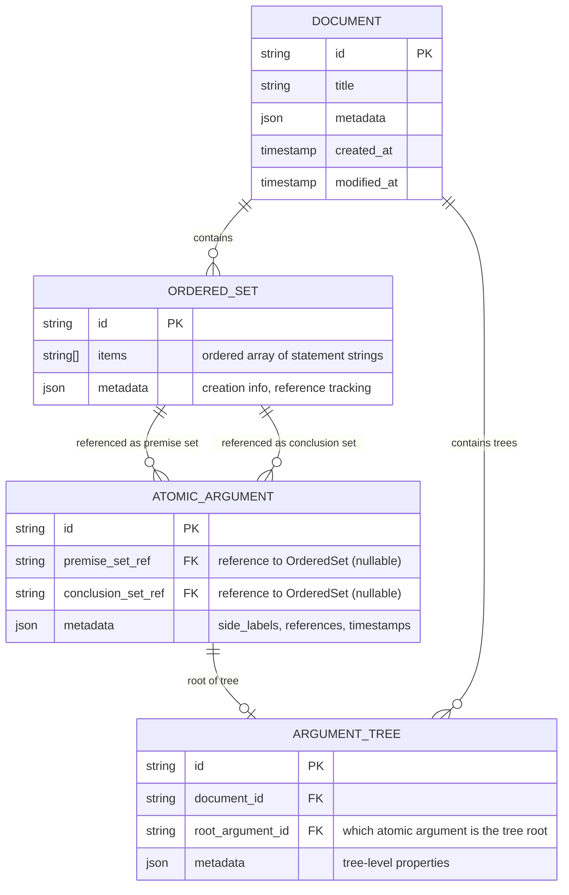

# [CORE] Conceptual Data Model

## Overview

This document defines the pure data structures and algorithms of the CORE layer. The CORE layer handles logical structure and relationships - it has no knowledge of visualization, user interaction, or platform specifics.

**Layer**: [CORE] - Platform-agnostic data structures and algorithms

**Note**: This is a technical design document. For pure domain concepts, see [DDD Glossary](../03-concepts/ddd-glossary.md).

## Core Principle: Ordered Set-Based Construction

The data model reflects a fundamental insight: **connections exist through shared ordered set objects**. When a connection is created, the conclusion ordered set of one atomic argument IS (same reference, not a copy) the premise ordered set of another. Ordered sets are first-class entities that maintain logical relationships through object identity.

## Entity Relationship Model

**Terminology Note**: The philosopher describes premises and conclusions as "ordered n-tuples of strings." In our implementation, we use OrderedSet entities that maintain both order AND uniqueness, shared by reference between atomic arguments to create connections.



**Key Insight**: No CONNECTION table! Connections emerge naturally from shared ordered set references. When one atomic argument's conclusion ordered set IS (same reference) another's premise ordered set, a connection exists implicitly.

## Conceptual Entities

### Ordered Set (Content Layer)
The fundamental unit of logical content:
- **Items**: Ordered array of statement strings
- **Identity**: Unique ID - connections based on object reference
- **Order matters**: ["P", "Q"] ≠ ["Q", "P"]
- **Uniqueness**: No duplicate items within a set
- **Shared reference**: Same object can be referenced by multiple atomic arguments

### Atomic Argument (Logical Layer)
A relation between two ordered sets:
- **Premise set**: Reference to an OrderedSet entity (may be null for empty)
- **Conclusion set**: Reference to an OrderedSet entity (may be null for empty)
- **Side labels**: Optional text annotations

Atomic arguments don't contain statements directly - they reference OrderedSet entities.

### Connection (Implicit Relationship)
Connections are **implicit relationships** that exist when atomic arguments share ordered set objects:
- No separate entity needed - connections emerge from the data
- When argument A's conclusion set IS (same reference) argument B's premise set, a connection exists
- The CORE layer discovers these relationships through reference equality checks

**How connections work without a CONNECTION table:**
1. **Discovery**: CORE checks reference equality between ordered sets
2. **Direction**: Conclusion→premise flow determines parent→child relationship
3. **Graph Building**: CORE constructs the connection graph from references
4. **Performance**: Direct reference comparison is extremely fast

### Document (Container)
The logical container for argument trees:
- Contains ordered sets and atomic arguments
- Maintains document-level metadata
- References argument trees by their root atomic arguments

### Argument (Computed View)
A path-complete set of atomic arguments connected through parent-child relationships. Computed by traversing the connection graph.

### Argument Tree (Computed View)
The maximal connected component containing all atomic arguments reachable through connections. While users think in terms of "trees," the implementation uses a DAG structure to handle cases where premises have multiple parents.

## CORE Layer Operations

### Creating Connections
When creating a new atomic argument that branches from an existing one:
1. Create the new atomic argument
2. Set its premise set reference to the parent's conclusion set reference
3. The connection now exists implicitly through the shared reference

### Discovering Connections
To find all connections:
1. Iterate through all atomic arguments
2. For each pair, check if one's conclusion set reference equals another's premise set reference
3. Build the connection graph from these relationships

## Key Design Principles

### 1. Connections are Shared Ordered Sets
Connections exist when atomic arguments share ordered set objects:
- Ordered sets are created once and referenced multiple times
- The SAME object (not copies) creates the connection
- Each connection represents intentional ordered set sharing
- Modifying a shared ordered set affects all referencing arguments

### 2. Reference-Based Connection Model
Connections are discovered through:
- Reference equality checks between ordered sets
- No need for separate connection entities
- Implicit relationships emerge from the data structure

### 3. Tree Structure Discovery
Argument trees are computed by:
- Starting from atomic arguments with no incoming connections (roots)
- Following connections through shared ordered sets
- Building the complete connected component

## What We Store vs What We Compute

### We Store:
- **Ordered Sets**: Collections of statements with order and uniqueness
- **Atomic Arguments**: Relations that reference ordered set IDs
- **Documents**: Container metadata
- **Argument Trees**: Root references for connected components

### We Compute (Emergent):
- **Connections**: Discovered from shared ordered set references
- **Arguments**: Path-complete subsets
- **Argument Trees**: Maximal connected components
- **Tree Properties**: Roots, leaves, depth
- **DAG Structure**: Built by checking reference equality
- **Connection Graph**: Derived from shared references

## Example: Building a Proof

```
Step 1: First atomic argument created
Stored data:
- OrderedSets: {
    os1: {id: "os1", items: ["A", "A→B"]},
    os2: {id: "os2", items: ["B"]}
  }
- AtomicArgument aa1: {
    premiseSetRef: "os1",
    conclusionSetRef: "os2"
  }

Step 2: Branch operation creates new atomic argument
New data added:
- OrderedSets: {
    os3: {id: "os3", items: ["C"]}
  }
- AtomicArgument aa2: {
    premiseSetRef: "os2",      ← SAME reference as aa1's conclusion!
    conclusionSetRef: "os3"
  }

The connection is implicit: 
- aa1.conclusionSetRef === aa2.premiseSetRef (both are "os2")
- They share the SAME ordered set object
- Therefore aa1 → aa2 connection exists automatically.
```

## Connection Graph Algorithm

### Building the Connection Graph

```
function buildConnectionGraph(atomicArguments) {
  // Discover connections from shared ordered set references
  const graph = new ConnectionGraph();
  
  for (const arg of atomicArguments) {
    if (arg.conclusionSetRef) {
      // Find arguments where premise set IS our conclusion set
      const children = atomicArguments.filter(other => 
        other.premiseSetRef === arg.conclusionSetRef
      );
      children.forEach(child => graph.addEdge(arg.id, child.id));
    }
  }
  
  return graph;
}
```

### Finding Argument Trees

```
function findArgumentTrees(atomicArguments) {
  const graph = buildConnectionGraph(atomicArguments);
  const visited = new Set();
  const trees = [];
  
  // Find all connected components
  for (const arg of atomicArguments) {
    if (!visited.has(arg.id)) {
      const tree = [];
      const queue = [arg.id];
      
      // BFS to find all connected arguments
      while (queue.length > 0) {
        const current = queue.shift();
        if (!visited.has(current)) {
          visited.add(current);
          tree.push(current);
          
          // Add all connected arguments
          const connections = graph.getConnections(current);
          queue.push(...connections);
        }
      }
      
      trees.push(tree);
    }
  }
  
  return trees;
}
```

## Design Rationale

### Why Use Ordered Set Entities?
1. **Clear Identity**: Connections based on object reference, not value equality
2. **Order Preservation**: ["P", "Q"] ≠ ["Q", "P"]
3. **Shared State**: Modifications propagate to all referencing arguments
4. **Simple Detection**: Just check reference equality (===)

### Why Not Arrays or Individual Statements?
1. **Uniqueness**: Sets prevent duplicate items
2. **Object Identity**: Reference sharing creates unambiguous connections
3. **Atomic Unit**: The whole set is shared, not individual parts
4. **No Ambiguity**: Same values but different objects don't connect

### Why This Architecture?
1. **Reusability**: Same logical structures can be processed by different systems
2. **Clean Architecture**: Logic independent of any presentation layer
3. **Multiple Implementations**: Different platforms can implement their own visualization
4. **Algorithm Flexibility**: Connection discovery algorithms can evolve independently
5. **Data Integrity**: Reference-based connections ensure consistency

## Summary

This data model reflects the true nature of the CORE layer: a system for **representing logical arguments through shared ordered sets**. Ordered sets are first-class entities that atomic arguments reference. When branching from an argument, the conclusion ordered set becomes the premise ordered set of the child - not a copy, but the SAME object.

The beauty of this model is its clarity: no separate connection table is needed. Connections emerge naturally from the data - when atomic arguments share ordered set references, they're connected. The system discovers these relationships through simple reference equality checks.

This approach provides:
- **Unambiguous connections**: Object identity is crystal clear
- **Shared state**: Changes to ordered sets propagate naturally
- **Order matters**: ["P", "Q"] ≠ ["Q", "P"]
- **Simple implementation**: Just check if references are ===
- **No false positives**: Equal values but different objects don't connect