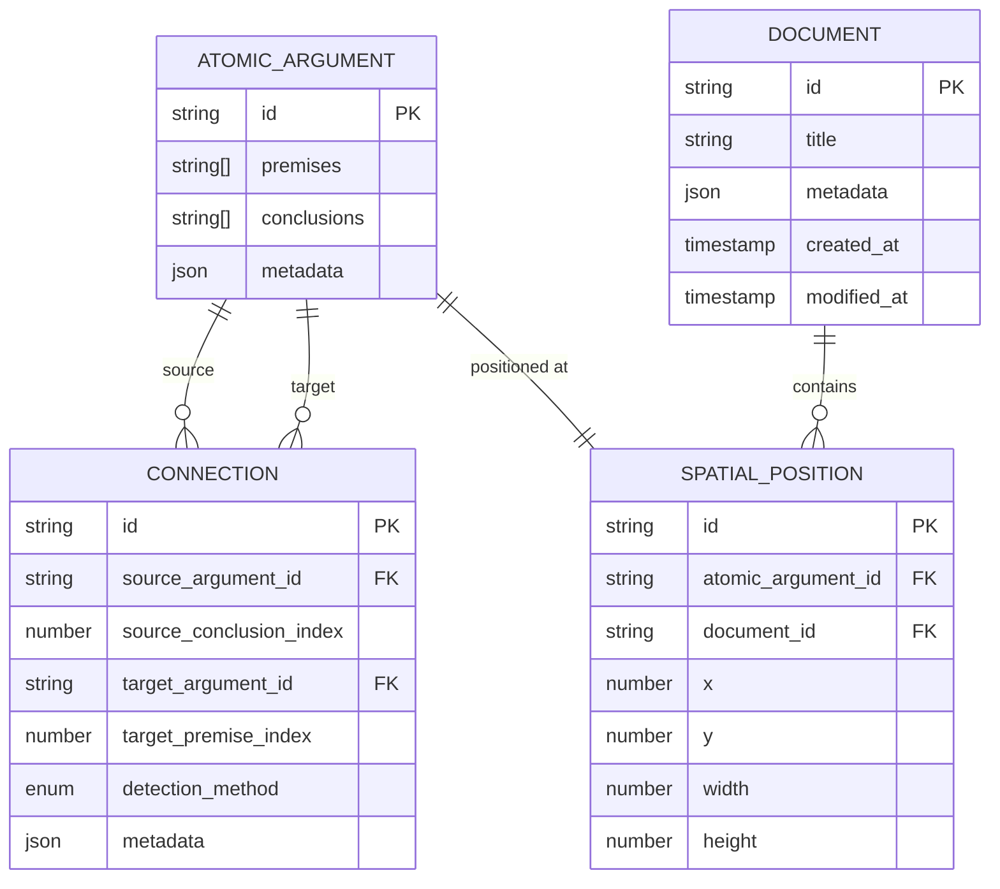
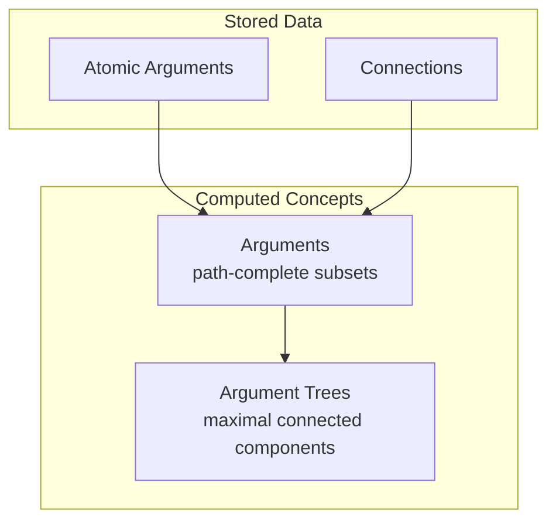
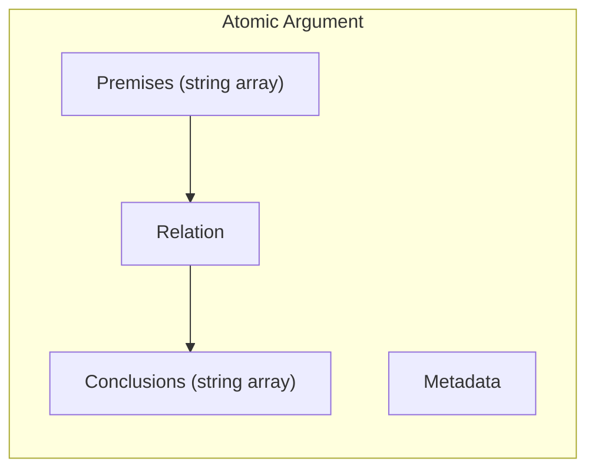
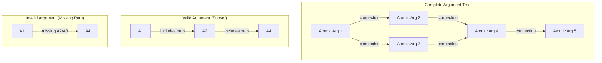
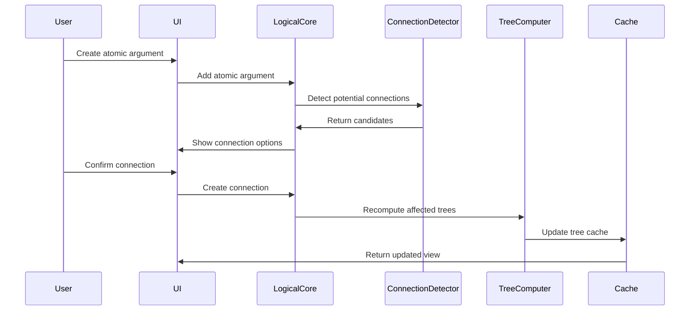

# Conceptual Data Model

## Overview

This document presents a conceptual model of the Proof Editor data structures, focusing on the essential entities and relationships while maintaining alignment with the project's core concepts.

## Core Principle: Separation of Concerns

The data model separates three distinct layers:
1. **Logical Layer** - The pure logical content (atomic arguments and their relationships)
2. **Spatial Layer** - Visual positioning and layout information
3. **Metadata Layer** - Additional information for tracking, validation, and user interaction

## Entity Relationship Model (Stored Data Only)

## Computed Concepts (Not Stored)

## Conceptual Entities

### Atomic Argument (Logical Layer)
The pure logical construct, containing only:
- Ordered tuples of premises
- Ordered tuples of conclusions
- Rule metadata (name, references)

*Note: Unique identifiers are assigned at the implementation level for tracking and reference, but are not part of the logical content itself.*

### Connection (Relationship Layer)
Represents the logical flow between atomic arguments:
- Links specific conclusion to specific premise
- Records how connection was established:
  - `automatic` - String matching detected
  - `manual` - User created
  - `semantic` - Language layer determined equivalence
- Preserves connection metadata

### Document (Container Layer)
The workspace containing atomic arguments:
- Provides spatial context
- Maintains document-level metadata
- Does NOT store the atomic arguments directly
- References atomic arguments through spatial positions

### Argument (Computed View)
An argument is a set of atomic arguments where:
- Every pair of atomic arguments in the set is connected
- All atomic arguments in the paths connecting those pairs are included
- May be a subset of a larger proof structure

**Not stored** - Computed on demand from atomic arguments and connections.

### Argument Tree (Computed View)
An argument tree is a special type of argument that:
- Contains ALL atomic arguments connected to any of its members
- Represents the maximal connected component
- Is unique - if two trees share any member, they are identical

**Not stored** - Discovered through graph analysis of connections.

## Empirical vs Computed Distinction

### Empirical (Stored) Data
These are facts that exist because users created them:
- **Atomic Arguments**: User creates these with specific premises/conclusions
- **Connections**: User confirms these (manually or by accepting suggestions)
- **Spatial Positions**: User places atomic arguments at specific locations
- **Documents**: User creates and names these workspaces

### Computed (Derived) Data
These are facts discovered from analyzing empirical data:
- **Arguments**: Any path-complete subset of connected atomic arguments
- **Argument Trees**: Maximal connected components
- **Root/Leaf Status**: Atomic arguments with no incoming/outgoing connections
- **Tree Depth**: Longest path from root to leaf
- **Tree Membership**: Which tree an atomic argument belongs to

### Why This Matters
1. **Storage efficiency**: Only store what users create
2. **Consistency**: Computed data can't become inconsistent
3. **Flexibility**: Different algorithms can compute trees differently
4. **Performance**: Cache computed results as needed

## Key Design Decisions

### 1. Connections as First-Class Entities
While connections *emerge* from string matching, they are *stored* as entities because:
- Users can override automatic detection
- Language layers define equivalence beyond string matching
- Connections carry metadata (confidence, creation method)
- Performance requires indexed lookups

### 2. Separation of Position from Logic
Atomic arguments contain only logical content. Spatial information is stored separately:
- Same atomic argument can appear in multiple documents
- Position is view-specific, not intrinsic
- Enables multiple visualization strategies

### 3. Trees as Computed Views
Trees are discovered, not created:
- No "create tree" operation
- Trees emerge from connections
- Tree membership is computed on demand
- Trees are unique - atomic arguments belong to exactly one tree
- Caching is an optimization, not a storage requirement

## Data Flow

## Implementation Mapping

This conceptual model maps to implementation as follows:

### Storage Strategy (Empirical Data Only)
1. **Atomic Arguments Table** - Core logical content
2. **Connections Table** - Explicit relationships
3. **Documents Table** - Workspace metadata
4. **Positions Table** - Spatial layout per document

### Computation Strategy (Derived Data)
- **Arguments** - Computed from graph traversal
- **Argument Trees** - Discovered as maximal connected components
- **Tree Properties** - Derived (roots, leaves, depth)
- **Caching** - Optional performance optimization

### Index Strategy
- String content → Atomic arguments (for connection detection)
- Atomic argument → Connections (for traversal)
- Document → Positions (for rendering)
- Computed results may be cached but are not authoritative

### Performance Considerations
- Connections stored explicitly for O(1) lookup
- Trees cached to avoid recomputation
- Incremental updates when possible
- Spatial indices for viewport queries

## Alignment with Core Concepts

This model preserves the conceptual simplicity while enabling implementation:

1. **Atomic arguments remain simple** - Just premises, conclusions, and metadata
2. **Connections emerge from strings** - But are stored for performance
3. **Trees are discovered** - Computed from the connection graph
4. **Documents are canvases** - Separate from the logical structure
5. **Language layers define equivalence** - Through connection detection rules

## Summary: What We Store vs What We Compute

### We Store (Empirical):
- **Atomic Arguments**: id, premises[], conclusions[], metadata
- **Connections**: id, source, target, detection_method, metadata
- **Documents**: id, title, metadata, timestamps
- **Spatial Positions**: id, atomic_argument_id, document_id, x, y

### We Compute (Derived):
- **Arguments**: Any path-complete subset of connected atomic arguments
- **Argument Trees**: Maximal connected components

### Key Principle:
If users didn't explicitly create it, we don't store it. Everything else is computed on demand (and optionally cached for performance).

## Open Questions

1. **Shared Atomic Arguments**: Can the same atomic argument appear in multiple documents?
2. **Connection Versioning**: How do we handle changes to connection rules?
3. **Tree Identity**: If trees are computed, how do we reference them persistently?
4. **Partial Documents**: Can we load subsets of large documents?
5. **Collaborative Positioning**: How do we resolve spatial conflicts in real-time collaboration?