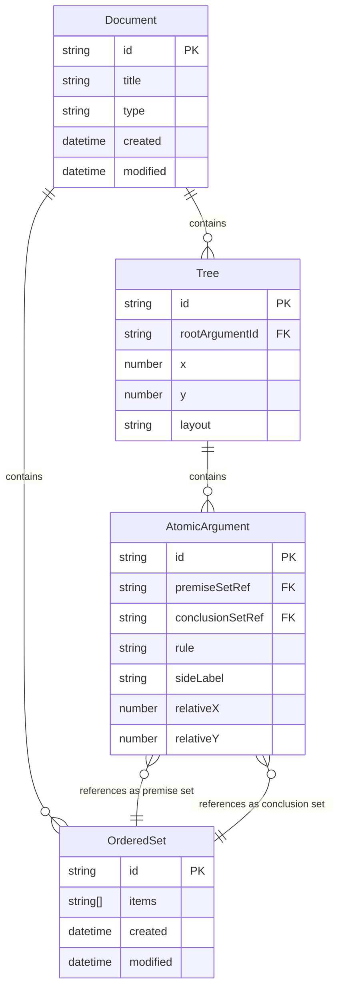

# Platform Responsibilities: Platform Layer vs Proof Editor Core vs Language Layers

## Overview

This document clearly delineates responsibilities across three layers in our platform-abstracted architecture:
- **Platform Layer**: Features we inherit from the host platform (VS Code, React Native, etc.)
- **Proof Editor Core**: Proof-specific features we implement (platform-agnostic)
- **Language Layers**: Domain-specific features provided through LSP integration

This three-layer architecture with platform abstraction maximizes leverage of platform capabilities while ensuring our core functionality works across different environments (desktop VS Code, mobile React Native, future web apps, etc.).

## Three-Layer Architecture

### Design Principle: Maximize Leverage
Every feature we build ourselves creates maintenance burden. Every platform feature we leverage is maintained by the platform vendor (Microsoft for VS Code, Meta for React Native) and familiar to users. We bias heavily toward integration over custom implementation while maintaining cross-platform compatibility.

### Layer Boundaries
- **Platform Layer**: Settings, file management, UI framework, collaboration, themes (abstracted through adapters)
- **Proof Editor Core**: Proof structure, visualization, navigation, document format (platform-agnostic)
- **Language Layer**: Validation, intelligence, domain-specific rendering (works through LSP across all platforms)

## Comprehensive Responsibility Table

| Concept | Platform Layer | Proof Editor Core | Language Layer | Notes |
|---------|---------|-------------------|----------------|-------|
| **Data Storage** |
| YAML file reading/writing | | ✓ | | Proof Editor handles .proof files |
| Ordered set entities (id, items) | ✓ | | Platform stores all ordered sets |
| Ordered set reference tracking | ✓ | | Platform tracks which arguments use which sets |
| Atomic argument data structure | ✓ | | References ordered set IDs |
| Atomic argument metadata | ✓ | | Rule names, timestamps, etc. |
| Tree positions in document | ✓ | | Platform manages spatial organization |
| Individual position overrides | ✓ | | Platform allows manual positioning |
| Validation state per atomic argument | ✓ | | Platform stores validation results |
| Version history tracking | ✓ | | Platform manages document versions |
| **Ordered Set Management** |
| Ordered set creation | ✓ | | Platform creates new ordered set entities |
| Ordered set content editing | ✓ | | Platform updates ordered set items |
| Ordered set reference tracking | ✓ | | Platform maintains usage references |
| Ordered set ID generation | ✓ | | Platform ensures unique IDs |
| Order preservation | ✓ | | Platform maintains item order |
| **Visual Rendering** |
| Canvas management (pan/zoom) | ✓ | | Platform provides viewport |
| Mini-map rendering | ✓ | | Platform provides document overview |
| Auto-fit view | ✓ | | Platform fits content to viewport |
| Atomic argument selection | ✓ | | Platform handles selection state |
| Ordered set highlighting | ✓ | | Platform shows ordered set usage |
| Drawing atomic arguments | | ✓ | Language LSP defines visual style |
| Implication line style | | ✓ | Language LSP chooses lines, turnstiles, etc. |
| Premise/conclusion visual arrangement | | ✓ | Language LSP decides layout |
| Side label rendering | | ✓ | Language LSP determines position/style |
| Connection visualization | | ✓ | Language LSP draws lines between shared ordered sets |
| Text formatting within atomic arguments | | ✓ | Language LSP handles symbols, wrapping |
| Validation visual indicators | ✓ | | Platform renders colored borders |
| What to highlight as errors | | ✓ | Language identifies problems |
| **Interaction** |
| Mouse events (click, drag) | ✓ | | Platform captures events |
| Keyboard event capture | ✓ | | Platform handles key input |
| Atomic argument selection | ✓ | | Platform allows selecting atomic arguments |
| Branch from conclusion | ✓ | | Platform creates new atomic argument sharing ordered set |
| Create independent atomic argument | ✓ | | Platform creates unconnected argument |
| Navigate between atomic arguments | ✓ | | Platform handles movement |
| Navigate to ordered set usage | ✓ | | Platform jumps to where ordered set is used |
| Tree position dragging | ✓ | | Platform moves entire trees |
| Atomic argument deletion | ✓ | | Platform removes from model |
| Ordered set deletion rules | | ✓ | Language LSP decides if unused ordered sets can be deleted |
| Valid branching locations | | ✓ | Language LSP defines where new arguments can be created |
| Context menu options | | ✓ | Language LSP provides domain actions |
| **Text Editing** |
| Text input handling | ✓ | | Platform provides text fields |
| Cursor/selection management | ✓ | | Platform handles text selection |
| LaTeX escape sequences (\\forall → ∀) | ✓ | | Platform provides text replacement |
| Symbol palette UI | ✓ | | Platform provides palette interface |
| Symbol palette contents | | ✓ | Language LSP defines available symbols |
| **Logic & Validation** |
| Ordered set content parsing | | ✓ | Language LSP understands logical notation |
| Inference rule validation | | ✓ | Language LSP checks validity |
| Real-time validation infrastructure | ✓ | | Platform triggers LSP validation |
| Validation timing | ✓ | | Platform decides when to call LSP |
| Validation rules | | ✓ | Language LSP implements logic |
| Completion suggestions | | ✓ | Language LSP provides next steps |
| Error messages | | ✓ | Language LSP explains problems |
| Quick fixes | | ✓ | Language LSP suggests corrections |
| **Layout** |
| Position calculation framework | ✓ | | Platform provides coordinates |
| Tree positioning | ✓ | | Platform stores tree locations |
| Atomic argument relative positions | ✓ | | Platform computes from tree |
| Standard layout algorithms | ✓ | | Platform provides common layouts |
| Default layout selection | | ✓ | Language LSP chooses layout |
| Custom layout implementation | | ✓ | Language LSP can override |
| Layout spacing parameters | | ✓ | Language LSP defines gaps |
| **File Format** |
| YAML schema definition | ✓ | | Platform defines structure |
| Serialization/deserialization | ✓ | | Platform handles I/O |
| Ordered set persistence | ✓ | | Platform saves ordered set table |
| Custom metadata fields | | ✓ | Language LSP adds domain fields |
| Version migration | ✓ | | Platform updates old files |
| Export infrastructure | ✓ | | Platform provides export system |
| Export formatting | | ✓ | Language LSP styles exports |
| **Commands & Operations** |
| Undo/redo infrastructure | ✓ | | Platform provides history |
| Undoable operation tracking | ✓ | | Platform records changes |
| Operation granularity | | ✓ | Language LSP defines undo units |
| Copy/paste infrastructure | ✓ | | Platform handles clipboard |
| Paste behavior | | ✓ | Language LSP implements paste logic |
| Find/replace infrastructure | ✓ | | Platform searches text |
| Find scope | | ✓ | Language LSP defines searchable items |
| Refactoring operations | | ✓ | Language LSP implements refactoring |
| **UI Components** |
| WebView management | ✓ | | | VS Code provides webview infrastructure |
| Command palette | ✓ | | | VS Code provides command UI |
| Status bar | ✓ | | | VS Code provides UI space |
| Status bar content | | | ✓ | Language LSP provides status text |
| Tree view panel | ✓ | | | VS Code provides panel infrastructure |
| Tree view content | | | ✓ | Language LSP defines what to show |
| Breadcrumb navigation | ✓ | | | VS Code shows location |
| Split view management | ✓ | | | VS Code handles multiple views |
| **Document Management** |
| Document types (working/presentation) | ✓ | | Platform manages modes |
| Presentation mode UI | ✓ | | Platform provides clean view |
| Template storage | ✓ | | Platform stores templates |
| Template content | | ✓ | Language LSP provides templates |
| Tab management | ✓ | | Platform handles multiple docs |
| Tab naming | ✓ | | Platform auto-names documents |
| **Performance** |
| Viewport culling | ✓ | | Platform optimizes rendering |
| Konva.js management | ✓ | | Platform integrates renderer |
| Spatial indexing (RTree) | ✓ | | Platform provides fast lookups |
| Render batching | ✓ | | Platform optimizes draws |
| Large document handling | ✓ | | Platform manages scale |
| **Configuration** |
| Font settings | ✓ | | | VS Code manages typography |
| Keyboard shortcuts | ✓ | | | VS Code handles rebinding |
| Default shortcuts | | | ✓ | Language LSP suggests shortcuts |
| Theme/appearance | ✓ | | | VS Code provides theming |
| Language-specific settings | ✓ | | | VS Code settings.json for all preferences |
| User/workspace settings | ✓ | | | VS Code manages settings hierarchy |
| **Future Features** |
| Collaboration infrastructure | ✓ | | Platform syncs changes |
| Analysis script runtime | ✓ | | Platform executes scripts |
| Analysis script content | | ✓ | Users write scripts |
| Custom logic definitions | | ✓ | Language LSP extensibility |

## Key Architectural Changes with Ordered Set Model

### Ordered Set-Based Architecture
- **Ordered sets** are first-class entities with IDs and ordered items
- **Atomic arguments** reference ordered set IDs, not individual statements
- **Connections** are implicit through shared ordered set references (same object)
- No separate connections table needed

### Branching Clarified
- **Branch from conclusion**: Select an atomic argument and create a new one using its conclusion set as premise
- **Independent creation**: Create new atomic arguments with new ordered sets
- Platform handles the mechanics, language LSP validates the logic

### Data Flow
1. User types statements → Platform creates/updates ordered set
2. Ordered set gets unique ID → Platform manages references
3. Atomic arguments reference ordered set IDs → Platform maintains relationships
4. Shared ordered sets create implicit connections → Language LSP visualizes as needed
5. Platform sends changes to Language LSP → LSP provides validation and intelligence

## Design Principles

1. **Platform manages structure** - Ordered sets, arguments, positions
2. **Language LSP provides meaning** - What's valid, how to display
3. **Platform is logic-agnostic** - Just manages ordered collections and references  
4. **Language LSP is logic-aware** - Understands and validates
5. **Separation of concerns** - Platform mechanics vs language semantics
6. **LSP Integration** - Language features delivered through standard protocol

## LSP Integration Points

The Language Server Protocol provides the interface between platform and language features:

1. **Validation Pipeline**: Platform serializes structure → LSP validates → Platform displays diagnostics
2. **Intelligence Features**: Platform maps positions → LSP provides completions/hovers → Platform renders UI
3. **Custom Requests**: Platform sends proof-specific requests → LSP analyzes structure → Platform updates visualization

For detailed LSP integration specifications, see [LSP Integration](./language/lsp-integration.md).

## ERD Update

The key insight: Connections are not stored - they're derived from shared ordered set references (same object).

## Key Platform Features We Leverage Through Abstraction

### Settings and Configuration [PLATFORM ABSTRACTED]
#### VS Code Implementation
- **Settings.json**: All user preferences stored in VS Code's settings system
- **Workspace settings**: Project-specific configurations
- **Settings UI**: VS Code's built-in settings editor
- **Settings sync**: Cross-device preference synchronization

#### React Native Implementation
- **AsyncStorage**: User preferences stored in device storage
- **App-level settings**: Global configuration management
- **Settings UI**: Custom React Native settings screens
- **Cloud sync**: Optional iCloud/Google Drive preference sync

### File Management [PLATFORM ABSTRACTED]
#### VS Code Implementation
- **File Explorer**: Integration with VS Code's file explorer
- **File watching**: Automatic reload when .proof files change
- **Auto-save**: Leverage VS Code's auto-save functionality
- **File encoding**: VS Code handles text encoding

#### React Native Implementation
- **Document picker**: Native file selection interface
- **File monitoring**: React Native file system watching
- **Auto-save**: Background save on app state changes
- **File encoding**: UTF-8 handling through React Native File System

### Editor Infrastructure [PLATFORM ABSTRACTED]
#### VS Code Implementation
- **Multi-tab editing**: Multiple proof documents
- **Split editors**: Side-by-side proof comparison
- **Editor groups**: Organize proof documents
- **Tab management**: VS Code handles document switching

#### React Native Implementation
- **Stack navigation**: Multiple proof documents in navigation stack
- **Split view**: Tablet-optimized side-by-side viewing
- **Tab bar**: Native tab interface for document organization
- **Navigation**: React Navigation handles document switching

### Search and Navigation [PLATFORM ABSTRACTED]
#### VS Code Implementation
- **Global search**: Find across all proof files using VS Code's search
- **Quick Open**: Ctrl+P to open proof files
- **Go to Symbol**: Navigate within proof documents (via LSP)
- **Find/Replace**: Text search within proofs

#### React Native Implementation
- **Search interface**: Native search bar with proof file indexing
- **Quick access**: Touch-optimized file picker with recent files
- **Symbol navigation**: Touch interface for LSP-based navigation
- **Find/Replace**: Mobile-optimized search and replace interface

### Version Control Integration [PLATFORM ABSTRACTED]
#### VS Code Implementation
- **Git integration**: Built-in version control for proofs
- **Diff viewing**: Compare proof versions
- **Source control panel**: Manage proof changes
- **Git blame**: Track proof authorship

#### React Native Implementation
- **Git sync**: Background sync with remote repositories
- **Visual diff**: Touch-optimized diff viewing
- **Commit interface**: Mobile-friendly commit UI
- **History view**: Touch-based history browsing

### Platform Ecosystem [PLATFORM ABSTRACTED]
#### VS Code Implementation
- **Live Share**: Real-time proof collaboration
- **Remote development**: Work on proofs remotely
- **Theme system**: Consistent appearance with user's theme
- **Extension marketplace**: Discoverability and updates

#### React Native Implementation
- **Real-time sync**: WebSocket-based collaboration
- **Cloud integration**: Work with cloud-stored proofs
- **Theme system**: Native theme support with dark/light modes
- **App store**: Distribution through mobile app stores

### Accessibility Infrastructure [PLATFORM ABSTRACTED]
#### VS Code Implementation
- **Screen reader support**: NVDA, JAWS, VoiceOver compatibility
- **High contrast themes**: Visual accessibility
- **Keyboard navigation**: Full keyboard access
- **ARIA labels**: Semantic markup for assistive technologies

#### React Native Implementation
- **VoiceOver/TalkBack**: Native screen reader support
- **High contrast**: Platform accessibility theme support
- **Touch navigation**: Accessibility-aware touch navigation
- **Accessibility labels**: React Native accessibility props

### Developer Experience [PLATFORM ABSTRACTED]
#### VS Code Implementation
- **Debug console**: For LSP development and troubleshooting
- **Output panel**: Extension logging and diagnostics
- **Problems panel**: Validation errors and warnings
- **Extension host**: Sandboxed execution environment

#### React Native Implementation
- **Debug mode**: React Native debugging tools
- **Logging**: Native logging with Flipper integration
- **Error boundaries**: React error handling and reporting
- **Development tools**: React Native development environment

## Benefits of Platform Abstraction Architecture

### For Users
- **Familiar interfaces**: Leverage platform-specific UX patterns users already know
- **Cross-platform consistency**: Same proof functionality across VS Code and mobile
- **Device flexibility**: Work on proofs using desktop or mobile as appropriate
- **Platform-native features**: Inherit platform strengths (VS Code extensions, mobile notifications)

### For Development
- **Code reuse**: 90%+ of core functionality shared across platforms
- **Platform leverage**: Each platform vendor maintains their infrastructure
- **Focused development**: We build proof-specific features, not platform infrastructure
- **Future-proof**: New platforms (web, desktop native) easily supported

### For Enterprise
- **Multi-platform deployment**: Support users on preferred platforms
- **Reduced training**: Users can use existing platform knowledge
- **Standards compliance**: Inherit each platform's accessibility and security features
- **Cost efficiency**: Single codebase serves multiple deployment targets

### For Research and Education
- **Accessibility**: Reach users on mobile devices for field work
- **Collaboration**: Desktop users can collaborate with mobile users
- **Flexibility**: Instructors can choose best platform for teaching context
- **Future growth**: Easy expansion to new platforms as needs evolve