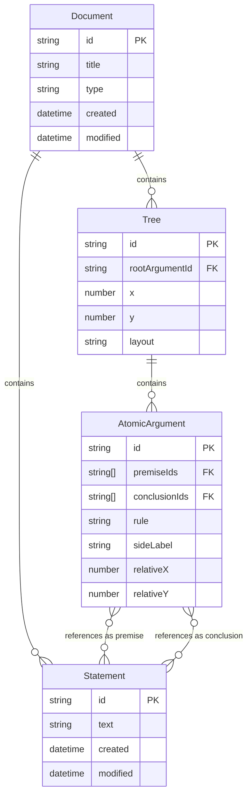

# Core Platform vs Language Layer Responsibilities

## Overview

This document clearly delineates which features and concepts are handled by the core Proof Editor platform versus what language layers are responsible for implementing.

## Responsibility Table

| Concept | Core Platform | Language Layer | Notes |
|---------|--------------|----------------|-------|
| **Data Storage** |
| YAML file reading/writing | ✓ | | Platform handles persistence |
| Statement entities (id, text) | ✓ | | Platform stores all Statements |
| Statement parent/child relationships | ✓ | | Platform tracks where Statements are used |
| Atomic argument data structure | ✓ | | References Statement IDs |
| Atomic argument metadata | ✓ | | Rule names, timestamps, etc. |
| Tree positions in document | ✓ | | Platform manages spatial organization |
| Individual position overrides | ✓ | | Platform allows manual positioning |
| Validation state per atomic argument | ✓ | | Platform stores validation results |
| Version history tracking | ✓ | | Platform manages document versions |
| **Statement Management** |
| Statement creation | ✓ | | Platform creates new Statement entities |
| Statement text editing | ✓ | | Platform updates Statement text |
| Statement reference tracking | ✓ | | Platform maintains usage references |
| Statement ID generation | ✓ | | Platform ensures unique IDs |
| Statement deduplication | | ✓ | Language decides if similar text = same Statement |
| **Visual Rendering** |
| Canvas management (pan/zoom) | ✓ | | Platform provides viewport |
| Mini-map rendering | ✓ | | Platform provides document overview |
| Auto-fit view | ✓ | | Platform fits content to viewport |
| Atomic argument selection | ✓ | | Platform handles selection state |
| Statement highlighting | ✓ | | Platform shows Statement usage |
| Drawing atomic arguments | | ✓ | Language defines visual style |
| Implication line style | | ✓ | Language chooses lines, turnstiles, etc. |
| Premise/conclusion visual arrangement | | ✓ | Language decides layout |
| Side label rendering | | ✓ | Language determines position/style |
| Statement connection visualization | | ✓ | Language draws lines between shared Statements |
| Text formatting within atomic arguments | | ✓ | Language handles symbols, wrapping |
| Validation visual indicators | ✓ | | Platform renders colored borders |
| What to highlight as errors | | ✓ | Language identifies problems |
| **Interaction** |
| Mouse events (click, drag) | ✓ | | Platform captures events |
| Keyboard event capture | ✓ | | Platform handles key input |
| Statement selection | ✓ | | Platform allows selecting Statement text |
| Branch from Statement | ✓ | | Platform creates new atomic argument with Statement |
| Create independent atomic argument | ✓ | | Platform creates unconnected argument |
| Navigate between atomic arguments | ✓ | | Platform handles movement |
| Navigate to Statement usage | ✓ | | Platform jumps to where Statement is used |
| Tree position dragging | ✓ | | Platform moves entire trees |
| Atomic argument deletion | ✓ | | Platform removes from model |
| Statement deletion rules | | ✓ | Language decides if unused Statements can be deleted |
| Valid branching locations | | ✓ | Language defines where new arguments can be created |
| Context menu options | | ✓ | Language provides domain actions |
| **Text Editing** |
| Text input handling | ✓ | | Platform provides text fields |
| Cursor/selection management | ✓ | | Platform handles text selection |
| LaTeX escape sequences (\\forall → ∀) | ✓ | | Platform provides text replacement |
| Symbol palette UI | ✓ | | Platform provides palette interface |
| Symbol palette contents | | ✓ | Language defines available symbols |
| **Logic & Validation** |
| Statement text parsing | | ✓ | Language understands logical notation |
| Inference rule validation | | ✓ | Language checks validity |
| Real-time validation infrastructure | ✓ | | Platform triggers validation |
| Validation timing | ✓ | | Platform decides when to validate |
| Validation rules | | ✓ | Language implements logic |
| Completion suggestions | | ✓ | Language provides next steps |
| Error messages | | ✓ | Language explains problems |
| Quick fixes | | ✓ | Language suggests corrections |
| **Layout** |
| Position calculation framework | ✓ | | Platform provides coordinates |
| Tree positioning | ✓ | | Platform stores tree locations |
| Atomic argument relative positions | ✓ | | Platform computes from tree |
| Standard layout algorithms | ✓ | | Platform provides common layouts |
| Default layout selection | | ✓ | Language chooses layout |
| Custom layout implementation | | ✓ | Language can override |
| Layout spacing parameters | | ✓ | Language defines gaps |
| **File Format** |
| YAML schema definition | ✓ | | Platform defines structure |
| Serialization/deserialization | ✓ | | Platform handles I/O |
| Statement persistence | ✓ | | Platform saves Statement table |
| Custom metadata fields | | ✓ | Language adds domain fields |
| Version migration | ✓ | | Platform updates old files |
| Export infrastructure | ✓ | | Platform provides export system |
| Export formatting | | ✓ | Language styles exports |
| **Commands & Operations** |
| Undo/redo infrastructure | ✓ | | Platform provides history |
| Undoable operation tracking | ✓ | | Platform records changes |
| Operation granularity | | ✓ | Language defines undo units |
| Copy/paste infrastructure | ✓ | | Platform handles clipboard |
| Paste behavior | | ✓ | Language implements paste logic |
| Find/replace infrastructure | ✓ | | Platform searches text |
| Find scope | | ✓ | Language defines searchable items |
| Refactoring operations | | ✓ | Language implements refactoring |
| **UI Components** |
| WebView management | ✓ | | Platform provides canvas |
| Command palette | ✓ | | Platform provides command UI |
| Status bar | ✓ | | Platform provides UI space |
| Status bar content | | ✓ | Language provides status text |
| Tree view panel | ✓ | | Platform provides panel |
| Tree view content | | ✓ | Language defines what to show |
| Breadcrumb navigation | ✓ | | Platform shows location |
| Split view management | ✓ | | Platform handles multiple views |
| **Document Management** |
| Document types (working/presentation) | ✓ | | Platform manages modes |
| Presentation mode UI | ✓ | | Platform provides clean view |
| Template storage | ✓ | | Platform stores templates |
| Template content | | ✓ | Language provides templates |
| Tab management | ✓ | | Platform handles multiple docs |
| Tab naming | ✓ | | Platform auto-names documents |
| **Performance** |
| Viewport culling | ✓ | | Platform optimizes rendering |
| Konva.js management | ✓ | | Platform integrates renderer |
| Spatial indexing (RTree) | ✓ | | Platform provides fast lookups |
| Render batching | ✓ | | Platform optimizes draws |
| Large document handling | ✓ | | Platform manages scale |
| **Configuration** |
| Font settings | ✓ | | Platform manages typography |
| Keyboard shortcuts | ✓ | | Platform handles rebinding |
| Default shortcuts | | ✓ | Language suggests shortcuts |
| Theme/appearance | ✓ | | Platform provides theming |
| Language-specific settings | | ✓ | Language adds settings |
| **Future Features** |
| Collaboration infrastructure | ✓ | | Platform syncs changes |
| Analysis script runtime | ✓ | | Platform executes scripts |
| Analysis script content | | ✓ | Users write scripts |
| Custom logic definitions | | ✓ | Language extensibility |

## Key Architectural Changes with Statement Model

### Statement-Based Architecture
- **Statements** are first-class entities with IDs and text
- **Atomic arguments** reference Statement IDs, not raw strings
- **Connections** are implicit through shared Statement references
- No separate connections table needed

### Branching Clarified
- **Branch from Statement**: Select a Statement (premise or conclusion) and create a new atomic argument using it
- **Independent creation**: Create new atomic arguments with new Statements
- Platform handles the mechanics, language validates the logic

### Data Flow
1. User types text → Platform creates/updates Statement
2. Statement gets unique ID → Platform manages references
3. Atomic arguments reference Statement IDs → Platform maintains relationships
4. Shared Statements create implicit connections → Language visualizes as needed

## Design Principles

1. **Platform manages structure** - Statements, arguments, positions
2. **Language provides meaning** - What's valid, how to display
3. **Platform is logic-agnostic** - Just manages text and references  
4. **Language is logic-aware** - Understands and validates
5. **Separation of concerns** - Platform mechanics vs language semantics

## ERD Update

The key insight: Connections are not stored - they're derived from shared Statement references.