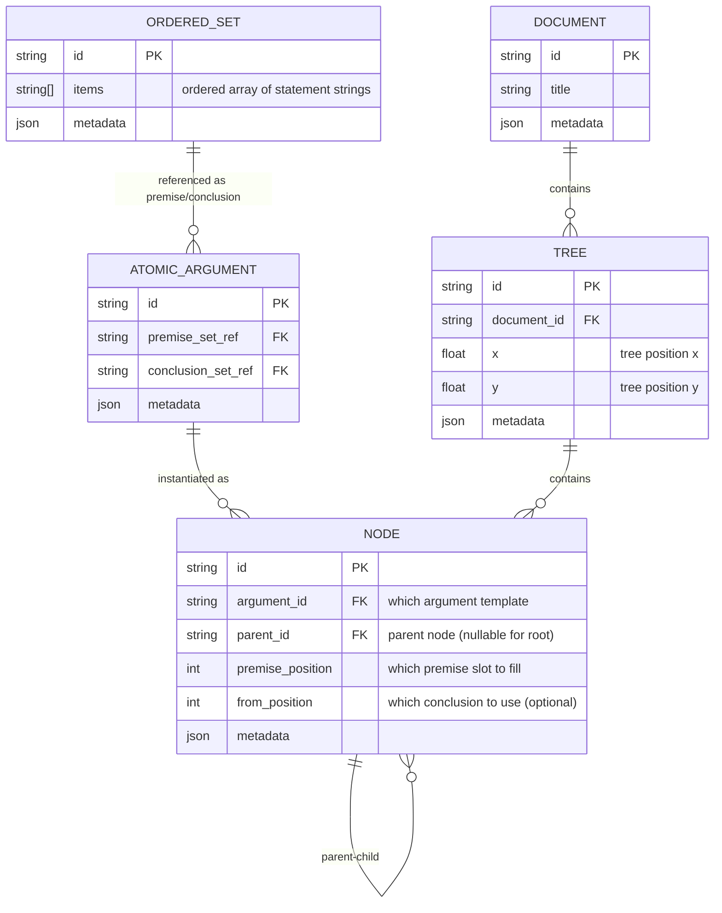

# Conceptual Data Model [CORE]

For all domain definitions, see [Key Terms](../03-concepts/key-terms.md).

## From File Format to Runtime Model: Reconstructing Connections

The relationship between file storage and runtime connections is fundamental to understanding Proof Editor's architecture:

### File Format: Serialization Mechanism
```yaml
# .proof file - serialization only
proof:
  atomic_arguments:
    - id: arg1
      premises:
        - statements: ["All men are mortal", "Socrates is a man"]  # String content
      conclusions:
        - statements: ["Socrates is mortal"]  # String content
        
    - id: arg2  
      premises:
        - statements: ["Socrates is mortal"]  # Same string content
      conclusions:
        - statements: ["Socrates will die"]
```

### Runtime Model: Object References
```typescript
// Runtime - actual connection model
const sharedOrderedSet = new OrderedSetEntity(["Socrates is mortal"]);

const arg1 = new AtomicArgumentEntity({
  premiseOrderedSet: new OrderedSetEntity(["All men are mortal", "Socrates is a man"]),
  conclusionOrderedSet: sharedOrderedSet  // Reference to same object
});

const arg2 = new AtomicArgumentEntity({
  premiseOrderedSet: sharedOrderedSet,    // Reference to same object
  conclusionOrderedSet: new OrderedSetEntity(["Socrates will die"])
});

// Connection exists because arg1.conclusionOrderedSet === arg2.premiseOrderedSet
```

### Key Insight: String Matching ≠ Connection Model

The file format uses string matching (implicit) and YAML anchors (explicit) to **reconstruct** the runtime object-reference-based connection model during loading. The strings in the file are serialization artifacts - the true connections exist only as shared object references in memory.

**Critical Understanding**: The `.proof` file's string content describes how to rebuild the runtime connections, but the connections themselves are the shared `OrderedSetEntity` objects, not the string patterns in the file.

## Core Principle: Ordered Set-Based Connections

Connections exist through shared ordered set objects. When atomic arguments share the SAME ordered set reference, they are connected.

## Data Structure



No CONNECTION table needed - logical connections emerge from shared ordered set references.
Tree structure is explicit through NODE parent-child relationships.

## Implementation Notes

- **Ordered Sets**: Entities with IDs, contain ordered arrays of statement strings
- **Atomic Arguments**: Reference OrderedSet IDs (nullable) - serve as templates
- **Nodes**: Instances of atomic arguments positioned in trees with parent-child relationships
- **Trees**: Explicit structures with positions in document workspace
- **Connections**: No separate entities - discovered through shared ordered set references
- **Arguments**: Computed by traversing logical connections (not tree structure)

## Key Operations

**Creating Connections**: New atomic argument's premise set reference = parent's conclusion set reference (same object)

**Creating Tree Structure**: 
1. Create node instance with argument reference
2. Set parent node and premise position
3. Optionally specify which conclusion to use (from position)

**Discovering Connections**: Check reference equality between atomic arguments' ordered sets

**Building Trees**: Follow parent-child relationships between nodes

## What We Store vs Compute

**Stored**: 
- Ordered sets (statement collections)
- Atomic arguments (templates with premise/conclusion references)
- Nodes (instances with parent-child relationships)
- Trees (with document positions)
- Documents

**Computed**: 
- Logical connections (from shared ordered set references)
- Arguments (path-complete sets)
- Node positions (from tree structure and layout algorithm)

## Example: Building a Proof

```
Step 1: First atomic argument created
Stored data:
- OrderedSets: {
    os1: {id: "os1", items: ["A", "A→B"]},
    os2: {id: "os2", items: ["B"]}
  }
- AtomicArgument aa1: {
    premiseSetRef: "os1",
    conclusionSetRef: "os2"
  }

Step 2: Branch operation creates new atomic argument
New data added:
- OrderedSets: {
    os3: {id: "os3", items: ["C"]}
  }
- AtomicArgument aa2: {
    premiseSetRef: "os2",      ← SAME reference as aa1's conclusion!
    conclusionSetRef: "os3"
  }

The connection is implicit: 
- aa1.conclusionSetRef === aa2.premiseSetRef (both are "os2")
- They share the SAME ordered set object
- Therefore aa1 → aa2 connection exists automatically.
```

