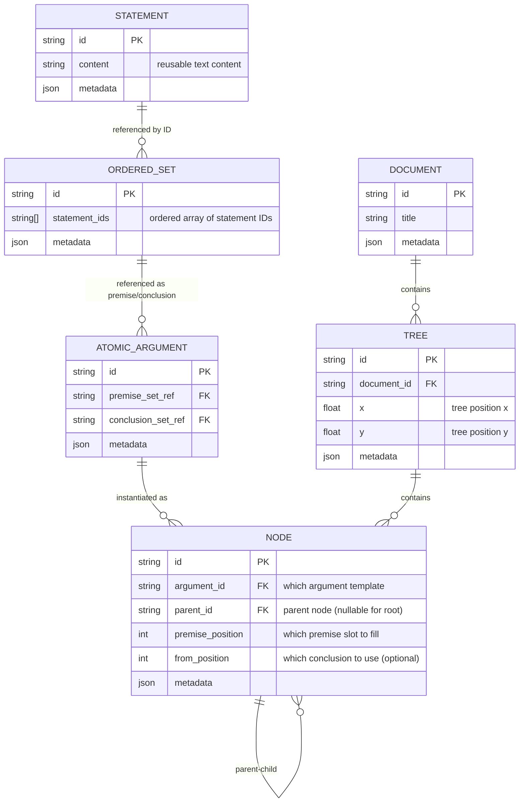

# Conceptual Data Model [CORE]

For all domain definitions, see [Key Terms](../03-concepts/key-terms.md).

## Statement-Centered Architecture Overview

Proof Editor implements a **statement-centered building block model** where:
- **Statements** are the fundamental building blocks (reusable text with unique IDs)
- **Ordered sets** collect statements for premise/conclusion groupings
- **Atomic arguments** relate premise ordered sets to conclusion ordered sets
- **Connections** exist through shared ordered set object references
- **Trees** have physical properties affecting statement flow and spatial positioning

## From File Format to Runtime Model: Reconstructing Connections

The relationship between file storage and runtime connections is fundamental to understanding Proof Editor's architecture:

### File Format: Statement Building Blocks
```yaml
# .proof file - statements as building blocks
statements:
  s1: "All men are mortal"    # Reusable statement building blocks
  s2: "Socrates is a man"
  s3: "Socrates is mortal" 
  s4: "Socrates will die"

proof:
  atomic_arguments:
    - id: arg1
      premises:
        - statements: [s1, s2]     # References to statement building blocks
      conclusions:
        - statements: [s3]         # References to statement building blocks
        
    - id: arg2  
      premises:
        - statements: [s3]         # Same statement reference creates connection
      conclusions:
        - statements: [s4]
```

### Runtime Model: Statement-Based Object References
```typescript
// Runtime - statement building blocks with connection model
const statements = new Map([
  ['s1', new StatementEntity('s1', "All men are mortal")],
  ['s2', new StatementEntity('s2', "Socrates is a man")],
  ['s3', new StatementEntity('s3', "Socrates is mortal")],
  ['s4', new StatementEntity('s4', "Socrates will die")]
]);

const sharedOrderedSet = new OrderedSetEntity(['s3']); // Contains statement ID

const arg1 = new AtomicArgumentEntity({
  premiseOrderedSet: new OrderedSetEntity(['s1', 's2']),  // Statement IDs
  conclusionOrderedSet: sharedOrderedSet  // Reference to same object
});

const arg2 = new AtomicArgumentEntity({
  premiseOrderedSet: sharedOrderedSet,    // Reference to same object
  conclusionOrderedSet: new OrderedSetEntity(['s4'])
});

// Connection exists because arg1.conclusionOrderedSet === arg2.premiseOrderedSet
// Statements are reusable building blocks referenced by ID
```

### Key Insight: Statements as Building Blocks ≠ Connection Model

The file format uses statement IDs and YAML anchors to **reconstruct** the runtime object-reference-based connection model during loading. Statements are reusable building blocks with unique IDs - the true connections exist only as shared OrderedSetEntity object references in memory.

**Critical Understanding**: The `.proof` file's statement references describe how to rebuild the runtime connections, but the connections themselves are the shared `OrderedSetEntity` objects that contain statement IDs, not the statement content itself.

## Core Principle: Ordered Set-Based Connections

Connections exist through shared ordered set objects. When atomic arguments share the SAME ordered set reference, they are connected.

## Data Structure



No CONNECTION table needed - logical connections emerge from shared ordered set references.
Tree structure is explicit through NODE parent-child relationships.

## Statement Flow Mechanics

### Runtime Flow Model
The system implements physical statement flow where statements move through atomic arguments as data processing nodes:

```typescript
// Statement flow interfaces for runtime execution
interface StatementFlowEngine {
  // Track statement movement through argument pathways
  traceStatementFlow(fromNodeId: string, toNodeId: string): StatementPath;
  
  // Resolve statement requirements for tree nodes
  resolveNodeInputs(nodeId: string): StatementRequirement[];
  
  // Compute available statement outputs from nodes
  computeNodeOutputs(nodeId: string): StatementOutput[];
  
  // Validate statement flow integrity in trees
  validateFlowIntegrity(treeId: string): FlowValidationResult;
}

interface StatementPath {
  sourceNodeId: string;
  targetNodeId: string;
  flowingStatements: StatementFlow[];
  pathIntegrity: boolean;
}

interface StatementFlow {
  statementId: string;
  sourcePosition: number;     // Which conclusion slot
  targetPosition: number;     // Which premise slot
  flowType: 'direct' | 'derived' | 'conditional';
}

interface StatementRequirement {
  position: number;           // Which premise position needs input
  requiredStatements: string[]; // Statement IDs expected
  satisfiedBy?: string;       // Node ID providing input
  flowStatus: 'pending' | 'satisfied' | 'conflict';
}

interface StatementOutput {
  position: number;           // Which conclusion position produces output
  producedStatements: string[]; // Statement IDs generated
  availableFor: string[];     // Node IDs that can consume this output
  flowCapacity: number;       // How many connections can use this output
}
```

### Physical Tree Flow Model
Trees represent physical statement processing networks where nodes have spatial relationships affecting statement flow:

```typescript
interface PhysicalTreeFlow {
  // Compute statement flow based on spatial tree structure
  computeTreeFlow(treeId: string): TreeFlowModel;
  
  // Handle statement routing between spatially positioned nodes
  routeStatements(fromNode: string, toNode: string): RoutingResult;
  
  // Manage flow conflicts in spatial positioning
  resolveFlowConflicts(treeId: string): ConflictResolution[];
}

interface TreeFlowModel {
  treeId: string;
  flowDirections: Map<string, FlowDirection>; // Node to flow direction
  statementPipelines: StatementPipeline[];   // Active flow paths
  bottlenecks: FlowBottleneck[];             // Flow constraints
  flowEfficiency: number;                    // Overall tree performance
}

interface StatementPipeline {
  pipelineId: string;
  sourceNodeId: string;
  sinkNodeId: string;
  intermediateNodes: string[];               // Nodes along the flow path
  statementCapacity: number;                 // Max statements per flow
  currentLoad: number;                       // Current statement volume
}

interface FlowBottleneck {
  nodeId: string;
  bottleneckType: 'input_capacity' | 'output_capacity' | 'processing_limit';
  severity: 'low' | 'medium' | 'high';
  affectedPipelines: string[];               // Pipeline IDs impacted
  suggestedResolutions: BottleneckResolution[];
}
```

## Implementation Notes

- **Ordered Sets**: Entities with IDs, contain ordered arrays of statement strings
- **Atomic Arguments**: Reference OrderedSet IDs (nullable) - serve as templates AND statement processors
- **Nodes**: Instances of atomic arguments positioned in trees with parent-child relationships AND statement flow capabilities
- **Trees**: Explicit structures with positions in document workspace AND statement processing networks
- **Connections**: No separate entities - discovered through shared ordered set references AND statement flow pathways
- **Arguments**: Computed by traversing logical connections (not tree structure) AND statement flow analysis
- **Statement Flow**: Physical mechanism where statements move through processing nodes in spatial tree networks

## Key Operations

**Creating Connections**: New atomic argument's premise set reference = parent's conclusion set reference (same object) AND establish statement flow pipeline

**Creating Tree Structure**: 
1. Create node instance with argument reference
2. Set parent node and premise position
3. Optionally specify which conclusion to use (from position)
4. Initialize statement flow interfaces for the node
5. Establish spatial positioning for statement routing

**Discovering Connections**: Check reference equality between atomic arguments' ordered sets AND trace statement flow pathways

**Building Trees**: Follow parent-child relationships between nodes AND construct statement processing networks

**Managing Statement Flow**:
1. Route statements from child outputs to parent inputs
2. Validate flow capacity and routing conflicts
3. Optimize statement pipeline efficiency
4. Handle spatial positioning effects on flow

**Spatial Tree Operations**:
1. Position nodes to optimize statement flow
2. Detect and resolve spatial flow conflicts
3. Maintain tree integrity during position changes
4. Update flow routing when trees are moved

## What We Store vs Compute

**Stored**: 
- Statements (reusable text building blocks with unique IDs)
- Ordered sets (collections of statement ID references)
- Atomic arguments (templates with premise/conclusion ordered set references)
- Nodes (instances with parent-child relationships)
- Trees (with document positions and physical properties)
- Documents
- Physical positioning data (spatial coordinates affecting tree layout)
- Tree physical properties (affecting statement flow and spatial behavior)

**Computed**: 
- Logical connections (from shared ordered set references)
- Arguments (path-complete sets)
- Node positions (from tree structure and layout algorithm)
- Statement content display (from statement ID lookups)
- Tree physical layout (from node relationships and tree properties)
- Statement flow visualization (based on tree physical properties)

## Example: Building a Proof with Statement Flow

```
Step 1: First atomic argument created with statement building blocks
Stored data:
- Statements: {
    s1: {id: "s1", content: "A"},
    s2: {id: "s2", content: "A→B"},
    s3: {id: "s3", content: "B"}
  }
- OrderedSets: {
    os1: {id: "os1", statementIds: ["s1", "s2"]},
    os2: {id: "os2", statementIds: ["s3"]}
  }
- AtomicArgument aa1: {
    premiseSetRef: "os1",
    conclusionSetRef: "os2"
  }

Step 2: Branch operation creates new atomic argument with statement building blocks
New data added:
- Statements: {
    s4: {id: "s4", content: "C"}     // New statement building block
  }
- OrderedSets: {
    os3: {id: "os3", statementIds: ["s4"]}
  }
- AtomicArgument aa2: {
    premiseSetRef: "os2",      ← SAME reference as aa1's conclusion!
    conclusionSetRef: "os3"
  }

The connection is implicit through shared statement building blocks: 
- aa1.conclusionSetRef === aa2.premiseSetRef (both are "os2")
- They share the SAME ordered set object containing statement ID "s3"
- Statement s3 ("B") creates the logical connection
- Therefore aa1 → aa2 connection exists through shared statement building block.

Step 3: Physical tree properties affect layout and visualization
Tree data added:
- Tree t1: {
    nodes: {"n1": aa1, "n2": aa2},
    physicalProperties: {
      x: 100, y: 100,              // Tree position in document
      layoutStyle: "bottom-up",     // Children provide inputs from below
      spacingX: 150,               // Horizontal spacing between siblings
      spacingY: 100                // Vertical spacing between levels
    },
    nodePositions: {               // Computed from tree structure
      n1: {x: 100, y: 100},        // Root node
      n2: {x: 100, y: 200}         // Child positioned below parent
    }
  }
```

