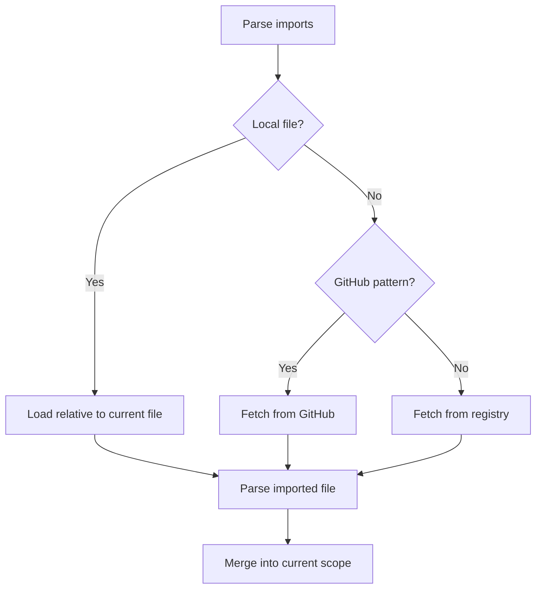

# Proof File Specification

## Overview

Proof Editor uses YAML files (`.proof` extension) to store logical proofs. The format prioritizes simplicity - most proofs need just a few lines.

**Primary Purpose**: The file format's primary role is to robustly *reconstruct* the runtime connection model during loading. This model is based on **STATEMENTS** - the fundamental building blocks that flow between nodes in physical tree structures.

**CRITICAL PRINCIPLES**: 
- **Compositional hierarchy** - understand what builds from what in the system
- **Identity-based connections** - same entities appearing in multiple places create relationships
- **Physical manifestation** - logical structures have spatial properties through rendering
- **Emergent layout** - tree positioning comes from structural relationships, not stored coordinates

## Minimal Valid Proof

```yaml
statements:
  - &A "A"
  - &B "B"
  - &C "C"

arguments:
  - &arg1 [*A, *B]: [*C]  # Needs A,B produces C
  - &arg3 [*C, *A]: [*B]  # Needs C,A produces B

trees:
  - offset: {x: 0, y: 0}
    nodes:
      n1: {arg: *arg1}         # Root node
      n2: {n1: *arg3, on: 1}   # Provides B to n1's second premise
```

This shows a single tree with two nodes, where n2 (child) provides statement B to n1's (parent) second premise slot. **Statement flow**: n1 produces C → n2 uses C (plus external A) → n2 produces B → n1 uses B. Data flows bottom-up: children fulfill their parents' premise requirements through **concrete statement movement**.

## Connection Reconstruction in Files

For the conceptual definition of connections, see [Key Terms](../03-concepts/key-terms.md#connections).

**Key Understanding**: The file format uses string matching to reconstruct the runtime connection model, which is based on shared object references. String matching in files ≠ string matching in runtime.

When loading proof files, the system reconstructs shared ordered set references through two mechanisms:

### Implicit Reconstruction (String Matching)

```yaml
- [All men are mortal, Socrates is a man]: [Socrates is mortal]
- [Socrates is mortal, All mortals die]: [Socrates will die]
```

During deserialization, the system detects that `[Socrates is mortal]` appears as both conclusion and premise. It creates a single OrderedSetEntity object that both atomic arguments reference by ID.

**Runtime result**: Two AtomicArgumentEntity objects that share the same OrderedSetEntity reference - this shared reference IS the connection.

### Explicit References (YAML Anchors)

```yaml
- [All men are mortal, Socrates is a man]: &s_mortal [Socrates is mortal]
- *s_mortal: [Socrates will die]
- *s_mortal: [Socrates will die]
```

Use anchors (`&`) and aliases (`*`) when:
- String variations exist ("Ground wet" vs "Ground is wet")
- You want guaranteed shared references
- You're reusing ordered sets multiple times

**Important**: String matching is just a deserialization mechanism. At runtime, connections exist through shared ordered set object references, not string comparison.

### Statement Reuse vs Connection Reconstruction

**Statement Reuse**: The same statement string can appear in multiple ordered sets:
```yaml
- [All men are mortal]: [Humans are mortal]  # First ordered set
- [All men are mortal]: [Males are mortal]   # Different ordered set, same statement
```
Both ordered sets contain the statement "All men are mortal", but they are NOT connected because they represent different OrderedSetEntity objects.

**Connection Reconstruction**: The same ordered set content creates shared references:
```yaml
- [P, Q]: [R]     # Creates OrderedSetEntity for [P, Q] and [R]
- [R]: [S]        # Reuses the OrderedSetEntity for [R], creating connection
```
The `[R]` ordered set is the SAME OrderedSetEntity object in both atomic arguments - this shared reference creates the connection.

## Progressive Enhancement

### Level 1: Basic Proof

```yaml
- [P, Q]: [R]
- [R, S]: [T]
```

### Level 2: With Reusable Statements

```yaml
statements:
  - &all_mortal "All men are mortal"
  
proof:
  - [*all_mortal, Socrates is a man]: [Socrates is mortal]
  - [*all_mortal, Plato is a man]: [Plato is mortal]
```

Or with imports:

```yaml
imports:
  - ./shared/mortality-axioms.proof  # Contains common statements

proof:
  - [All men are mortal, Socrates is a man]: [Socrates is mortal]
```

### Level 3: With Metadata

```yaml
title: "Example Proof"
language: first-order-logic

proof:
  - premises: [P, Q]
    conclusions: [R]
    left: "(1)"  # Side text before implication line
    right: "MP"  # Side text after implication line
    confidence: 0.95
    
  - premises: [R, S]
    conclusions: [T]
    right: "∧E"  # Only right side text
```

### Level 4: Multiple Trees

```yaml
socrates:  # First tree
  - [All men are mortal, Socrates is a man]: [Socrates is mortal]
  
plato:  # Second tree (independent)
  - [All men are mortal, Plato is a man]: [Plato is mortal]
```

## Complete File Structure

All fields are optional except the proof itself:

```yaml
# Metadata
version: "1.0"
title: "My Proof"
description: "Optional description"
tags: [logic, example]

# Language specification
language: first-order-logic  # or: first-order-logic@^2.0.0
# Full form:
# language:
#   name: modal-logic
#   version: "^1.0.0"
#   source: "github:logic-tools/modal-logic-lsp"
#   config:
#     axiomSystem: S5

# Imports (local files or packages)
imports:
  - basic-logic@^1.0.0  # Package from registry
  - logic-tools/modal-logic@^2.0  # GitHub package (owner/repo)
  - ./lemmas/number-theory.proof  # Local file
  - ../shared/definitions.proof  # Relative path

# Custom characters (defined by language/packages, not here)

# Global statements
statements:
  - &premise "Shared premise"

# The actual proofs
main:
  - [*premise, Q]: [R]
```

### Multiple Trees in Document

```yaml
arguments:
  - &syllogism [All men are mortal, Socrates is a man]: [Socrates is mortal]
  - &universal_elim [Socrates is mortal]: [Socrates will die]
  - &syllogism2 [All men are mortal, Plato is a man]: [Plato is mortal]

trees:
  # First proof tree
  - id: socrates_proof
    offset: {x: 0, y: 0}
    nodes:
      s1: {arg: *syllogism}              # Root
      s2: {s1: *universal_elim, on: 0}   # Uses s1's conclusion
      
  # Second independent proof tree
  - id: plato_proof
    offset: {x: 500, y: 0}
    nodes:
      p1: {arg: *syllogism2}             # Different root
      p2: {p1: *universal_elim, on: 0}   # Same template, different instance
```

**Key points**:
- Trees are independent structures in the document workspace
- The same argument template (universal_elim) appears in both trees
- Each node has its own identity even when using the same argument

## Additional Features

### Tree Structure Storage

**CRITICAL INSIGHT**: Arguments are templates that can be instantiated multiple times at different positions. Tree structure requires explicit parent-child-position relationships.

**PHYSICAL TREE STRUCTURE**: Trees are actually connected via the STATEMENTS (not just the arguments). The same tree structure could be described from the statement perspective - statements flow between nodes, creating the physical connections that form the tree. This makes it clear that trees have concrete physical properties: statements move between specific positions, creating directed connections in physical space.

**Physical Properties**: Trees have emergent spatial layout from parent-child relationships. Each tree moves as a cohesive unit with single workspace offset. No individual node coordinates are stored - physical positioning emerges from rendering the logical structure.

## Tree Structure Patterns

Trees demonstrate different organizational patterns based on how argument templates connect. The following examples show concrete patterns with external inputs, template reuse, and complex flows.

### Pattern Types

**Linear Chain**: Each node feeds exactly one parent, creating a sequential dependency flow.

**Parallel Structure**: Multiple children provide inputs to a single parent at different premise positions.

**Hierarchical Branching**: Deeper nesting where some nodes serve both as parents (receiving inputs) and children (providing inputs to their own parents).

### Flow Analysis Framework

To understand any tree:
1. **Identify what each argument template needs (premises) and produces (conclusions)**
2. **Trace which outputs can satisfy which input requirements**
3. **Follow the `on: position` values to see which specific premise slots get filled**
4. **Remember bottom-up flow: children fulfill their parents' input requirements**

### External Input Patterns

Some trees require external statements that aren't produced by other nodes in the tree. These external inputs come from outside the tree structure:

```yaml
statements:
  - &P "P is true"
  - &Q "Q is true"
  - &R "R follows"
  - &S "S is established"

arguments:
  - &modus_ponens [*P, "P implies Q"]: [*Q]
  - &universal_inst ["All things have property R", *P]: [*R]
  - &composition [*Q, *R]: [*S]

trees:
  - offset: {x: 0, y: 0}
    nodes:
      main: {arg: *composition}         # Needs Q and R
      left: {main: *modus_ponens, on: 0}   # Provides Q, needs P + "P implies Q"
      right: {main: *universal_inst, on: 1} # Provides R, needs "All things..." + P
```

**Statement Sources**:
- **Internal**: *Q and *R produced by child nodes
- **External**: *P, "P implies Q", "All things have property R" must come from outside this tree
- **Reused External**: *P is needed by both left and right children

### Multiple Template Instances

The same argument template can appear multiple times as different nodes in the same tree:

```yaml
statements:
  - &premise1 "All humans are mortal"
  - &socrates "Socrates is human"
  - &plato "Plato is human"
  - &soc_mortal "Socrates is mortal"
  - &plato_mortal "Plato is mortal"
  - &both_mortal "Both are mortal"

arguments:
  - &syllogism_template [*premise1, "X is human"]: ["X is mortal"]
  - &conjunction [*soc_mortal, *plato_mortal]: [*both_mortal]

trees:
  - offset: {x: 0, y: 0}
    nodes:
      conclusion: {arg: *conjunction}
      soc_proof: {conclusion: *syllogism_template, on: 0}  # First instance
      plato_proof: {conclusion: *syllogism_template, on: 1} # Second instance of same template
```

**Key Points**:
- `*syllogism_template` appears twice as different nodes
- Each instance handles different specific inputs ("Socrates is human" vs "Plato is human")
- Same logical pattern, different concrete applications

### Complex Flow Scenarios

#### Scenario 1: Linear Chain with External Supplements

```yaml
statements:
  - &base "Base fact"
  - &derived1 "First derivation"
  - &derived2 "Second derivation"
  - &final "Final conclusion"

arguments:
  - &step1 [*base, "External rule 1"]: [*derived1]
  - &step2 [*derived1, "External rule 2"]: [*derived2]
  - &step3 [*derived2, "External rule 3"]: [*final]

trees:
  - offset: {x: 0, y: 0}
    nodes:
      root: {arg: *step3}              # Produces final
      middle: {root: *step2, on: 0}    # Provides derived2
      bottom: {middle: *step1, on: 0}  # Provides derived1
```

**Flow Analysis**:
- External inputs: *base, "External rule 1", "External rule 2", "External rule 3"
- Internal flow: *base → *derived1 → *derived2 → *final
- Each step depends on both internal flow and external rules

#### Scenario 2: Parallel Inputs with Shared Dependencies

```yaml
statements:
  - &shared "Shared premise"
  - &specific1 "Specific premise 1"
  - &specific2 "Specific premise 2"
  - &result1 "Result 1"
  - &result2 "Result 2"
  - &combined "Combined result"

arguments:
  - &branch1 [*shared, *specific1]: [*result1]
  - &branch2 [*shared, *specific2]: [*result2]
  - &combine [*result1, *result2]: [*combined]

trees:
  - offset: {x: 0, y: 0}
    nodes:
      final: {arg: *combine}           # Needs result1 and result2
      left: {final: *branch1, on: 0}   # Provides result1
      right: {final: *branch2, on: 1}  # Provides result2
```

**Flow Analysis**:
- External inputs: *shared (used by both children), *specific1, *specific2
- Parallel flow: Both children use *shared but need different specific premises
- Convergence: Both results combine at the root

#### Scenario 3: Hierarchical Branching with Multiple Levels

```yaml
statements:
  - &axiom1 "Axiom 1"
  - &axiom2 "Axiom 2"
  - &lemma1 "Lemma 1"
  - &lemma2 "Lemma 2"
  - &theorem1 "Theorem 1"
  - &theorem2 "Theorem 2"
  - &final_theorem "Final theorem"

arguments:
  - &prove_lemma1 [*axiom1, "Additional rule 1"]: [*lemma1]
  - &prove_lemma2 [*axiom2, "Additional rule 2"]: [*lemma2]
  - &prove_theorem1 [*lemma1, *axiom1]: [*theorem1]
  - &prove_theorem2 [*lemma2, *axiom2]: [*theorem2]
  - &final_proof [*theorem1, *theorem2]: [*final_theorem]

trees:
  - offset: {x: 0, y: 0}
    nodes:
      root: {arg: *final_proof}              # Level 3: Final theorem
      th1: {root: *prove_theorem1, on: 0}    # Level 2: First theorem
      th2: {root: *prove_theorem2, on: 1}    # Level 2: Second theorem
      lem1: {th1: *prove_lemma1, on: 0}      # Level 1: First lemma
      lem2: {th2: *prove_lemma2, on: 0}      # Level 1: Second lemma
```

**Flow Analysis**:
- External inputs: *axiom1, *axiom2, "Additional rule 1", "Additional rule 2"
- Level 1: Lemmas derived from axioms + external rules
- Level 2: Theorems derived from lemmas + original axioms (reused)
- Level 3: Final theorem combines both theorems
- **Note**: *axiom1 and *axiom2 are reused at multiple levels

### Statement Source Classification

Understanding where statements come from in tree structures:

#### 1. External Statements (Required from outside the tree)
- **Axioms**: Foundational truths not derived within the tree
- **Given premises**: Statements provided as assumptions
- **Imported statements**: From other proofs or packages
- **User assertions**: Statements introduced by user input

#### 2. Internal Statements (Produced within the tree)
- **Intermediate conclusions**: Output of child nodes
- **Derived statements**: Results of applying argument templates
- **Flowing statements**: Move from child conclusions to parent premises

#### 3. Mixed Usage Patterns
- **Reused externals**: Same external statement used by multiple nodes
- **Cascading internals**: Internal statements that become inputs for multiple subsequent nodes
- **Branching points**: Single statement that feeds multiple different reasoning paths

### YAML Structure Principles

```yaml
statements:
  - &statement1 "content1"
  - &statement2 "content2"
  
arguments:
  - &template1 [*input1, *input2]: [*output1]
  - &template2 [*output1, *input3]: [*output2]

trees:
  - offset: {x: 0, y: 0}
    nodes:
      root: {arg: *template1}
      child: {root: *template2, on: position_number}
```

The key insight: tree structure emerges from which templates can provide the inputs that other templates require.

**Key Node Format**:
- **Root node**: `{arg: argument_ref}`
- **Child node**: `{parent_id: argument_ref, on: position}`
  - Parent ID becomes the key (e.g., `n1:` not `parent: n1`)
  - `on` specifies which premise position to fill
  - For multiple conclusions: `on: "from:to"` (e.g., `"1:0"`)

**Bottom-up data flow**: Children provide their conclusions as inputs to their parents' premise slots.

### Side Text

Side text can appear on the left or right (or both) of the implication line:

```yaml
# Left side only
- premises: [P, Q]
  conclusions: [R]
  left: "(1)"

# Right side only  
- premises: [P, Q]
  conclusions: [R]
  right: "MP"

# Both sides
- premises: [P, Q]
  conclusions: [R]
  left: "Assumption"
  right: "∧I"
```

### Hover Text

Provide additional context that appears on hover:

```yaml
# Hover text for the entire atomic argument
- premises: [P → Q, P]
  conclusions: [Q]
  right: "MP"
  hover: "Modus Ponens: If P implies Q and P is true, then Q must be true"

# Hover on individual statements using maps
- premises: 
    - {text: "∀x P(x)", hover: "For all x, P holds"}
    - {text: "a ∈ U", hover: "a is in the universe of discourse"}
  conclusions: [{text: "P(a)", hover: "P holds for a specifically"}]
```

### Statement Composition

```yaml
statements:
  - &A "something"
  - &B "something"
  - &C "something"

arguments:
  - ["{*A} {*B}"]: [*C]
  - ["{*B} {*C}"]: [*A]
  - ["{*C} {*A}"]: [*B]


```

## Import Formats

```yaml
imports:
  # Package from default registry
  - package-name@^1.0.0
  
  # GitHub package (owner/repo pattern)
  - owner/repo@tag
  - owner/repo@^2.0.0
  
  # Local files (start with . or /)
  - ./local-file.proof
  - ../shared/lemmas.proof
  - /absolute/path/to/axioms.proof
```

## Import System

The import system allows you to share and reuse proofs, statements, and logical frameworks across files and projects.

### What Can Be Imported

#### 1. Other Proof Files
Import statements, lemmas, theorems, and complete proofs from other `.proof` files:

```yaml
imports:
  - ./lemmas/basic-arithmetic.proof
  - ../shared/axioms/peano.proof
```

**What gets exposed:**
- All statements defined in the `statements:` section
- All named proof trees (e.g., `theorem1:`, `lemma2:`)
- Transitively imported statements (imports of imports)

#### 2. Language Packages
Import formal language definitions with symbols and validation rules:

```yaml
imports:
  - first-order-logic@^2.0.0  # From registry
  - logic-tools/modal-logic    # From GitHub
```

**What language packages provide:**
- Character definitions (∀, ∃, →, ¬, etc.)
- Validation rules for that logical system
- Precedence and associativity rules
- Standard axioms and inference rules

#### 3. Library Packages
Import collections of common proof patterns and utilities:

```yaml
imports:
  - proof-patterns/induction@^1.0.0
  - math-proofs/number-theory
```

**What library packages provide:**
- Reusable proof templates
- Common lemmas and theorems
- Domain-specific statement collections
- Helper validations

### How Imports Work

#### Resolution Rules

1. **Local File Imports**
   - Paths starting with `./`, `../`, or `/` are file imports
   - Resolved relative to the current file's directory
   - Must have `.proof` extension (can be omitted in import)
   
   ```yaml
   imports:
     - ./lemmas/helper       # Resolves to ./lemmas/helper.proof
     - ../shared/axioms.proof  # Explicit extension
   ```

2. **Package Imports**
   - No path prefix = package from registry
   - `owner/repo` pattern = GitHub package
   - Version constraints follow semver
   
   ```yaml
   imports:
     - modal-logic@^2.0.0           # Registry package
     - proof-tools/classical@v1.0   # GitHub package
   ```

#### Import Loading Process



#### Referencing Imported Content

1. **Direct Reference** (when no conflicts):
   ```yaml
   imports:
     - ./axioms.proof  # Contains statement "All men are mortal"
   
   proof:
     - [All men are mortal, Socrates is a man]: [Socrates is mortal]
   ```

2. **Namespace Reference** (when disambiguation needed):
   ```yaml
   imports:
     - ./logic1.proof as L1
     - ./logic2.proof as L2
   
   proof:
     - [L1::axiom1, L2::axiom1]: [Combined result]
   ```

3. **Anchor Reference** (for specific statements):
   ```yaml
   imports:
     - ./shared.proof  # Exports &mortality anchor
   
   proof:
     - [*mortality, Socrates is a man]: [Socrates is mortal]
   ```

### Conflict Resolution

#### Duplicate Statement Names

When multiple imports define the same statement:

```yaml
# File: axioms1.proof
statements:
  - &identity "A = A"  # Version 1

# File: axioms2.proof  
statements:
  - &identity "∀x(x = x)"  # Version 2

# Your file:
imports:
  - ./axioms1.proof
  - ./axioms2.proof  # This "identity" wins (last import)

proof:
  - [identity]: [...]  # Uses "∀x(x = x)"
```

#### Precedence Rules

1. **Local > Imported**: Local definitions always win
   ```yaml
   imports:
     - ./common.proof  # Defines "P implies Q"
   
   statements:
     - "P implies Q"  # This local version takes precedence
   ```

2. **Last Import Wins**: Later imports override earlier ones
   ```yaml
   imports:
     - ./old-axioms.proof  # Defines axiom1
     - ./new-axioms.proof  # Also defines axiom1 (this wins)
   ```

3. **Explicit Wins**: Namespace/alias references are never ambiguous
   ```yaml
   imports:
     - ./logic1.proof as L1
     - ./logic2.proof as L2
   
   proof:
     - [L1::axiom, L2::axiom]: [...]  # No ambiguity
   ```

#### Disambiguation Strategies

1. **Import Aliases**:
   ```yaml
   imports:
     - ./classical-logic.proof as classical
     - ./intuitionistic-logic.proof as intuit
   
   proof:
     - [classical::excluded_middle]: [P or not P]
     # intuit::excluded_middle would not be valid
   ```

2. **Selective Import** (future feature):
   ```yaml
   imports:
     - from: ./large-library.proof
       include: [theorem1, lemma3, axiom_set_1]
   ```

3. **Re-export Control** (future feature):
   ```yaml
   imports:
     - ./private-lemmas.proof  # Not re-exported by default
   
   exports:
     - *  # Export everything including imports
     # OR
     - local  # Export only local definitions
   ```

### Import Syntax Details

#### Optional Imports

Use `?` suffix for imports that might not exist:

```yaml
imports:
  - ./optional-lemmas.proof?  # Doesn't fail if file missing
  - experimental-logic@^1.0.0?  # Doesn't fail if package unavailable
```

Use case: Development environments where some files might not be present yet.

#### Version Constraints

Follow npm-style semver for packages:

```yaml
imports:
  # Exact version
  - modal-logic@2.1.0
  
  # Minor updates allowed
  - first-order-logic@^1.2.0  # 1.2.0 <= version < 2.0.0
  
  # Patch updates only
  - proof-validator@~3.1.4  # 3.1.4 <= version < 3.2.0
  
  # Any version
  - experimental-package
  
  # Specific tag/branch (GitHub)
  - owner/repo@develop
  - owner/repo@feature/new-axioms
```

#### Path Types

```yaml
imports:
  # Relative paths (most common)
  - ./sibling.proof
  - ../parent/other.proof
  - ../../shared/common.proof
  
  # Absolute paths (not recommended - breaks portability)
  - /home/user/proofs/axioms.proof
  
  # Package paths (no ./ prefix)
  - standard-logic
  - math/number-theory
```

### Common Import Patterns

#### 1. Shared Axiom Sets

```yaml
# File: axioms/arithmetic.proof
statements:
  - &zero_identity "∀a: a + 0 = a"
  - &succ_def "∀a,b: S(a) + b = S(a + b)"

# File: theorems/addition.proof
imports:
  - ../axioms/arithmetic.proof

proof:
  - [*zero_identity]: [1 + 0 = 1]
```

#### 2. Lemma Libraries

```yaml
# File: lemmas/inequalities.proof
transitivity:
  - premises: [a < b, b < c]
    conclusions: &trans_result [a < c]

# File: main-proof.proof
imports:
  - ./lemmas/inequalities.proof

proof:
  - [x < y, y < z]: [x < z]  # Connects to imported lemma
```

#### 3. Multi-Language Support

```yaml
imports:
  - classical-logic@^2.0.0 as CL
  - intuitionistic-logic@^1.0.0 as IL

classical_proof:
  - [CL::LEM]: [P ∨ ¬P]  # Law of excluded middle

intuitionistic_proof:
  - [IL::premises]: [IL::conclusion]  # Different logical system
```

### Connection Model with Imports

#### Connections Across Import Boundaries

Imported ordered sets can connect with local atomic arguments through shared references:

```yaml
# File: lemmas.proof
lemma1:
  - [A, B]: &shared_conclusion [C]  # Creates OrderedSetEntity for [C]

# File: main.proof  
imports:
  - ./lemmas.proof

theorem:
  - [*shared_conclusion, D]: [E]  # References the SAME OrderedSetEntity from lemmas.proof
```

**Runtime result**: The `*shared_conclusion` reference points to the same OrderedSetEntity object created in lemmas.proof, creating a connection across file boundaries.

#### Transitive Connections

Connections flow through multiple files via shared object references:

```yaml
# File: base.proof
- [P]: &q [Q]  # Creates OrderedSetEntity for [Q]

# File: middle.proof
imports: [./base.proof]
- [*q]: &r [R]  # Uses [Q] OrderedSetEntity from base.proof, creates new [R] OrderedSetEntity

# File: final.proof
imports: [./middle.proof]
- [*r]: [S]  # Uses [R] OrderedSetEntity from middle.proof
```

**Statement vs Connection Independence**: Note that statement "Q" could appear in other files without creating connections - connections require shared OrderedSetEntity references, not just shared statement strings.

### Security Considerations

#### Import Validation

The system validates imports before execution:

1. **Path Traversal Protection**: Cannot import outside project root
   ```yaml
   imports:
     - ../../../etc/passwd  # ERROR: Outside project
   ```

2. **Circular Import Detection**: Prevents infinite loops
   ```yaml
   # a.proof imports b.proof
   # b.proof imports a.proof
   # ERROR: Circular dependency detected
   ```

3. **Content Validation**: Imported files must be valid proof files
   ```yaml
   imports:
     - ./not-a-proof.txt  # ERROR: Invalid proof file
   ```

#### Trust Boundaries

1. **Local Files**: Trusted by default (in your project)
2. **Registry Packages**: Verified and signed
3. **GitHub Packages**: Trust based on repository reputation
4. **URL Imports**: Not supported for security reasons

### Performance Considerations

#### Import Caching

Imports are cached to avoid redundant parsing:

```yaml
# These files all import common.proof
imports:
  - ./proof1.proof  # Imports common.proof
  - ./proof2.proof  # Also imports common.proof
  - ./common.proof  # Directly imported

# common.proof is only parsed once
```

#### Lazy Loading

Large imports can be lazy-loaded:

```yaml
imports:
  - lazy: ./huge-theorem-database.proof
    # Only loads when actually referenced
```

#### Import Depth Limits

Default maximum import depth: 10 levels
- Prevents stack overflow from deep import chains
- Configurable in language server settings

### Best Practices

1. **Organize Imports Logically**:
   ```yaml
   imports:
     # Language definitions first
     - first-order-logic@^2.0.0
     
     # Common libraries
     - proof-patterns/induction
     
     # Project-specific files
     - ./shared/axioms.proof
     - ./lemmas/arithmetic.proof
   ```

2. **Use Consistent Naming**:
   ```yaml
   imports:
     - ./axioms/peano.proof as peano
     - ./axioms/zfc.proof as zfc
   ```

3. **Document Import Purpose**:
   ```yaml
   # For basic arithmetic operations
   imports:
     - ./arithmetic.proof
     
   # Provides modal logic operators
   imports:
     - modal-logic@^2.0.0
   ```

4. **Avoid Deep Import Chains**: Prefer direct imports over transitive dependencies

5. **Version Lock Important Dependencies**:
   ```yaml
   imports:
     - critical-logic@2.1.0  # Exact version for stability
     - helper-lib@^1.0.0     # Flexible for non-critical
   ```

## Key Points

1. **Order matters**: `[A, B]` ≠ `[B, A]`
2. **String matching is exact and case-sensitive**
3. **Use quotes for complex statements**: `"If P then Q"`
4. **Empty premises**: `[]` or omit the key
5. **All metadata fields are optional**
6. **Characters** (∀, ∃, →) come from language specs and imports
7. **Side text** uses `left:` and `right:` for text before/after the implication line
8. **Imports** can be packages or local `.proof` files
9. **Hover text** adds explanatory tooltips to arguments or individual statements
10. **Import precedence**: Local > Last Import > Earlier Imports
11. **Connections work across imports**: Imported ordered sets can create shared references
12. **Optional imports** use `?` suffix for graceful failures
13. **Namespaces** prevent conflicts: `L1::axiom` vs `L2::axiom`
14. **Statement reuse**: Same statement strings can appear in different ordered sets without connections
15. **Connection mechanism**: String matching in files rebuilds shared object references in runtime
16. **File format ≠ Runtime model**: Connections are about shared references, not string matching

## Philosophy

Start simple. Add complexity only when needed. Most proofs work perfectly with just:

```yaml
- [Premise 1, Premise 2]: [Conclusion 1]
- [Conclusion 1, Premise 3]: [Conclusion 2]
```