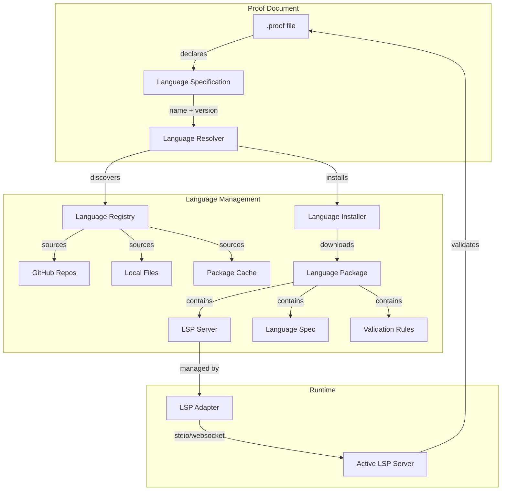

# Language Management System

## Overview

The Language Management System enables proof files to specify their logical language and automatically loads the appropriate Language Server Protocol (LSP) implementation. Languages are distributed as packages containing LSP servers, validation rules, and language-specific configurations. This system provides hot-swapping, version management, and platform-specific transport mechanisms.

## Core Architecture



## Language Declaration in Proof Files

Proof files declare their language in the header:

```yaml
# Modal Logic Proof
version: "1.0"
language:
  name: "modal-logic"
  version: "^1.2.0"
  source: "github:logictools/modal-logic-lsp"
  config:
    strictMode: true
    worldSemantics: "possible-worlds"

# Alternative source formats:
# source: "file:./local-languages/modal-logic"
# source: "https://logic.example.com/packages/modal-logic.tar.gz"
# source: "registry:modal-logic"  # From language registry

# Document content continues...
orderedSets:
  os1: ["□(P → Q)", "□P"]
  os2: ["□Q"]
```

## Language Package Structure

Language packages follow a standardized structure similar to MCP servers:

```
modal-logic-lsp/
├── language-spec.yaml          # Language specification
├── README.md                   # Documentation
├── package.json               # Node.js dependencies (if applicable)
├── server/
│   ├── server.js              # LSP server implementation
│   ├── server.exe             # Platform-specific binaries
│   ├── server-darwin-arm64    # macOS ARM64 binary
│   └── server-linux-x64       # Linux x64 binary
├── validation/
│   ├── rules.json             # Validation rule definitions
│   └── custom-validators.js   # Custom validation logic
├── examples/
│   ├── basic-modal.proof      # Example proofs
│   └── advanced-s5.proof      # Advanced examples
├── config/
│   ├── default-settings.json  # Default configuration
│   └── keybindings.json       # Language-specific keybindings
└── tests/
    └── language-tests.yaml     # Language compliance tests
```

## Language Specification Format

The `language-spec.yaml` file defines language capabilities and requirements:

```yaml
# Modal Logic Language Specification
name: "modal-logic"
version: "1.2.3"
description: "Modal Logic validation and analysis with S5 support"
author: "Logic Tools Team"
homepage: "https://github.com/logictools/modal-logic-lsp"
license: "MIT"

# LSP Server Configuration
lsp:
  # Desktop configuration (stdio)
  desktop:
    command: ["node", "server/server.js"]
    args: ["--stdio"]
    transport: "stdio"
    
  # Mobile configuration (websocket)
  mobile:
    transport: "websocket"
    port: 8080
    # Alternative: hosted service
    # service: "wss://api.logictools.com/modal-logic"
    
  # Platform-specific binaries
  binaries:
    darwin-arm64: "server/server-darwin-arm64"
    darwin-x64: "server/server-darwin-x64"
    linux-x64: "server/server-linux-x64"
    win32-x64: "server/server.exe"

# LSP Capabilities
capabilities:
  # Standard LSP features
  textDocument:
    completion: true
    hover: true
    signatureHelp: true
    definition: true
    references: true
    documentSymbol: true
    codeAction: true
    diagnostic: true
    
  # Custom proof-specific capabilities
  proofCapabilities:
    - "proof/validateArgument"
    - "proof/completeInference"
    - "proof/analyzeStructure"
    - "proof/checkConsistency"
    - "proof/findCounterexample"

# Language Dependencies
dependencies:
  # Other languages this builds upon
  languages:
    - name: "propositional-logic"
      version: "^2.0.0"
    - name: "first-order-logic"
      version: "^1.5.0"
      
  # Runtime dependencies
  runtime:
    node: ">=14.0.0"  # If using Node.js
    # python: ">=3.8"  # If using Python
    
# Configuration Schema
configuration:
  properties:
    modalLogic.strictMode:
      type: "boolean"
      default: true
      description: "Enable strict modal logic validation"
      
    modalLogic.worldSemantics:
      type: "string"
      enum: ["possible-worlds", "algebraic", "topological"]
      default: "possible-worlds"
      description: "Modal semantics framework"
      
    modalLogic.axiomSystem:
      type: "string"
      enum: ["K", "T", "S4", "S5", "custom"]
      default: "S5"
      description: "Modal axiom system"
      
    modalLogic.customAxioms:
      type: "array"
      items:
        type: "string"
      description: "Custom axioms when using custom system"

# Validation Rules
validation:
  builtinRules:
    - id: "necessity-distribution"
      description: "□(P→Q) → (□P→□Q)"
    - id: "possibility-consistency"
      description: "◇P → ¬□¬P"
    - id: "reflexivity"
      description: "□P → P (for T and stronger)"
    - id: "transitivity"
      description: "□P → □□P (for S4 and stronger)"
    - id: "euclidean"
      description: "◇P → □◇P (for S5)"
      
  customRules:
    path: "validation/rules.json"
    
# Example Documents
examples:
  - name: "Basic Modal Argument"
    file: "examples/basic-modal.proof"
    description: "Simple necessity and possibility"
  - name: "S5 System Proof"
    file: "examples/advanced-s5.proof"
    description: "Advanced S5 modal logic proof"
  - name: "Epistemic Logic"
    file: "examples/epistemic.proof"
    description: "Knowledge and belief operators"

# Metadata
keywords: ["modal", "logic", "necessity", "possibility", "S5", "Kripke"]
category: "modal-logics"
tags: ["philosophical-logic", "formal-methods", "epistemic"]
```

## Language Discovery and Registry

### Discovery Mechanisms

1. **GitHub Topic Search**
   ```typescript
   interface GitHubDiscovery {
     searchByTopic(topic: "proof-editor-language"): Promise<Repository[]>;
     searchByOrganization(org: string): Promise<Repository[]>;
     searchByQuery(query: string): Promise<Repository[]>;
   }
   ```

2. **Language Registry Files**
   ```json
   // In well-known repositories (e.g., proof-editor/language-registry)
   {
     "languages": [
       {
         "name": "modal-logic",
         "description": "Modal Logic LSP with S5 support",
         "source": "github:logictools/modal-logic-lsp",
         "version": "1.2.3",
         "author": "Logic Tools Team",
         "verified": true
       },
       {
         "name": "first-order-logic",
         "description": "First-Order Logic with equality",
         "source": "github:formal-systems/fol-lsp",
         "version": "2.1.0",
         "author": "Formal Systems Lab"
       }
     ]
   }
   ```

3. **Local Directory Scanning**
   ```typescript
   interface LocalDiscovery {
     scanDirectory(path: string): Promise<LanguagePackage[]>;
     watchDirectory(path: string, callback: (changes: LanguageChange[]) => void): Watcher;
   }
   ```

## Language Installation and Management

### Installation Process

```typescript
interface LanguageInstaller {
  // Install from various sources
  async installLanguage(spec: LanguageSource): Promise<LanguageInstallation> {
    const resolver = new LanguageResolver();
    const packageInfo = await resolver.resolve(spec);
    
    // Download package
    const packageData = await this.downloadPackage(packageInfo);
    
    // Verify integrity
    await this.verifyPackage(packageData);
    
    // Check dependencies
    const deps = await this.resolveDependencies(packageInfo);
    await this.installDependencies(deps);
    
    // Install to local cache
    const installation = await this.installToCache(packageData);
    
    // Register with language manager
    await this.registerLanguage(installation);
    
    return installation;
  }
  
  // Version management
  async updateLanguage(name: string, version?: string): Promise<void>;
  async rollbackLanguage(name: string, version: string): Promise<void>;
  
  // Dependency resolution
  async resolveDependencies(language: LanguageInfo): Promise<Dependency[]>;
  async checkCompatibility(language: LanguageInfo): Promise<CompatibilityReport>;
}

interface LanguageSource {
  type: 'github' | 'url' | 'file' | 'registry';
  location: string;
  version?: string;  // Semver constraint
  branch?: string;   // Git branch
  tag?: string;      // Git tag
  commit?: string;   // Specific commit
}

interface LanguageInstallation {
  name: string;
  version: string;
  path: string;
  manifest: LanguageManifest;
  dependencies: Record<string, string>;
  installedAt: Date;
}
```

### Cache Management

```typescript
interface LanguageCacheManager {
  // Cache location: ~/.proof-editor/languages/
  cacheDirectory: string;
  
  // Cache operations
  async getCachedLanguage(name: string, version: string): Promise<LanguageInstallation | null>;
  async listCachedLanguages(): Promise<LanguageInfo[]>;
  async clearCache(): Promise<void>;
  async pruneOldVersions(keepLatest: number): Promise<void>;
  
  // Offline support
  async exportLanguages(names: string[], target: string): Promise<void>;
  async importLanguages(source: string): Promise<LanguageInfo[]>;
}
```

### Version Resolution

```typescript
interface VersionResolver {
  // Resolve version constraints
  async resolveVersion(name: string, constraint: string): Promise<string> {
    const available = await this.getAvailableVersions(name);
    return semver.maxSatisfying(available, constraint);
  }
  
  // Check compatibility
  async checkCompatibility(
    language: LanguageInfo,
    proofEditorVersion: string
  ): Promise<boolean>;
  
  // Migration support
  async getMigrationPath(
    name: string,
    fromVersion: string,
    toVersion: string
  ): Promise<Migration[]>;
}
```

## LSP Server Lifecycle Management

### Server Manager

```typescript
interface LanguageServerManager {
  // Server lifecycle
  async startLanguageServer(language: string): Promise<ServerHandle> {
    const installation = await this.languageManager.getInstallation(language);
    const config = await this.loadServerConfig(installation);
    
    // Platform-specific server startup
    const adapter = this.platform.lsp;
    const handle = await adapter.startServer({
      id: `language-${language}`,
      name: installation.manifest.name,
      command: config.command,
      args: config.args,
      transport: config.transport,
      // ... platform-specific config
    });
    
    // Health monitoring
    this.monitorHealth(handle);
    
    return handle;
  }
  
  async stopLanguageServer(language: string): Promise<void>;
  async restartLanguageServer(language: string): Promise<void>;
  
  // Hot-swapping support
  async swapLanguage(
    document: ProofDocument,
    newLanguage: LanguageSpec
  ): Promise<void> {
    // Save document state
    const state = await this.saveDocumentState(document);
    
    // Stop old server
    await this.stopLanguageServer(document.language.name);
    
    // Install new language if needed
    if (!await this.isInstalled(newLanguage)) {
      await this.installLanguage(newLanguage);
    }
    
    // Start new server
    await this.startLanguageServer(newLanguage.name);
    
    // Restore document state
    await this.restoreDocumentState(document, state);
    
    // Revalidate with new language
    await this.revalidateDocument(document);
  }
  
  // Health monitoring
  monitorHealth(handle: ServerHandle): void {
    setInterval(async () => {
      const health = await this.checkHealth(handle);
      if (health.status === 'unhealthy') {
        await this.handleUnhealthyServer(handle);
      }
    }, 30000); // Check every 30 seconds
  }
}

interface ServerHandle {
  id: string;
  language: string;
  process?: any;
  transport: Transport;
  status: 'starting' | 'running' | 'stopping' | 'stopped' | 'error';
  startTime: Date;
  dispose(): Promise<void>;
}
```

### Platform-Specific Transports

```typescript
// Desktop/VS Code: stdio transport
class StdioTransport implements Transport {
  async start(config: ServerConfig): Promise<void> {
    this.process = spawn(config.command, config.args, {
      stdio: ['pipe', 'pipe', 'pipe']
    });
    // Set up JSON-RPC communication over stdio
  }
}

// Mobile: WebSocket transport
class WebSocketTransport implements Transport {
  async start(config: ServerConfig): Promise<void> {
    this.ws = new WebSocket(`ws://${config.address}:${config.port}`);
    // Set up JSON-RPC communication over WebSocket
  }
}

// Alternative: HTTP transport for stateless operations
class HttpTransport implements Transport {
  async sendRequest(method: string, params: any): Promise<any> {
    const response = await fetch(`${this.baseUrl}/${method}`, {
      method: 'POST',
      headers: { 'Content-Type': 'application/json' },
      body: JSON.stringify(params)
    });
    return response.json();
  }
}
```

## Integration with Platform Abstraction

### LanguageAdapter Interface

```typescript
interface LanguageAdapter {
  // Language discovery
  discoverLanguages(sources: LanguageSource[]): Promise<LanguageDescriptor[]>;
  searchLanguages(query: string, options?: SearchOptions): Promise<LanguageDescriptor[]>;
  
  // Installation and management
  installLanguage(spec: LanguageSpec): Promise<LanguageInstallation>;
  updateLanguage(name: string, version?: string): Promise<void>;
  uninstallLanguage(name: string): Promise<void>;
  listInstalledLanguages(): Promise<LanguageInfo[]>;
  
  // Version management
  getAvailableVersions(name: string): Promise<string[]>;
  getCurrentVersion(name: string): Promise<string | null>;
  
  // LSP server management
  startLanguageServer(language: string): Promise<LSPServerHandle>;
  stopLanguageServer(language: string): Promise<void>;
  restartLanguageServer(language: string): Promise<void>;
  getServerStatus(language: string): Promise<ServerStatus>;
  
  // Configuration
  getLanguageConfig(language: string): Promise<LanguageConfig>;
  setLanguageConfig(language: string, config: Partial<LanguageConfig>): Promise<void>;
  getDefaultConfig(language: string): Promise<LanguageConfig>;
  
  // Hot-swapping
  canHotSwap(from: string, to: string): Promise<boolean>;
  hotSwapLanguage(document: string, newLanguage: LanguageSpec): Promise<void>;
  
  // Cache management
  getCacheInfo(): Promise<CacheInfo>;
  clearCache(language?: string): Promise<void>;
  exportCache(languages: string[], target: string): Promise<void>;
  importCache(source: string): Promise<void>;
}

interface LanguageDescriptor {
  name: string;
  version: string;
  description: string;
  author: string;
  source: LanguageSource;
  capabilities: string[];
  verified?: boolean;
  downloads?: number;
  lastUpdated?: Date;
}

interface SearchOptions {
  category?: string;
  author?: string;
  capabilities?: string[];
  verified?: boolean;
  limit?: number;
  offset?: number;
}

interface ServerStatus {
  running: boolean;
  healthy: boolean;
  uptime?: number;
  memoryUsage?: number;
  requestsHandled?: number;
  averageResponseTime?: number;
  errors?: number;
}
```

## Mobile Considerations

### Pre-bundled Languages

```typescript
interface MobileLanguageBundle {
  // Languages included with app
  bundledLanguages: {
    'propositional-logic': BundledLanguage;
    'first-order-logic': BundledLanguage;
    'modal-logic': BundledLanguage;
  };
  
  // Activation on first use
  async activateBundledLanguage(name: string): Promise<void> {
    const bundle = this.bundledLanguages[name];
    if (!bundle) throw new Error(`Unknown bundled language: ${name}`);
    
    // Extract to app documents directory
    await this.extractBundle(bundle);
    
    // Register with language manager
    await this.languageManager.registerLanguage(bundle);
  }
}

interface BundledLanguage {
  name: string;
  version: string;
  bundlePath: string;  // Path within app bundle
  size: number;
  extractedSize: number;
}
```

### Remote Language Servers

```typescript
interface RemoteLanguageServer {
  // Connect to hosted language server
  async connectToRemote(config: RemoteServerConfig): Promise<RemoteConnection> {
    const connection = new WebSocketConnection(config.url);
    await connection.connect();
    
    // Authentication if required
    if (config.apiKey) {
      await connection.authenticate(config.apiKey);
    }
    
    return connection;
  }
  
  // Fallback strategies
  fallbackStrategies: {
    noConnection: 'use-cached' | 'basic-local' | 'disable';
    slowConnection: 'increase-timeout' | 'reduce-features' | 'queue-requests';
    serverDown: 'try-alternative' | 'use-cached' | 'notify-user';
  };
}

interface RemoteServerConfig {
  url: string;
  apiKey?: string;
  timeout?: number;
  retryCount?: number;
  compression?: boolean;
}
```

## Security Considerations

### Language Package Verification

```typescript
interface PackageVerifier {
  // Signature verification
  async verifySignature(
    packageData: Buffer,
    signature: string
  ): Promise<boolean> {
    // Verify package hasn't been tampered with
    const publicKey = await this.getPublisherKey(packageData);
    return crypto.verify(packageData, signature, publicKey);
  }
  
  // Content validation
  async validatePackage(package: LanguagePackage): Promise<ValidationResult> {
    const checks = [
      this.checkManifest(package),
      this.checkDependencies(package),
      this.scanForMalware(package),
      this.checkPermissions(package)
    ];
    
    return Promise.all(checks);
  }
  
  // Sandboxing
  sandboxConfig: {
    fileSystemAccess: 'read-only' | 'none';
    networkAccess: false;
    processSpawning: 'restricted';
    memoryLimit: '512MB';
    cpuLimit: '50%';
    timeout: 30000; // 30 seconds
  };
}
```

### Permission Model

```typescript
interface LanguagePermissions {
  // Required permissions declared in manifest
  required: {
    fileSystem?: {
      read?: string[];  // Paths that can be read
      write?: string[]; // Paths that can be written
    };
    network?: {
      urls?: string[];  // Allowed URLs
      ports?: number[]; // Allowed ports
    };
    process?: {
      spawn?: string[]; // Allowed executables
    };
  };
  
  // User approval required for sensitive permissions
  async requestPermissions(
    language: LanguageInfo
  ): Promise<GrantedPermissions> {
    const required = language.manifest.permissions;
    
    // Show permission dialog
    const approved = await this.ui.showPermissionDialog({
      title: `${language.name} requires permissions`,
      permissions: required,
      risks: this.assessRisks(required)
    });
    
    if (!approved) {
      throw new Error('Permissions denied');
    }
    
    return this.grantPermissions(language, required);
  }
}
```

## Example Workflows

### Academic Course Setup

```yaml
# Professor creates course-specific language
name: "logic-101-fall-2024"
version: "1.0.0"
description: "Custom logic language for Logic 101"
extends: "first-order-logic@^2.0.0"

# Custom validation rules for assignments
validation:
  customRules:
    - id: "assignment-1-rules"
      file: "validation/assignment1.js"
    - id: "midterm-constraints"
      file: "validation/midterm.js"

# Course-specific notation
configuration:
  notation:
    implication: "⊃"  # Use horseshoe instead of arrow
    universal: "∀"
    existential: "∃"
```

### Research Project Language

```yaml
# Research team custom language
name: "quantum-logic-research"
version: "0.1.0"
description: "Quantum logic for research project"

# Multiple parent languages
dependencies:
  languages:
    - "modal-logic@^1.0.0"
    - "linear-logic@^2.0.0"
    
# Research-specific extensions
capabilities:
  proofCapabilities:
    - "quantum/superposition"
    - "quantum/entanglement"
    - "quantum/measurement"
```

## Implementation Roadmap

### Phase 1: Core Infrastructure
- [ ] Define LanguageAdapter interface
- [ ] Implement language discovery mechanisms
- [ ] Create installation and caching system
- [ ] Basic version resolution

### Phase 2: LSP Integration
- [ ] Extend LSP adapter for language servers
- [ ] Implement server lifecycle management
- [ ] Add health monitoring
- [ ] Create transport abstraction

### Phase 3: Hot-swapping
- [ ] Document state preservation
- [ ] Server switching logic
- [ ] Validation migration
- [ ] User notification system

### Phase 4: Mobile Support
- [ ] WebSocket transport implementation
- [ ] Bundled language system
- [ ] Remote server connections
- [ ] Offline fallbacks

### Phase 5: Security & Polish
- [ ] Package verification
- [ ] Permission system
- [ ] Sandboxing implementation
- [ ] Performance optimization

## Best Practices

### Language Development
1. **Version semantically** - Use semver for predictable updates
2. **Document thoroughly** - Include examples and migration guides
3. **Test extensively** - Provide test suites with language
4. **Fail gracefully** - Handle errors without crashing
5. **Optimize startup** - Fast language server initialization

### Language Distribution
1. **Use topics** - Tag repos with `proof-editor-language`
2. **Include binaries** - Pre-built for common platforms
3. **Sign packages** - Enable verification (future)
4. **Provide fallbacks** - Basic validation without full LSP
5. **Document requirements** - Clear system requirements

### User Experience
1. **Auto-install** - When opening documents with unknown languages
2. **Progress indication** - Show download/install progress
3. **Offline support** - Cache languages for offline use
4. **Easy switching** - Simple UI for language changes
5. **Clear errors** - Helpful messages when things go wrong