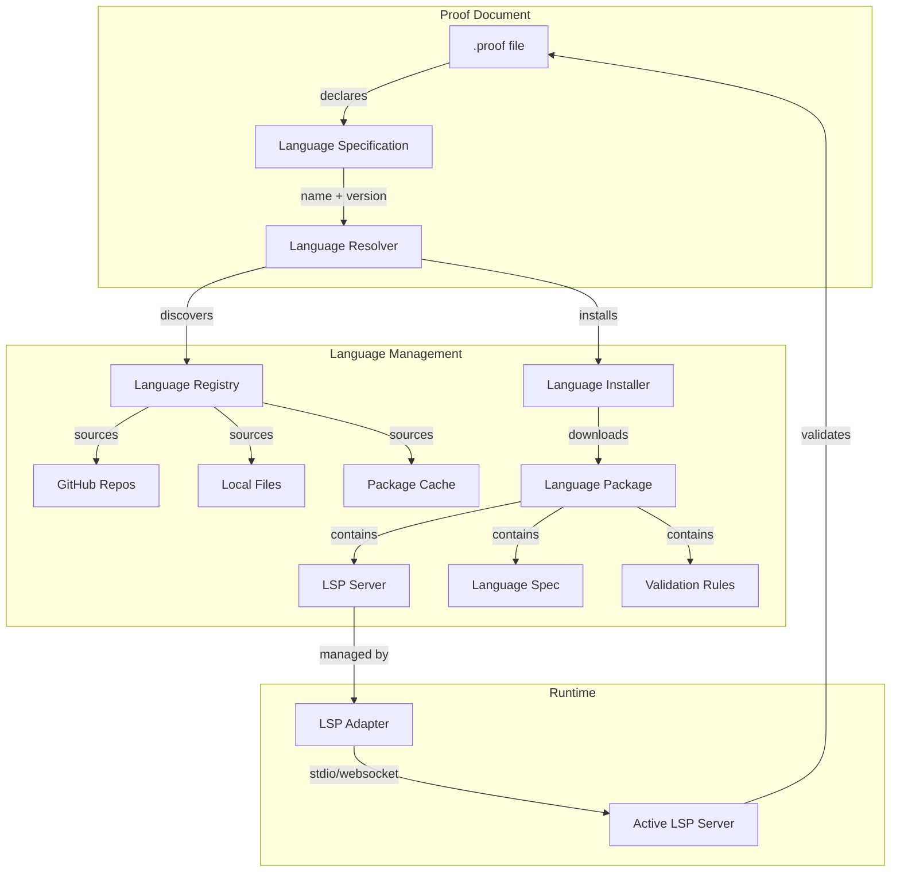

# Language Architecture

## Overview

The Language Management System enables proof files to specify their logical language and automatically loads the appropriate Language Server Protocol (LSP) implementation. This document describes the core concepts, package structure, and how languages integrate with Proof Editor.

Languages are distributed as packages containing LSP servers, validation rules, and language-specific configurations. The system provides hot-swapping, version management, and platform-specific transport mechanisms.

## Core Architecture



## Key Concepts

### Language
A language in Proof Editor represents a specific logical system (e.g., propositional logic, modal logic, first-order logic). Each language defines:
- **Syntax**: What constitutes valid statements
- **Validation Rules**: How to check argument correctness
- **LSP Server**: Provides IDE features like completion, hover, diagnostics
- **Configuration**: Language-specific settings and options

### Language Package
A self-contained bundle that includes everything needed to support a language:
- LSP server implementation (executable or script)
- Language specification manifest
- Validation rule definitions
- Documentation and examples
- Default configuration

### Language Server Protocol (LSP)
Standard protocol for communication between the editor and language-specific servers. Proof Editor extends standard LSP with proof-specific capabilities like argument validation and inference completion.

## Language Declaration in Proof Files

Proof files declare their language in the header:

```yaml
# Modal Logic Proof
version: "1.0"
language:
  name: "modal-logic"
  version: "^1.2.0"
  source: "github:logictools/modal-logic-lsp"
  config:
    strictMode: true
    worldSemantics: "possible-worlds"

# Alternative source formats:
# source: "file:./local-languages/modal-logic"
# source: "https://logic.example.com/packages/modal-logic.tar.gz"
# source: "registry:modal-logic"  # From language registry

# Document content continues...
orderedSets:
  os1: ["□(P → Q)", "□P"]
  os2: ["□Q"]
```

### Source Types
- **GitHub**: `github:owner/repo` - Installs from GitHub repository
- **File**: `file:./path` - Uses local file system
- **URL**: `https://...` - Downloads from URL
- **Registry**: `registry:name` - Uses curated registry

## Language Package Structure

Language packages follow a standardized structure similar to MCP servers:

```
modal-logic-lsp/
├── language-spec.yaml          # Language specification
├── README.md                   # Documentation
├── package.json               # Node.js dependencies (if applicable)
├── server/
│   ├── server.js              # LSP server implementation
│   ├── server.exe             # Platform-specific binaries
│   ├── server-darwin-arm64    # macOS ARM64 binary
│   └── server-linux-x64       # Linux x64 binary
├── validation/
│   ├── rules.json             # Validation rule definitions
│   └── custom-validators.js   # Custom validation logic
├── examples/
│   ├── basic-modal.proof      # Example proofs
│   └── advanced-s5.proof      # Advanced examples
├── config/
│   ├── default-settings.json  # Default configuration
│   └── keybindings.json       # Language-specific keybindings
└── tests/
    └── language-tests.yaml     # Language compliance tests
```

### Directory Structure
- **`server/`**: Contains the LSP server implementation
- **`validation/`**: Validation rules and custom validators
- **`examples/`**: Example proof files demonstrating the language
- **`config/`**: Default settings and configurations
- **`tests/`**: Test cases for language features

## Language Specification Format

The `language-spec.yaml` file defines language capabilities and requirements:

```yaml
# Modal Logic Language Specification
name: "modal-logic"
version: "1.2.3"
description: "Modal Logic validation and analysis with S5 support"
author: "Logic Tools Team"
homepage: "https://github.com/logictools/modal-logic-lsp"
license: "MIT"

# LSP Server Configuration
lsp:
  # Desktop configuration (stdio)
  desktop:
    command: ["node", "server/server.js"]
    args: ["--stdio"]
    transport: "stdio"
    
  # Mobile configuration (websocket)
  mobile:
    transport: "websocket"
    port: 8080
    # Alternative: hosted service
    # service: "wss://api.logictools.com/modal-logic"
    
  # Platform-specific binaries
  binaries:
    darwin-arm64: "server/server-darwin-arm64"
    darwin-x64: "server/server-darwin-x64"
    linux-x64: "server/server-linux-x64"
    win32-x64: "server/server.exe"

# LSP Capabilities
capabilities:
  # Standard LSP features
  textDocument:
    completion: true
    hover: true
    signatureHelp: true
    definition: true
    references: true
    documentSymbol: true
    codeAction: true
    diagnostic: true
    
  # Custom proof-specific capabilities
  proofCapabilities:
    - "proof/validateArgument"
    - "proof/completeInference"
    - "proof/analyzeStructure"
    - "proof/checkConsistency"
    - "proof/findCounterexample"

# Language Dependencies
dependencies:
  # Other languages this builds upon
  languages:
    - name: "propositional-logic"
      version: "^2.0.0"
    - name: "first-order-logic"
      version: "^1.5.0"
      
  # Runtime dependencies
  runtime:
    node: ">=14.0.0"  # If using Node.js
    # python: ">=3.8"  # If using Python
    
# Configuration Schema
configuration:
  properties:
    modalLogic.strictMode:
      type: "boolean"
      default: true
      description: "Enable strict modal logic validation"
      
    modalLogic.worldSemantics:
      type: "string"
      enum: ["possible-worlds", "algebraic", "topological"]
      default: "possible-worlds"
      description: "Modal semantics framework"
      
    modalLogic.axiomSystem:
      type: "string"
      enum: ["K", "T", "S4", "S5", "custom"]
      default: "S5"
      description: "Modal axiom system"
      
    modalLogic.customAxioms:
      type: "array"
      items:
        type: "string"
      description: "Custom axioms when using custom system"

# Validation Rules
validation:
  builtinRules:
    - id: "necessity-distribution"
      description: "□(P→Q) → (□P→□Q)"
    - id: "possibility-consistency"
      description: "◇P → ¬□¬P"
    - id: "reflexivity"
      description: "□P → P (for T and stronger)"
    - id: "transitivity"
      description: "□P → □□P (for S4 and stronger)"
    - id: "euclidean"
      description: "◇P → □◇P (for S5)"
      
  customRules:
    path: "validation/rules.json"
    
# Example Documents
examples:
  - name: "Basic Modal Argument"
    file: "examples/basic-modal.proof"
    description: "Simple necessity and possibility"
  - name: "S5 System Proof"
    file: "examples/advanced-s5.proof"
    description: "Advanced S5 modal logic proof"
  - name: "Epistemic Logic"
    file: "examples/epistemic.proof"
    description: "Knowledge and belief operators"

# Metadata
keywords: ["modal", "logic", "necessity", "possibility", "S5", "Kripke"]
category: "modal-logics"
tags: ["philosophical-logic", "formal-methods", "epistemic"]
```

### Key Sections

#### LSP Configuration
Defines how to start the language server on different platforms:
- **Desktop**: Uses stdio for communication
- **Mobile**: Uses WebSocket or hosted service
- **Binaries**: Platform-specific executables

#### Capabilities
Declares what features the language server supports:
- **Standard LSP**: Completion, hover, diagnostics, etc.
- **Proof-specific**: Custom capabilities for logical validation

#### Dependencies
- **Language dependencies**: Other languages this builds upon
- **Runtime dependencies**: Required runtime environments

#### Configuration Schema
Defines the settings users can configure for the language.

#### Validation Rules
- **Built-in rules**: Common inference rules for the logical system
- **Custom rules**: Path to additional validation logic

## Example Use Cases

### Academic Course Language

```yaml
# Professor creates course-specific language
name: "logic-101-fall-2024"
version: "1.0.0"
description: "Custom logic language for Logic 101"
extends: "first-order-logic@^2.0.0"

# Custom validation rules for assignments
validation:
  customRules:
    - id: "assignment-1-rules"
      file: "validation/assignment1.js"
    - id: "midterm-constraints"
      file: "validation/midterm.js"

# Course-specific notation
configuration:
  notation:
    implication: "⊃"  # Use horseshoe instead of arrow
    universal: "∀"
    existential: "∃"
```

### Research Project Language

```yaml
# Research team custom language
name: "quantum-logic-research"
version: "0.1.0"
description: "Quantum logic for research project"

# Multiple parent languages
dependencies:
  languages:
    - "modal-logic@^1.0.0"
    - "linear-logic@^2.0.0"
    
# Research-specific extensions
capabilities:
  proofCapabilities:
    - "quantum/superposition"
    - "quantum/entanglement"
    - "quantum/measurement"
```

## See Also

- [Language Discovery](./language-discovery.md) - How languages are found and installed
- [LSP Lifecycle](./lsp-lifecycle.md) - Managing language server processes
- [Language Security](./language-security.md) - Security model and verification
- [Platform Abstraction](../platform-abstraction.md) - Platform-specific implementations