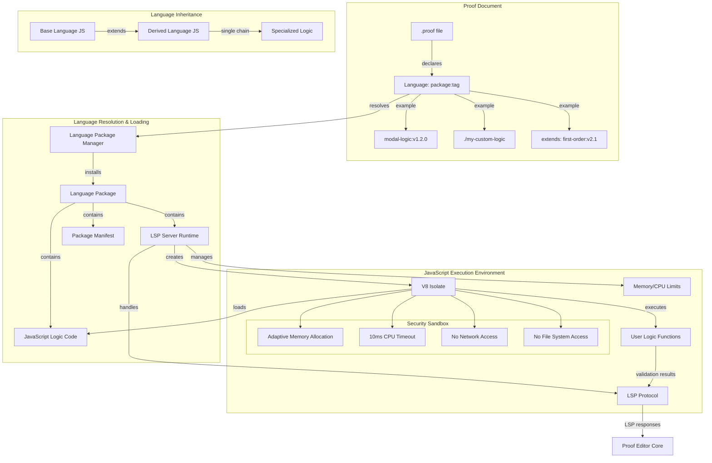

# Language Architecture

## Overview

The Language Management System enables proof files to specify their logical language and automatically loads the appropriate **JavaScript execution environment** via Language Server Protocol (LSP). This document describes how user-defined logic systems execute as JavaScript code within sandboxed V8 Isolates.

**CRITICAL ARCHITECTURAL SHIFT**: Languages are no longer just "configuration + validation rules" - they are **JavaScript execution environments** where user-defined logic code runs. Each language package contains JavaScript implementations of logical reasoning systems that execute within secure V8 Isolates.

### JavaScript Execution Model

Every language package implements custom logic as JavaScript code that executes within:
- **Dedicated V8 Isolate**: Sandboxed JavaScript runtime per language server
- **LSP Server Process**: Manages JavaScript execution and protocol communication
- **Performance Targets**: <10ms validation, <100ms hot reload, adaptive memory allocation
- **Single Language Per Proof**: One active language with inheritance support

## Core Architecture: JavaScript Execution Environment



## Key Concepts

### JavaScript Execution Environment

Every language package contains JavaScript code that implements a complete logical reasoning system. This code executes within a secure V8 Isolate managed by an LSP server process.

#### Core Components

**JavaScript Logic Implementation**
- **Validation Functions**: User-defined JavaScript that checks argument validity
- **Inference Rules**: Custom logic for completing proofs and suggesting next steps  
- **Symbol Handling**: JavaScript code for parsing and rendering logical notation
- **Analysis Functions**: Custom structure analysis and proof checking

**LSP Server Runtime**
- **V8 Isolate Management**: Creates and manages sandboxed JavaScript contexts
- **Protocol Handling**: Implements LSP communication with Proof Editor Core
- **Performance Monitoring**: Enforces 10ms response time targets
- **Security Enforcement**: Memory limits, CPU timeouts, access restrictions

**Package Structure**
- **logic.js**: Main JavaScript file with user-defined reasoning functions
- **server.js**: LSP server that loads and executes logic.js
- **package.yaml**: Manifest with dependencies and capabilities
- **examples/**: Sample proofs demonstrating the logical system

#### Language Inheritance Model

**Single Language Per Proof**: Each proof document uses exactly one active language, but that language can inherit from others:

```javascript
// Base language: first-order-logic
const baseLogic = {
  validateArgument(premises, conclusions, rule, context) {
    // Base first-order logic validation
  }
};

// Derived language: modal-logic extends first-order-logic
const modalLogic = {
  ...baseLogic, // Inherit base functionality
  
  validateArgument(premises, conclusions, rule, context) {
    // Check modal-specific rules first
    if (this.isModalRule(rule)) {
      return this.validateModalRule(premises, conclusions, rule);
    }
    // Fall back to base logic
    return baseLogic.validateArgument(premises, conclusions, rule, context);
  }
};
```

### Docker-Inspired Versioning

#### Package:Tag Format
```yaml
# Remote packages with versioning
language: natural-deduction:latest
language: modal-logic:v1.2.3
language: first-order-logic:stable

# Local development
language: ./my-modal-logic
language: file:../shared-logic

# Inheritance chains
extends: natural-deduction:v2.1.0
```

#### Version Resolution
- **latest**: Most recent stable version
- **v1.2.3**: Specific semantic version
- **stable**: Latest stable (not pre-release)
- **beta**: Latest beta version
- **./path**: Local development directory

### Language Inheritance

#### Single Inheritance Chain
Each proof document uses one inheritance chain:
```yaml
# Simple inheritance
language: epistemic-modal-logic:v1.0
extends: modal-logic:v2.1.0

# Chain resolution: epistemic-modal-logic -> modal-logic -> base
```

#### Conflict Resolution
- **Override rules**: Child language rules take precedence
- **Additive symbols**: Combine symbol sets from chain
- **Explicit conflicts**: Clear error messages for ambiguity
- **Version compatibility**: Semantic versioning prevents breaking changes

## Language Declaration in Proof Files

### Docker-Like Package Declaration

```yaml
# Modern simplified syntax
version: "1.0"
language: modal-logic:v1.2.3

# Local development (file watching enabled)
language: ./my-modal-logic

# Inheritance chain
language: epistemic-logic:latest
extends: modal-logic:v2.1.0

# Configuration overrides
config:
  strictMode: true
  worldSemantics: "possible-worlds"

# Document content continues...
orderedSets:
  os1: ["□(P → Q)", "□P"]
  os2: ["□Q"]
```

### Local Development Workflow

```yaml
# Enable hot reload for local development
language: ./my-logic
# File watching automatically reloads on changes
# Supports rapid iteration and testing
```

### Package Resolution Priority
1. **Local paths**: `./path` or `file:../path`
2. **Cached packages**: Previously downloaded versions
3. **Registry packages**: `package:tag` format
4. **GitHub packages**: `github:owner/repo:tag`
5. **Direct URLs**: `https://...` (fallback)

### Advanced Package Sources

```yaml
# Advanced source specifications
language:
  package: modal-logic:v1.2.3
  source: github:logictools/modal-logic
  fallback: https://cdn.logictools.com/modal-logic-v1.2.3.tar.gz
  integrity: sha256:abc123...
```

## 3-Tier Language Package Structure

### Tier 1: Config YAML Structure

```
modal-logic-basic/
├── package.yaml               # Package metadata and tier specification
├── README.md                  # Documentation
├── config/
│   ├── symbols.yaml          # Logical symbols and notation
│   ├── patterns.yaml         # Inference rule patterns
│   └── validation.yaml       # Declarative validation rules
├── examples/
│   ├── basic-modal.proof     # Example proofs
│   └── tutorials/            # Step-by-step tutorials
└── tests/
    └── pattern-tests.yaml    # Test cases for patterns
```

### Tier 2: JavaScript Rules Structure

```
modal-logic-js/
├── package.yaml              # Package metadata (tier: javascript)
├── README.md                 # Documentation
├── config/
│   ├── symbols.yaml         # Symbol definitions (inherited from Tier 1)
│   └── settings.yaml        # Configuration schema
├── rules/
│   ├── validators.js        # Custom validation functions
│   ├── generators.js        # Template-based rule generation
│   └── helpers.js           # Utility functions
├── examples/
│   ├── advanced-modal.proof # Complex examples
│   └── rule-demos/         # Examples showing custom rules
└── tests/
    ├── validator-tests.js   # JavaScript rule tests
    └── integration-tests.yaml
```

### Tier 3: Full LSP Structure

```
modal-logic-lsp/
├── package.yaml              # Package metadata (tier: lsp)
├── README.md                 # Documentation
├── lsp-server/
│   ├── server.js            # LSP server implementation
│   ├── server.exe           # Platform-specific binaries
│   ├── server-darwin-arm64  # macOS ARM64 binary
│   └── server-linux-x64     # Linux x64 binary
├── config/
│   ├── capabilities.yaml   # LSP capabilities declaration
│   ├── symbols.yaml        # Symbol definitions
│   └── settings.yaml       # Configuration schema
├── validation/
│   ├── core-rules.js       # Core validation logic
│   ├── proof-analysis.js   # Advanced proof analysis
│   └── external-tools.js   # Integration with theorem provers
├── examples/
│   ├── complex-proofs/     # Advanced examples
│   ├── integrations/       # External tool examples
│   └── performance/        # Large proof examples
└── tools/
    ├── development.js      # Development utilities
    ├── testing.js          # Testing framework
    └── migration.js        # Version migration tools
```

### Progressive Enhancement Pattern
- **Start simple**: Begin with Tier 1 (YAML config)
- **Add complexity**: Upgrade to Tier 2 (JavaScript) when needed
- **Full power**: Move to Tier 3 (LSP) for advanced requirements
- **Inheritance preserved**: Higher tiers inherit lower tier definitions

## Package Specification Format

### Universal Package.yaml Structure

All tiers use the same `package.yaml` format with tier-specific sections:

```yaml
# Universal package metadata
name: "modal-logic"
version: "1.2.3"
description: "Modal Logic validation and analysis with S5 support"
author: "Logic Tools Team"
homepage: "https://github.com/logictools/modal-logic"
license: "MIT"

# Tier specification
tier: "config"  # or "javascript" or "lsp"

# Inheritance chain
extends: "propositional-logic:v2.0.0"

# Docker-like versioning
tags:
  - "latest"
  - "v1.2.3"
  - "stable"
  - "s5-axioms"

# Tier 1: Config YAML Specification
config:
  # Symbol definitions
  symbols:
    necessity: "□"
    possibility: "◇"
    implication: "→"
    
  # Inference patterns (declarative)
  patterns:
    - name: "necessity-distribution"
      pattern: "□(P → Q) → (□P → □Q)"
      description: "Distribution of necessity over implication"
      
    - name: "possibility-definition"
      pattern: "◇P ↔ ¬□¬P"
      description: "Possibility as negated necessity"

# Tier 2: JavaScript Rules (when tier: "javascript")
javascript:
  # Custom validation functions
  validators:
    - "rules/modal-validators.js"
    - "rules/s5-validators.js"
    
  # Template-based rule generation
  ruleGeneration:
    enabled: true
    examples: "examples/generation-examples/"
    
# Tier 3: LSP Server Configuration (when tier: "lsp")
lsp:
  # Server configuration
  server:
    command: ["node", "lsp-server/server.js"]
    args: ["--stdio"]
    transport: "stdio"
    
  # Platform-specific binaries
  binaries:
    darwin-arm64: "lsp-server/server-darwin-arm64"
    darwin-x64: "lsp-server/server-darwin-x64"
    linux-x64: "lsp-server/server-linux-x64"
    win32-x64: "lsp-server/server.exe"

# Tier-Specific Capabilities
capabilities:
  # Tier 1: Config YAML capabilities
  config:
    - "pattern-matching"      # Declarative rule patterns
    - "symbol-validation"     # Symbol syntax checking
    - "basic-completion"      # Symbol and operator completion
    - "error-reporting"       # Pattern violation messages
    
  # Tier 2: JavaScript capabilities (includes Tier 1)
  javascript:
    - "custom-validation"     # JavaScript validation functions
    - "dynamic-patterns"      # Context-dependent rules
    - "template-generation"   # Template-based rule creation
    - "advanced-completion"   # Context-aware suggestions
    
  # Tier 3: Full LSP capabilities (includes Tier 1 & 2)
  lsp:
    # Standard LSP features
    textDocument:
      completion: true
      hover: true
      signatureHelp: true
      definition: true
      references: true
      documentSymbol: true
      codeAction: true
      diagnostic: true
      
    # Custom proof-specific capabilities
    proofCapabilities:
      - "proof/validateArgument"
      - "proof/completeInference"
      - "proof/analyzeStructure"
      - "proof/checkConsistency"
      - "proof/findCounterexample"
      - "proof/externalProver"    # Integration with external tools

# Inheritance and Dependencies
inheritance:
  # Single inheritance chain (Docker-like)
  extends: "propositional-logic:v2.0.0"
  
  # Inheritance resolution
  conflictResolution: "child-overrides"  # Child rules take precedence
  symbolMerging: "additive"             # Combine symbol sets
  
dependencies:
  # Runtime dependencies (tier-specific)
  runtime:
    # Tier 1: No runtime dependencies
    config: []
    
    # Tier 2: JavaScript runtime
    javascript:
      - "node: >=16.0.0"
      - "sandbox: safe-eval"
      
    # Tier 3: Full LSP runtime
    lsp:
      - "node: >=16.0.0"
      - "optional: z3-solver"  # For advanced reasoning
      - "optional: coq"        # For formal verification
    
# Local Development Configuration
localDevelopment:
  # File watching for hot reload
  fileWatching:
    enabled: true
    paths:
      - "config/**/*.yaml"
      - "rules/**/*.js"
      - "lsp-server/**/*.js"
    debounceMs: 500
    
  # Development server
  devServer:
    port: 3001
    hotReload: true
    debugMode: true
    
# Configuration Schema
configuration:
  properties:
    # Core configuration (all tiers)
    modalLogic.axiomSystem:
      type: "string"
      enum: ["K", "T", "S4", "S5", "custom"]
      default: "S5"
      description: "Modal axiom system"
      
    modalLogic.strictMode:
      type: "boolean"
      default: true
      description: "Enable strict modal logic validation"
      
    # Tier-specific configuration
    modalLogic.tier:
      type: "string"
      enum: ["config", "javascript", "lsp"]
      default: "config"
      description: "SDK tier to use"
      
    # Advanced configuration (Tier 2+)
    modalLogic.templateGeneration:
      type: "boolean"
      default: false
      description: "Enable template-based rule generation"
      tier: "javascript"
      
    # Expert configuration (Tier 3 only)
    modalLogic.externalProvers:
      type: "array"
      items:
        type: "string"
      description: "External theorem provers to integrate"
      tier: "lsp"

# Tier-Specific Validation Rules
validation:
  # Tier 1: Declarative YAML patterns
  configRules:
    patterns:
      - id: "necessity-distribution"
        pattern: "□(P→Q) → (□P→□Q)"
        description: "Distribution of necessity over implication"
        axiomSystems: ["K", "T", "S4", "S5"]
        
      - id: "possibility-definition"
        pattern: "◇P ↔ ¬□¬P"
        description: "Possibility as negated necessity"
        axiomSystems: ["K", "T", "S4", "S5"]
        
      - id: "reflexivity"
        pattern: "□P → P"
        description: "Reflexivity (for T and stronger)"
        axiomSystems: ["T", "S4", "S5"]
        
  # Tier 2: JavaScript custom rules
  javascriptRules:
    validators:
      - path: "rules/modal-validators.js"
        functions: ["validateNecessityRule", "validatePossibilityRule"]
      - path: "rules/s5-validators.js"
        functions: ["validateEuclideanProperty"]
        
    # Template-based rule generation
    ruleGeneration:
      enabled: true
      examplePath: "examples/rule-examples/"
      outputPath: "rules/generated/"
      
  # Tier 3: Full LSP validation
  lspRules:
    server: "lsp-server/validation-server.js"
    externalTools:
      - name: "z3"
        command: "z3 -smt2"
        timeout: 5000
      - name: "lean"
        command: "lean --check"
        timeout: 10000
    
# Example Documents by Tier
examples:
  # Tier 1: Config YAML examples
  tier1:
    - name: "Basic Modal Patterns"
      file: "examples/tier1/basic-modal.proof"
      description: "Simple necessity and possibility patterns"
      demonstrates: ["necessity-distribution", "possibility-definition"]
      
    - name: "Axiom System Comparison"
      file: "examples/tier1/axiom-systems.proof"
      description: "Differences between K, T, S4, S5"
      demonstrates: ["reflexivity", "transitivity", "euclidean"]
      
  # Tier 2: JavaScript examples
  tier2:
    - name: "Custom Modal Rules"
      file: "examples/tier2/custom-rules.proof"
      description: "Using JavaScript custom validators"
      demonstrates: ["custom-validation", "dynamic-patterns"]
      
    - name: "Template-Generated Rules"
      file: "examples/tier2/template-generated.proof"
      description: "Rules created with template assistance"
      demonstrates: ["template-generation", "pattern-learning"]
      
  # Tier 3: Full LSP examples
  tier3:
    - name: "External Prover Integration"
      file: "examples/tier3/external-provers.proof"
      description: "Integration with Z3 and Lean"
      demonstrates: ["external-tools", "automated-proving"]
      
    - name: "Complex Modal Systems"
      file: "examples/tier3/complex-systems.proof"
      description: "Advanced modal logic with performance optimization"
      demonstrates: ["performance", "scalability"]

# Package Metadata
metadata:
  keywords: ["modal", "logic", "necessity", "possibility", "S5", "Kripke"]
  category: "modal-logics"
  tags: ["philosophical-logic", "formal-methods", "epistemic"]
  
  # Tier progression information
  tierInfo:
    recommendedStartTier: "config"
    progressionPath: ["config", "javascript", "lsp"]
    complexityIndicators:
      config: "Basic modal logic patterns"
      javascript: "Custom validation needs"
      lsp: "Advanced reasoning and external tools"
```

### Key Package Components

#### Tier Specification
Defines which SDK tier the package uses:
- **config**: Pure YAML declarative patterns (90% of cases)
- **javascript**: Custom JavaScript validation rules (9% of cases)
- **lsp**: Full Language Server Protocol implementation (1% of cases)

#### Inheritance Chain
Single inheritance with Docker-like versioning:
- **extends**: Parent language with version (e.g., "modal-logic:v2.1.0")
- **Conflict resolution**: Clear rules for handling inheritance conflicts
- **Progressive enhancement**: Higher tiers inherit lower tier capabilities

#### Local Development Support
Built-in development workflow features:
- **File watching**: Automatic reloading on changes
- **Hot reload**: Live updates without restart
- **Debug mode**: Enhanced error reporting and logging
- **Test integration**: Automatic test running on changes

#### Versioning Strategy
Docker-inspired package management:
- **Semantic versions**: v1.2.3 for specific releases
- **Tag aliases**: latest, stable, beta for convenience
- **Local development**: ./path for file watching
- **Integrity checking**: SHA256 verification for security

#### Progressive Capabilities
Features unlock as complexity increases:
- **Tier 1**: Pattern matching, symbol validation, basic completion
- **Tier 2**: Custom JavaScript logic, template generation, dynamic patterns
- **Tier 3**: Full IDE features, external tools, performance optimization

## Progressive Development Examples

### Start Simple: Tier 1 Config YAML

```yaml
# Professor creates course-specific language
name: "logic-101-fall-2024"
version: "1.0.0"
description: "Introduction to Logic course language"
tier: "config"
extends: "propositional-logic:v2.0.0"

# Simple declarative patterns
config:
  symbols:
    implication: "⊃"  # Use horseshoe for course
    conjunction: "&"
    disjunction: "∨"
    
  patterns:
    - name: "modus-ponens"
      pattern: "P, P ⊃ Q ⊢ Q"
      description: "Basic modus ponens for beginners"
      
    - name: "modus-tollens"
      pattern: "P ⊃ Q, ¬Q ⊢ ¬P"
      description: "Modus tollens introduction"

# Local development for course updates
localDevelopment:
  fileWatching: true  # Auto-reload when course materials change
```

### Add Complexity: Tier 2 JavaScript Rules

```yaml
# Advanced course with custom grading logic
name: "logic-301-advanced"
version: "2.0.0"
description: "Advanced Logic with custom validation"
tier: "javascript"
extends: "first-order-logic:v3.0.0"

# Custom JavaScript validation for complex assignments
javascript:
  validators:
    - "rules/assignment-grading.js"    # Custom grading logic
    - "rules/proof-complexity.js"      # Complexity metrics
    - "rules/style-checking.js"        # Proof style validation
    
  # Template-based rule generation from examples
  ruleGeneration:
    enabled: true
    examples: "examples/student-proofs/"
    generateFromTemplates: true
```

### Full Power: Tier 3 LSP Extension

```yaml
# Research team with external tool integration
name: "quantum-logic-research"
version: "0.1.0"
description: "Quantum logic research environment"
tier: "lsp"
extends: "modal-logic:v2.0.0"

# Full LSP server with external tools
lsp:
  server: "research-tools/quantum-lsp-server.js"
  
  # Integration with external quantum reasoning tools
  externalTools:
    - name: "qiskit"
      command: "python qiskit-verify.py"
      timeout: 30000
      
    - name: "cirq"
      command: "python cirq-analyze.py"
      timeout: 15000
      
  capabilities:
    proofCapabilities:
      - "quantum/superposition-check"
      - "quantum/entanglement-verify"
      - "quantum/circuit-generation"
      - "quantum/noise-analysis"

# Performance optimization for large quantum proofs
performance:
  caching: true
  parallelValidation: true
  maxProofSize: 10000  # Large quantum circuit proofs
```

### Local Development Workflow

```yaml
# Local development language (./my-modal-logic/package.yaml)
name: "my-modal-logic"
version: "dev"
description: "Local development version"
tier: "javascript"  # Start with JavaScript tier
extends: "modal-logic:stable"

# Hot reload enabled for rapid iteration
localDevelopment:
  fileWatching: true
  debounceMs: 200    # Fast reloads for development
  debugMode: true    # Extra logging
  testMode: true     # Run tests on changes
  
# Development-specific configuration
devConfig:
  strictValidation: false  # Allow incomplete rules during dev
  showInternalErrors: true # Detailed error messages
  enableProfiling: true    # Performance measurements
  autoGenerateTests: true  # Create tests from examples
```

## Migration Path Between Tiers

### Tier 1 → Tier 2 Migration

```yaml
# Original Tier 1 config
config:
  patterns:
    - name: "custom-rule"
      pattern: "Complex pattern that YAML can't express"
      
# Migrated to Tier 2 JavaScript
javascript:
  validators:
    - "rules/custom-rule.js"  # Implement complex logic in JavaScript
    
migration:
  from: "config"
  to: "javascript"
  reason: "Need dynamic validation logic"
  preserves: ["symbols", "basic-patterns"]
```

### Tier 2 → Tier 3 Migration

```yaml
# Performance or integration requirements drive LSP migration
lsp:
  server: "advanced-lsp/server.js"
  reason: "Need external tool integration and performance"
  
migration:
  from: "javascript"
  to: "lsp"
  preserves: ["symbols", "patterns", "validators"]
  adds: ["external-tools", "advanced-ide-features"]
```

## Template-Based Rule Generation

### Example-Driven Rule Creation

```yaml
# Template-based rule generation configuration
ruleGeneration:
  enabled: true
  
  # Provide examples for pattern recognition
  examples:
    - input: "□P, P → Q"
      output: "□Q"
      description: "Necessity preserves valid inference"
      
    - input: "◇P, P → Q"
      output: "Not valid"  # Learn what's invalid too
      description: "Possibility doesn't preserve inference"
      
  # Generate JavaScript validator from templates
  output:
    path: "rules/generated/template-modal-rules.js"
    format: "javascript"
    humanReviewRequired: true
```

## See Also

- [3-Tier SDK Guide](./sdk-tiers.md) - Detailed tier progression guide
- [Local Development Workflow](./local-development.md) - Hot reload and iteration
- [Language Inheritance](./inheritance.md) - Inheritance chains and conflict resolution
- [Docker-Like Versioning](./versioning.md) - Package:tag format and resolution
- [Template Rule Generation](./template-generation.md) - Template-based rule creation
- [Migration Guide](./tier-migration.md) - Moving between tiers
- [Language Security](./language-security.md) - Security model across tiers
- [Platform Abstraction](../platform-abstraction.md) - Platform-specific implementations