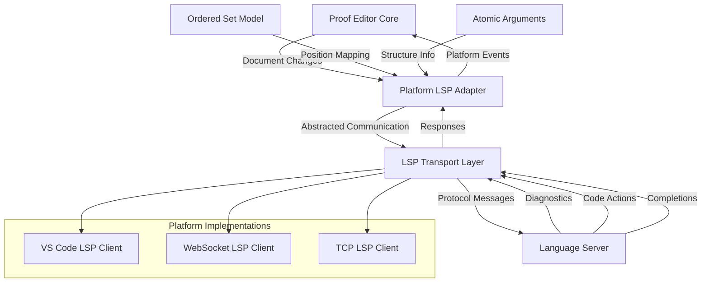

# Language Server Protocol (LSP) Integration

## Overview

Proof Editor uses the Language Server Protocol to provide language-specific features while maintaining a clean separation between the core platform and individual proof languages. This document defines how language servers integrate with the Proof Editor platform across different host environments (VS Code, React Native mobile apps, etc.).

## Recommended Architecture

> **Note**: This represents a recommended implementation approach based on LSP integration requirements. Specific architectural decisions should be validated during the design phase.



## Position Mapping

The core challenge is mapping between Proof Editor's structured model and LSP's text-based position system.

### Document Serialization for LSP

The platform serializes the proof structure into a virtual text document:

```
# Atomic Argument: arg1
## Premises
1. All men are mortal
2. Socrates is a man
## Conclusions
1. Socrates is mortal
## Metadata
Rule: Modus Ponens

# Atomic Argument: arg2
...
```

### Position Mapping Protocol

```typescript
interface ProofPosition {
  argumentId: string;
  component: 'premise' | 'conclusion' | 'rule' | 'sideLabel';
  orderedSetId?: string;
  itemIndex?: number;
  characterOffset: number;
}

interface PositionMapping {
  proofToLsp(pos: ProofPosition): lsp.Position;
  lspToProof(pos: lsp.Position): ProofPosition;
}
```

## Extended LSP Capabilities

### Custom Requests

#### Validation Request
```typescript
// Client → Server
interface ValidateArgumentRequest {
  method: 'proof/validateArgument';
  params: {
    argumentId: string;
    premises: string[];
    conclusions: string[];
    rule?: string;
    context: ArgumentContext;
  };
}

// Server → Client
interface ValidateArgumentResponse {
  valid: boolean;
  diagnostics: Diagnostic[];
  suggestedRules?: string[];
}
```

#### Inference Completion
```typescript
// Client → Server
interface InferenceCompletionRequest {
  method: 'proof/completeInference';
  params: {
    premises: string[];
    partialConclusion?: string;
    context: ArgumentContext;
  };
}

// Server → Client
interface InferenceCompletionResponse {
  completions: {
    conclusion: string;
    rule: string;
    confidence: number;
  }[];
}
```

#### Structure Analysis
```typescript
// Client → Server
interface AnalyzeStructureRequest {
  method: 'proof/analyzeStructure';
  params: {
    treeRootId: string;
    includeMetrics: boolean;
  };
}

// Server → Client
interface AnalyzeStructureResponse {
  openPremises: string[];
  openConclusions: string[];
  circularDependencies: string[][];
  metrics?: {
    depth: number;
    breadth: number;
    totalArguments: number;
  };
}
```

#### Tree Query Protocol
```typescript
// Client → Server
interface ProofQueryRequest {
  method: 'proof/query';
  params: {
    textDocument: TextDocumentIdentifier;
    query: string;  // ProofPath expression
    context?: {     // Optional starting node
      nodeId: string;
    };
  };
}

// Server → Client
interface ProofQueryResponse {
  results: ProofNode[];
  executionTime: number;  // Milliseconds
}

// Client → Server
interface ProofNavigateRequest {
  method: 'proof/navigate';
  params: {
    textDocument: TextDocumentIdentifier;
    from: NodeIdentifier;
    axis: NavigationAxis;
    steps?: number;  // For ancestor[n] navigation
  };
}

type NavigationAxis = 
  | 'parent' 
  | 'ancestor' 
  | 'proof-root'
  | 'premise-parent'
  | 'conclusion-child';

interface ProofNavigateResponse {
  target: ProofNode | null;
  path?: ProofNode[];  // For multi-step navigation
}
```

### Standard LSP Features

#### Text Document Synchronization
- Incremental sync for individual statement edits
- Full sync on structural changes (adding/removing arguments)
- Custom change notifications for reordering

#### Diagnostics
- Syntax errors in logical notation
- Invalid inference rules
- Undefined references
- Circular reasoning detection

#### Code Completion
- Logical operators and quantifiers
- Previously used statements
- Valid inference rules
- Referenced theorems

#### Hover Information
- Rule explanations
- Symbol definitions
- Theorem statements
- Quick proof previews

#### Code Actions
- Fix invalid syntax
- Apply inference rules
- Extract sub-proofs
- Introduce lemmas

## Implementation Guidelines

### Language Server Requirements

1. **Stateless Operation**: Servers should not maintain document state
2. **Fast Response**: Validation should complete within 100ms
3. **Incremental Updates**: Support partial document validation
4. **Error Recovery**: Gracefully handle malformed input

### Platform Responsibilities

1. **Document Management**: Maintain authoritative document state
2. **Position Mapping**: Convert between model and text positions  
3. **Change Batching**: Aggregate related changes before sending
4. **Error Handling**: Gracefully degrade if LSP unavailable

### Communication Protocol

```typescript
interface ProofDocumentChange {
  type: 'structure' | 'content' | 'metadata';
  changes: Array<{
    argumentId: string;
    change: StructuralChange | ContentChange | MetadataChange;
  }>;
}

interface StructuralChange {
  type: 'add' | 'remove' | 'reorder';
  // ... change specifics
}

interface ContentChange {
  type: 'edit' | 'replace';
  orderedSetId: string;
  itemIndex?: number;
  text: string;
}
```

## Language Server Examples

### First-Order Logic Server

Provides:
- Syntax validation for FOL notation
- Natural deduction rule checking
- Quantifier scope analysis
- Theorem database integration

### Modal Logic Server  

Provides:
- Modal operator validation
- Kripke semantics visualization hints
- Accessibility relation checking
- Modal theorem prover integration

### Type Theory Server

Provides:
- Type checking for terms
- Proof term generation
- Dependent type validation
- Tactic suggestions

## Transport Layer Abstraction

The LSP adapter supports multiple transport mechanisms to enable cross-platform compatibility:

### Transport Types

#### Standard I/O (stdio)
- **Desktop/VS Code**: Direct process communication
- **Mobile**: Not supported (requires process spawning)
- **Use case**: Local language server processes

#### WebSocket
- **Desktop/VS Code**: WebSocket client connection
- **Mobile**: Native WebSocket support
- **Use case**: Remote language servers, mobile apps

#### TCP Socket
- **Desktop/VS Code**: TCP client connection  
- **Mobile**: TCP socket support
- **Use case**: Network-based language servers

#### HTTP/REST
- **Desktop/VS Code**: HTTP client requests
- **Mobile**: Native HTTP support
- **Use case**: Stateless language analysis services

### Configuration

Language servers are configured through the platform's settings system:

```json
{
  "proofEditor.languageServers": {
    "firstOrderLogic": {
      "id": "fol-server",
      "name": "First Order Logic Server", 
      "transport": "stdio",
      "command": "fol-server",
      "args": ["--stdio"],
      "languages": ["fol", "predicate-logic"]
    },
    "modalLogicRemote": {
      "id": "modal-logic-remote",
      "name": "Modal Logic Server (Remote)",
      "transport": "websocket",
      "address": "logic.example.com",
      "port": 8080,
      "languages": ["modal", "temporal"]
    },
    "mobileProver": {
      "id": "mobile-prover",
      "name": "Mobile Theorem Prover",
      "transport": "http",
      "baseUrl": "https://api.prover.com/v1",
      "apiKey": "your-api-key",
      "languages": ["propositional"]
    }
  }
}
```

## Platform-Specific Implementations

### VS Code LSP Adapter

```typescript
class VSCodeLSPAdapter implements LSPAdapter {
  private clients = new Map<string, LanguageClient>();
  
  async startServer(config: LSPServerConfig): Promise<LSPServerHandle> {
    if (config.transport === 'stdio') {
      const serverOptions: ServerOptions = {
        command: config.command,
        args: config.args,
        options: { cwd: config.workingDirectory }
      };
      
      const client = new LanguageClient(
        config.id,
        config.name,
        serverOptions,
        this.getClientOptions()
      );
      
      await client.start();
      this.clients.set(config.id, client);
      
      return { id: config.id, dispose: () => client.stop() };
    }
    
    // Handle other transport types...
  }
}
```

### React Native LSP Adapter

```typescript
class ReactNativeLSPAdapter implements LSPAdapter {
  private connections = new Map<string, LSPConnection>();
  
  async startServer(config: LSPServerConfig): Promise<LSPServerHandle> {
    if (config.transport === 'websocket') {
      const connection = new WebSocketLSPConnection(
        `ws://${config.address}:${config.port}`
      );
      
      await connection.connect();
      this.connections.set(config.id, connection);
      
      return {
        id: config.id,
        dispose: () => connection.close()
      };
    }
    
    if (config.transport === 'http') {
      const connection = new HTTPLSPConnection(config.baseUrl, {
        apiKey: config.apiKey
      });
      
      this.connections.set(config.id, connection);
      
      return {
        id: config.id,
        dispose: () => this.connections.delete(config.id)
      };
    }
    
    throw new Error(`Unsupported transport: ${config.transport}`);
  }
  
  async sendRequest<T>(serverId: string, method: string, params: any): Promise<T> {
    const connection = this.connections.get(serverId);
    if (!connection) {
      throw new Error(`Server ${serverId} not connected`);
    }
    
    return await connection.sendRequest(method, params);
  }
}
```

### Mobile-Specific Considerations

#### WebSocket LSP Connection
```typescript
class WebSocketLSPConnection {
  private ws: WebSocket;
  private requestId = 0;
  private pendingRequests = new Map<number, { resolve: Function; reject: Function }>();
  
  constructor(private url: string) {}
  
  async connect(): Promise<void> {
    return new Promise((resolve, reject) => {
      this.ws = new WebSocket(this.url);
      
      this.ws.onopen = () => resolve();
      this.ws.onerror = (error) => reject(error);
      this.ws.onmessage = (event) => this.handleMessage(event);
    });
  }
  
  async sendRequest<T>(method: string, params: any): Promise<T> {
    const id = ++this.requestId;
    const request = {
      jsonrpc: '2.0',
      id,
      method,
      params
    };
    
    return new Promise((resolve, reject) => {
      this.pendingRequests.set(id, { resolve, reject });
      this.ws.send(JSON.stringify(request));
      
      // Timeout after 30 seconds
      setTimeout(() => {
        if (this.pendingRequests.has(id)) {
          this.pendingRequests.delete(id);
          reject(new Error('Request timeout'));
        }
      }, 30000);
    });
  }
  
  private handleMessage(event: MessageEvent): void {
    const message = JSON.parse(event.data);
    
    if (message.id && this.pendingRequests.has(message.id)) {
      const { resolve, reject } = this.pendingRequests.get(message.id)!;
      this.pendingRequests.delete(message.id);
      
      if (message.error) {
        reject(new Error(message.error.message));
      } else {
        resolve(message.result);
      }
    }
  }
}
```

#### HTTP LSP Connection (for stateless services)
```typescript
class HTTPLSPConnection {
  constructor(
    private baseUrl: string,
    private options: { apiKey?: string } = {}
  ) {}
  
  async sendRequest<T>(method: string, params: any): Promise<T> {
    const url = `${this.baseUrl}/${method}`;
    const headers: Record<string, string> = {
      'Content-Type': 'application/json'
    };
    
    if (this.options.apiKey) {
      headers['Authorization'] = `Bearer ${this.options.apiKey}`;
    }
    
    const response = await fetch(url, {
      method: 'POST',
      headers,
      body: JSON.stringify(params)
    });
    
    if (!response.ok) {
      throw new Error(`HTTP ${response.status}: ${response.statusText}`);
    }
    
    return await response.json();
  }
}
```

## Performance Considerations

### Debouncing
- Validation requests debounced by 300ms during typing
- Immediate validation on structural changes
- Batch position mappings for efficiency

### Caching
- Cache position mappings per document version
- Reuse validation results for unchanged arguments
- Invalidate caches on structural changes

### Mobile Optimizations
- Connection pooling for HTTP-based LSP services
- Aggressive caching for mobile bandwidth conservation
- Offline mode with cached validation results
- Background sync when connection restored

### Progressive Enhancement
- Core features work without LSP
- Graceful degradation if server crashes
- Optional features clearly marked in UI
- Platform-appropriate fallbacks (local vs remote processing)

## Testing Language Servers

### Test Harness
The platform provides a test harness for language server development:

```typescript
interface TestCase {
  input: ProofDocument;
  expectedDiagnostics: Diagnostic[];
  expectedCompletions?: CompletionItem[];
}

class LanguageServerTestHarness {
  async runTests(server: string, tests: TestCase[]): Promise<TestResults>;
}
```

### Compliance Tests
All language servers must pass core compliance tests:
- Position mapping accuracy
- Change notification handling  
- Performance benchmarks
- Error recovery scenarios

## Future Extensions

### Proof Automation
- Automated proof search
- Tactic application
- Proof simplification
- Counter-example generation

### Collaborative Features
- Shared validation state
- Conflict resolution for concurrent edits
- Proof review annotations
- Change attribution

### Advanced Analysis
- Proof complexity metrics
- Style checking
- Best practice suggestions
- Learning recommendations