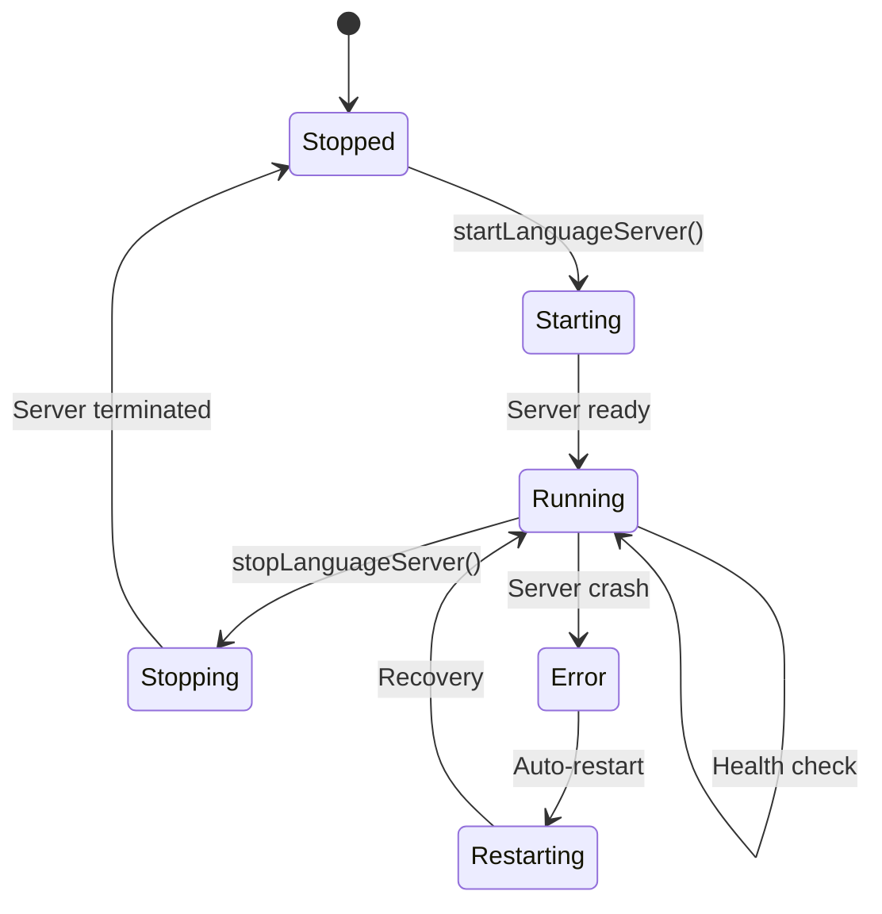

# LSP Lifecycle Management

## Overview

This document details how Proof Editor manages Language Server Protocol (LSP) servers throughout their lifecycle - from startup through shutdown, including health monitoring, platform-specific transports, hot-swapping capabilities, and ultra-fast performance optimization for single-user experience.

## Server Lifecycle

### Lifecycle Stages



### Server Manager

The central component managing all language servers:

```typescript
interface LanguageServerManager {
  // Server lifecycle
  async startLanguageServer(language: string): Promise<ServerHandle> {
    const installation = await this.languageManager.getInstallation(language);
    const config = await this.loadServerConfig(installation);
    
    // Platform-specific server startup
    const adapter = this.platform.lsp;
    const handle = await adapter.startServer({
      id: `language-${language}`,
      name: installation.manifest.name,
      command: config.command,
      args: config.args,
      transport: config.transport,
      // ... platform-specific config
    });
    
    // Health monitoring
    this.monitorHealth(handle);
    
    return handle;
  }
  
  async stopLanguageServer(language: string): Promise<void>;
  async restartLanguageServer(language: string): Promise<void>;
  
  // Hot-swapping support
  async swapLanguage(
    document: ProofDocument,
    newLanguage: LanguageSpec
  ): Promise<void> {
    // Save document state
    const state = await this.saveDocumentState(document);
    
    // Stop old server
    await this.stopLanguageServer(document.language.name);
    
    // Install new language if needed
    if (!await this.isInstalled(newLanguage)) {
      await this.installLanguage(newLanguage);
    }
    
    // Start new server
    await this.startLanguageServer(newLanguage.name);
    
    // Restore document state
    await this.restoreDocumentState(document, state);
    
    // Revalidate with new language
    await this.revalidateDocument(document);
  }
  
  // Health monitoring
  monitorHealth(handle: ServerHandle): void {
    setInterval(async () => {
      const health = await this.checkHealth(handle);
      if (health.status === 'unhealthy') {
        await this.handleUnhealthyServer(handle);
      }
    }, 30000); // Check every 30 seconds
  }
}
```

### Server Handle

Represents a running language server:

```typescript
interface ServerHandle {
  id: string;
  language: string;
  process?: any;
  transport: Transport;
  status: 'starting' | 'running' | 'stopping' | 'stopped' | 'error';
  startTime: Date;
  dispose(): Promise<void>;
}
```

## Platform-Specific Transports

Different platforms require different communication mechanisms:

### Desktop: stdio Transport

Standard input/output for desktop environments:

```typescript
class StdioTransport implements Transport {
  private process: ChildProcess;
  private connection: MessageConnection;
  
  async start(config: ServerConfig): Promise<void> {
    // Spawn language server process
    this.process = spawn(config.command, config.args, {
      stdio: ['pipe', 'pipe', 'pipe']
    });
    
    // Create JSON-RPC connection
    const reader = new StreamMessageReader(this.process.stdout);
    const writer = new StreamMessageWriter(this.process.stdin);
    this.connection = createMessageConnection(reader, writer);
    
    // Start listening
    this.connection.listen();
  }
  
  async sendRequest(method: string, params: any): Promise<any> {
    return this.connection.sendRequest(method, params);
  }
  
  async sendNotification(method: string, params: any): Promise<void> {
    this.connection.sendNotification(method, params);
  }
  
  async stop(): Promise<void> {
    this.connection.dispose();
    this.process.kill('SIGTERM');
  }
}
```

### Mobile: WebSocket Transport

WebSocket for mobile and web environments:

```typescript
class WebSocketTransport implements Transport {
  private ws: WebSocket;
  private connection: MessageConnection;
  
  async start(config: ServerConfig): Promise<void> {
    // Connect to WebSocket server
    this.ws = new WebSocket(`ws://${config.address}:${config.port}`);
    
    // Wait for connection
    await new Promise((resolve, reject) => {
      this.ws.onopen = resolve;
      this.ws.onerror = reject;
    });
    
    // Create JSON-RPC connection
    const reader = new WebSocketMessageReader(this.ws);
    const writer = new WebSocketMessageWriter(this.ws);
    this.connection = createMessageConnection(reader, writer);
    
    // Start listening
    this.connection.listen();
  }
  
  // Reconnection logic for mobile
  async reconnect(): Promise<void> {
    await this.stop();
    await this.start(this.config);
  }
}
```

### Alternative: HTTP Transport

For stateless operations or restricted environments:

```typescript
class HttpTransport implements Transport {
  private baseUrl: string;
  private session: string;
  
  async start(config: ServerConfig): Promise<void> {
    this.baseUrl = `${config.protocol}://${config.address}:${config.port}`;
    
    // Initialize session
    const response = await fetch(`${this.baseUrl}/initialize`, {
      method: 'POST',
      headers: { 'Content-Type': 'application/json' },
      body: JSON.stringify({ capabilities: this.getClientCapabilities() })
    });
    
    const data = await response.json();
    this.session = data.sessionId;
  }
  
  async sendRequest(method: string, params: any): Promise<any> {
    const response = await fetch(`${this.baseUrl}/${method}`, {
      method: 'POST',
      headers: {
        'Content-Type': 'application/json',
        'X-Session-ID': this.session
      },
      body: JSON.stringify(params)
    });
    
    return response.json();
  }
}
```

## Health Monitoring

### Health Checks

Regular health checks ensure server reliability:

```typescript
interface HealthMonitor {
  async checkHealth(handle: ServerHandle): Promise<HealthStatus> {
    try {
      // Send ping request
      const start = Date.now();
      await handle.transport.sendRequest('$/ping', {});
      const responseTime = Date.now() - start;
      
      // Check memory usage
      const stats = await handle.transport.sendRequest('$/stats', {});
      
      return {
        status: 'healthy',
        responseTime,
        memoryUsage: stats.memory,
        requestsHandled: stats.requests,
        uptime: Date.now() - handle.startTime.getTime()
      };
    } catch (error) {
      return {
        status: 'unhealthy',
        error: error.message
      };
    }
  }
  
  async handleUnhealthyServer(handle: ServerHandle): Promise<void> {
    // Log the issue
    this.logger.warn(`Server ${handle.id} is unhealthy`);
    
    // Attempt restart
    const restartCount = this.getRestartCount(handle.id);
    if (restartCount < this.maxRestarts) {
      await this.restartServer(handle);
    } else {
      // Too many restarts, notify user
      await this.notifyServerFailure(handle);
    }
  }
}

interface HealthStatus {
  status: 'healthy' | 'unhealthy' | 'degraded';
  responseTime?: number;
  memoryUsage?: number;
  requestsHandled?: number;
  uptime?: number;
  error?: string;
}
```

### Ultra-Fast Performance Monitoring

Track and optimize for single-user ultra-fast performance:

```typescript
interface UltraFastPerformanceMonitor {
  // Track validation performance with sub-10ms targets
  async trackValidation(method: string, duration: number, cacheHit: boolean): Promise<void> {
    this.metrics.record('validation_duration', duration, {
      method,
      language: this.language,
      cached: cacheHit
    });
    
    // Alert if exceeding ultra-fast targets
    if (!cacheHit && duration > 10) {
      this.alerts.push({
        severity: 'performance',
        message: `Validation exceeded 10ms target: ${duration}ms`
      });
    }
  }
  
  // Monitor cache performance (targeting ~0ms hits)
  async getCachePerformance(): Promise<CacheMetrics> {
    return {
      hitRate: this.cacheHitRate, // Target: >95%
      averageHitTime: this.avgCacheHitTime, // Target: <1ms
      missLatency: this.avgCacheMissTime, // Target: <10ms
      cacheSize: this.currentCacheSize, // Adaptive allocation per language
      preWarmingEffectiveness: this.preWarmHitRate
    };
  }
  
  // Single-user resource monitoring (generous limits)
  async getResourceUsage(): Promise<SingleUserResourceUsage> {
    return {
      memoryPerLanguage: await this.getMemoryByLanguage(), // Adaptive allocation each
      totalMemoryUsage: await this.getTotalMemoryUsage(),
      cacheMemoryUsage: await this.getCacheMemoryUsage(),
      preWarmedContexts: await this.getPreWarmedContextCount(),
      averageStartupTime: this.avgStartupTime // Target: <200ms
    };
  }
  
  // Alert on performance degradation from ultra-fast targets
  async checkUltraFastPerformance(): Promise<PerformanceAlert[]> {
    const alerts: PerformanceAlert[] = [];
    
    // Validation performance alerts
    if (this.avgValidationTime > 10) {
      alerts.push({
        severity: 'warning',
        message: `Average validation time ${this.avgValidationTime}ms exceeds 10ms target`,
        suggestion: 'Check cache hit rate and rule complexity'
      });
    }
    
    // Cache performance alerts
    if (this.cacheHitRate < 0.95) {
      alerts.push({
        severity: 'optimization',
        message: `Cache hit rate ${this.cacheHitRate * 100}% below 95% target`,
        suggestion: 'Improve cache warming or increase cache size'
      });
    }
    
    // Hot reload performance
    if (this.avgHotReloadTime > 100) {
      alerts.push({
        severity: 'warning',
        message: `Hot reload time ${this.avgHotReloadTime}ms exceeds 100ms target`,
        suggestion: 'Check pre-warming effectiveness'
      });
    }
    
    return alerts;
  }
}
```

## Hot-Swapping Languages

### State Preservation

When switching languages, preserve document state:

```typescript
interface StatePreservation {
  async saveDocumentState(document: ProofDocument): Promise<DocumentState> {
    return {
      // Document content
      orderedSets: document.orderedSets,
      atomicArguments: document.atomicArguments,
      
      // UI state
      selection: await this.getSelection(),
      viewport: await this.getViewport(),
      expandedNodes: await this.getExpandedNodes(),
      
      // Validation state
      diagnostics: await this.getDiagnostics(),
      markers: await this.getMarkers()
    };
  }
  
  async restoreDocumentState(
    document: ProofDocument,
    state: DocumentState
  ): Promise<void> {
    // Restore content (already in document)
    
    // Restore UI state
    await this.setSelection(state.selection);
    await this.setViewport(state.viewport);
    await this.setExpandedNodes(state.expandedNodes);
    
    // Clear old diagnostics
    await this.clearDiagnostics();
    
    // New language will revalidate
  }
}
```

### Migration Strategies

Handle incompatibilities during language switch:

```typescript
interface LanguageMigration {
  async migrate(
    from: LanguageInfo,
    to: LanguageInfo,
    document: ProofDocument
  ): Promise<MigrationResult> {
    const issues: MigrationIssue[] = [];
    
    // Check notation differences
    const notationMap = await this.getNotationMapping(from, to);
    if (notationMap.hasChanges) {
      issues.push({
        type: 'notation',
        description: 'Symbol notation differs',
        autoFixable: true,
        fix: () => this.applyNotationMapping(document, notationMap)
      });
    }
    
    // Check rule compatibility
    const ruleCompatibility = await this.checkRuleCompatibility(from, to);
    for (const incompatible of ruleCompatibility.incompatible) {
      issues.push({
        type: 'rule',
        description: `Rule '${incompatible}' not supported`,
        autoFixable: false
      });
    }
    
    return { issues, canMigrate: issues.every(i => i.autoFixable) };
  }
}
```

## Server Configuration

### Dynamic Configuration

Update server configuration without restart:

```typescript
interface ConfigurationManager {
  async updateConfiguration(
    language: string,
    config: Partial<LanguageConfig>
  ): Promise<void> {
    const handle = this.getServerHandle(language);
    
    // Send configuration change notification
    await handle.transport.sendNotification(
      'workspace/didChangeConfiguration',
      {
        settings: {
          [language]: config
        }
      }
    );
  }
  
  // Watch for configuration changes
  watchConfiguration(
    language: string,
    callback: (config: LanguageConfig) => void
  ): Disposable {
    return this.configService.onDidChangeConfiguration(e => {
      if (e.affectsConfiguration(language)) {
        const config = this.configService.get<LanguageConfig>(language);
        callback(config);
      }
    });
  }
}
```

## Mobile Considerations

### Embedded Servers

For mobile, consider embedded language servers:

```typescript
interface MobileServerManager {
  // Use in-process servers when possible
  async startEmbeddedServer(language: string): Promise<EmbeddedHandle> {
    const module = await this.loadServerModule(language);
    
    // Run in worker thread
    const worker = new Worker(module.path);
    
    // Set up message passing
    const transport = new WorkerTransport(worker);
    
    return {
      id: `embedded-${language}`,
      transport,
      worker,
      dispose: () => worker.terminate()
    };
  }
  
  // Fallback to remote servers
  async connectToRemote(config: RemoteConfig): Promise<RemoteHandle> {
    const connection = new WebSocketConnection(config.url);
    await connection.connect();
    
    // Handle reconnection
    connection.on('disconnect', () => {
      this.scheduleReconnect(connection);
    });
    
    return {
      id: `remote-${config.language}`,
      connection,
      dispose: () => connection.close()
    };
  }
}
```

### Single-User Performance Optimization

Optimize for ultra-fast single-user experience across platforms:

```typescript
interface SingleUserOptimization {
  // Pre-warming strategy for ultra-fast startup
  async preWarmLanguageContexts(): Promise<void> {
    // Start LSP servers early, before they're needed
    const recentLanguages = await this.getRecentlyUsedLanguages();
    const promises = recentLanguages.map(lang => 
      this.preStartLanguageServer(lang)
    );
    await Promise.all(promises);
  }
  
  // Aggressive caching for zero-latency access
  async setupUltraFastCaching(): Promise<void> {
    // Cache validation results
    this.validationCache = new LRUCache({
      max: 10000, // Generous for single user
      maxAge: 1000 * 60 * 30 // 30 minutes
    });
    
    // Cache compiled rules
    this.ruleCache = new Map(); // Never expire during session
    
    // Cache language contexts
    this.contextCache = new Map(); // Keep warm
    
    // Pre-cache common patterns
    await this.preCacheCommonPatterns();
  }
  
  // Platform-specific optimization
  async optimizeForPlatform(platform: Platform): Promise<void> {
    switch (platform) {
      case 'desktop':
        // Use worker threads for parallel processing
        await this.setupWorkerThreads();
        // Generous memory allocation
        this.memoryLimit = 'adaptive'; // Adaptive allocation per language
        break;
        
      case 'mobile':
        // Direct execution for lower latency
        this.useDirectExecution = true;
        // Still generous but battery-aware
        this.enableSmartCaching();
        break;
        
      case 'web':
        // Use SharedArrayBuffer if available
        if (typeof SharedArrayBuffer !== 'undefined') {
          await this.setupSharedMemory();
        }
        break;
    }
  }
  
  // Zero-latency cache hits
  async getCachedValidation(key: string): Promise<ValidationResult | null> {
    // Target: 0ms for cache hits
    return this.validationCache.get(key) || null;
  }
  
  // Hot path optimization
  async optimizeHotPaths(): Promise<void> {
    // Identify most common validation patterns
    const hotPatterns = await this.analyzeUsagePatterns();
    
    // Pre-compile and cache hot paths
    for (const pattern of hotPatterns) {
      await this.preCompilePattern(pattern);
    }
    
    // Keep hot contexts in memory
    await this.pinHotContextsInMemory();
  }

  // Battery and Network Awareness (still important for mobile)
  // Batch requests to reduce battery usage
  batchRequests(requests: Request[]): BatchedRequest {
    return {
      method: '$/batch',
      params: { requests }
    };
  }
  
  // Balance ultra-fast performance with battery efficiency
  async optimizeForBattery(): Promise<void> {
    // Reduce health check frequency but maintain performance
    this.healthCheckInterval = 120000; // 2 minutes
    
    // Keep essential features for ultra-fast experience
    // Only disable truly non-critical features
    await this.disableFeatures(['documentHighlight']);
    
    // Smart debouncing that doesn't hurt perceived performance  
    this.enableSmartDebouncing(100); // Shorter delay for responsiveness
  }
  
  // Handle network changes while maintaining performance
  onNetworkChange(status: NetworkStatus): void {
    if (status === 'offline') {
      // Use more aggressive caching in offline mode
      this.switchToOfflineModeWithCaching();
    } else if (status === 'cellular') {
      // Reduce data usage but maintain fast validation
      this.optimizeDataUsageKeepPerformance();
    }
  }
}
```

## Error Recovery

### Automatic Recovery

Handle common failure scenarios:

```typescript
interface ErrorRecovery {
  async handleServerCrash(handle: ServerHandle): Promise<void> {
    // Save current state
    const documents = await this.getOpenDocuments(handle.language);
    
    // Clean up crashed process
    await this.cleanupServer(handle);
    
    // Restart server
    const newHandle = await this.startLanguageServer(handle.language);
    
    // Restore document associations
    for (const doc of documents) {
      await this.associateDocument(doc, newHandle);
    }
    
    // Notify user
    this.notifyUser('Language server restarted', 'info');
  }
  
  async handleStartupFailure(
    language: string,
    error: Error
  ): Promise<void> {
    // Check common issues
    if (error.message.includes('ENOENT')) {
      // Missing executable
      await this.reinstallLanguage(language);
    } else if (error.message.includes('EADDRINUSE')) {
      // Port already in use
      await this.findAlternativePort(language);
    } else {
      // Unknown error, provide diagnostics
      await this.runDiagnostics(language);
    }
  }
}
```

## Ultra-Fast Performance Targets

### Single-User Optimization Principles
- **Memory-Rich Environment**: Adaptive allocation per language (no sharing constraints)
- **Latency-First**: Optimize for response time over throughput
- **Cache-Aggressive**: Pre-warm and cache everything practical
- **Platform-Adaptive**: Use best execution strategy per platform

### Performance Benchmarks
- **LSP Startup**: <200ms (one-time, pre-warmed)
- **Validation**: <10ms (cached), <15ms (complex uncached)
- **Hot Reload**: <100ms (language switching)
- **Cache Hits**: ~0ms (immediate access)
- **Rule Compilation**: <5ms (cached after first use)

### Optimization Strategies
- **Pre-warming**: Start servers before first use
- **Caching Layers**: Results, rules, contexts, patterns
- **Direct Execution**: Skip worker threads when beneficial
- **Memory Generous**: Don't optimize for memory in single-user scenario
- **Pattern Recognition**: Cache common validation patterns

## See Also

- [Language Architecture](./language-architecture.md) - Understanding language packages
- [Language Discovery](./language-discovery.md) - How languages are installed
- [Language Security](./language-security.md) - Security during server execution
- [LSP Integration](../lsp-integration.md) - LSP protocol implementation
- [Validation Performance](../../05-capabilities/validation.md) - Ultra-fast validation targets