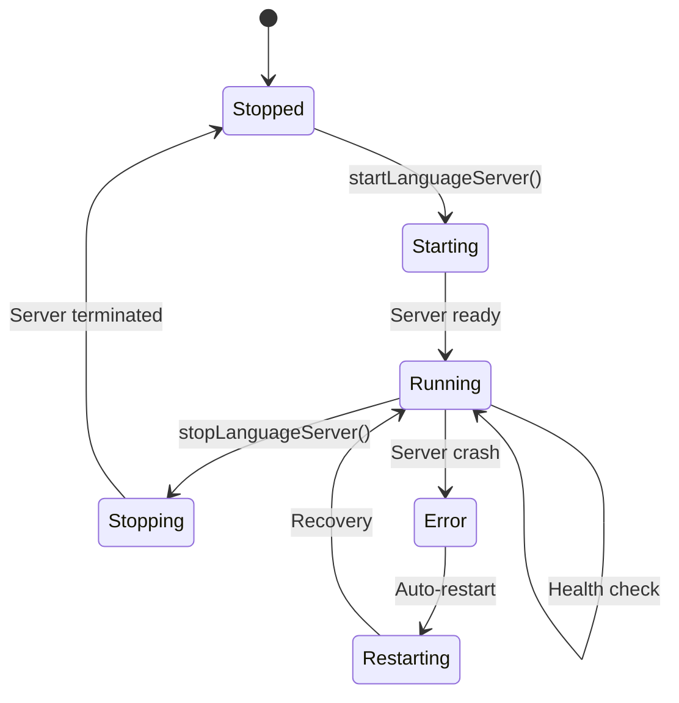

# LSP Lifecycle Management

## Overview

This document details how Proof Editor manages Language Server Protocol (LSP) servers throughout their lifecycle - from startup through shutdown, including health monitoring, platform-specific transports, and hot-swapping capabilities.

## Server Lifecycle

### Lifecycle Stages



### Server Manager

The central component managing all language servers:

```typescript
interface LanguageServerManager {
  // Server lifecycle
  async startLanguageServer(language: string): Promise<ServerHandle> {
    const installation = await this.languageManager.getInstallation(language);
    const config = await this.loadServerConfig(installation);
    
    // Platform-specific server startup
    const adapter = this.platform.lsp;
    const handle = await adapter.startServer({
      id: `language-${language}`,
      name: installation.manifest.name,
      command: config.command,
      args: config.args,
      transport: config.transport,
      // ... platform-specific config
    });
    
    // Health monitoring
    this.monitorHealth(handle);
    
    return handle;
  }
  
  async stopLanguageServer(language: string): Promise<void>;
  async restartLanguageServer(language: string): Promise<void>;
  
  // Hot-swapping support
  async swapLanguage(
    document: ProofDocument,
    newLanguage: LanguageSpec
  ): Promise<void> {
    // Save document state
    const state = await this.saveDocumentState(document);
    
    // Stop old server
    await this.stopLanguageServer(document.language.name);
    
    // Install new language if needed
    if (!await this.isInstalled(newLanguage)) {
      await this.installLanguage(newLanguage);
    }
    
    // Start new server
    await this.startLanguageServer(newLanguage.name);
    
    // Restore document state
    await this.restoreDocumentState(document, state);
    
    // Revalidate with new language
    await this.revalidateDocument(document);
  }
  
  // Health monitoring
  monitorHealth(handle: ServerHandle): void {
    setInterval(async () => {
      const health = await this.checkHealth(handle);
      if (health.status === 'unhealthy') {
        await this.handleUnhealthyServer(handle);
      }
    }, 30000); // Check every 30 seconds
  }
}
```

### Server Handle

Represents a running language server:

```typescript
interface ServerHandle {
  id: string;
  language: string;
  process?: any;
  transport: Transport;
  status: 'starting' | 'running' | 'stopping' | 'stopped' | 'error';
  startTime: Date;
  dispose(): Promise<void>;
}
```

## Platform-Specific Transports

Different platforms require different communication mechanisms:

### Desktop: stdio Transport

Standard input/output for desktop environments:

```typescript
class StdioTransport implements Transport {
  private process: ChildProcess;
  private connection: MessageConnection;
  
  async start(config: ServerConfig): Promise<void> {
    // Spawn language server process
    this.process = spawn(config.command, config.args, {
      stdio: ['pipe', 'pipe', 'pipe']
    });
    
    // Create JSON-RPC connection
    const reader = new StreamMessageReader(this.process.stdout);
    const writer = new StreamMessageWriter(this.process.stdin);
    this.connection = createMessageConnection(reader, writer);
    
    // Start listening
    this.connection.listen();
  }
  
  async sendRequest(method: string, params: any): Promise<any> {
    return this.connection.sendRequest(method, params);
  }
  
  async sendNotification(method: string, params: any): Promise<void> {
    this.connection.sendNotification(method, params);
  }
  
  async stop(): Promise<void> {
    this.connection.dispose();
    this.process.kill('SIGTERM');
  }
}
```

### Mobile: WebSocket Transport

WebSocket for mobile and web environments:

```typescript
class WebSocketTransport implements Transport {
  private ws: WebSocket;
  private connection: MessageConnection;
  
  async start(config: ServerConfig): Promise<void> {
    // Connect to WebSocket server
    this.ws = new WebSocket(`ws://${config.address}:${config.port}`);
    
    // Wait for connection
    await new Promise((resolve, reject) => {
      this.ws.onopen = resolve;
      this.ws.onerror = reject;
    });
    
    // Create JSON-RPC connection
    const reader = new WebSocketMessageReader(this.ws);
    const writer = new WebSocketMessageWriter(this.ws);
    this.connection = createMessageConnection(reader, writer);
    
    // Start listening
    this.connection.listen();
  }
  
  // Reconnection logic for mobile
  async reconnect(): Promise<void> {
    await this.stop();
    await this.start(this.config);
  }
}
```

### Alternative: HTTP Transport

For stateless operations or restricted environments:

```typescript
class HttpTransport implements Transport {
  private baseUrl: string;
  private session: string;
  
  async start(config: ServerConfig): Promise<void> {
    this.baseUrl = `${config.protocol}://${config.address}:${config.port}`;
    
    // Initialize session
    const response = await fetch(`${this.baseUrl}/initialize`, {
      method: 'POST',
      headers: { 'Content-Type': 'application/json' },
      body: JSON.stringify({ capabilities: this.getClientCapabilities() })
    });
    
    const data = await response.json();
    this.session = data.sessionId;
  }
  
  async sendRequest(method: string, params: any): Promise<any> {
    const response = await fetch(`${this.baseUrl}/${method}`, {
      method: 'POST',
      headers: {
        'Content-Type': 'application/json',
        'X-Session-ID': this.session
      },
      body: JSON.stringify(params)
    });
    
    return response.json();
  }
}
```

## Health Monitoring

### Health Checks

Regular health checks ensure server reliability:

```typescript
interface HealthMonitor {
  async checkHealth(handle: ServerHandle): Promise<HealthStatus> {
    try {
      // Send ping request
      const start = Date.now();
      await handle.transport.sendRequest('$/ping', {});
      const responseTime = Date.now() - start;
      
      // Check memory usage
      const stats = await handle.transport.sendRequest('$/stats', {});
      
      return {
        status: 'healthy',
        responseTime,
        memoryUsage: stats.memory,
        requestsHandled: stats.requests,
        uptime: Date.now() - handle.startTime.getTime()
      };
    } catch (error) {
      return {
        status: 'unhealthy',
        error: error.message
      };
    }
  }
  
  async handleUnhealthyServer(handle: ServerHandle): Promise<void> {
    // Log the issue
    this.logger.warn(`Server ${handle.id} is unhealthy`);
    
    // Attempt restart
    const restartCount = this.getRestartCount(handle.id);
    if (restartCount < this.maxRestarts) {
      await this.restartServer(handle);
    } else {
      // Too many restarts, notify user
      await this.notifyServerFailure(handle);
    }
  }
}

interface HealthStatus {
  status: 'healthy' | 'unhealthy' | 'degraded';
  responseTime?: number;
  memoryUsage?: number;
  requestsHandled?: number;
  uptime?: number;
  error?: string;
}
```

### Performance Monitoring

Track server performance metrics:

```typescript
interface PerformanceMonitor {
  // Track request latency
  async trackRequest(method: string, duration: number): Promise<void> {
    this.metrics.record('request_duration', duration, {
      method,
      language: this.language
    });
  }
  
  // Monitor resource usage
  async getResourceUsage(): Promise<ResourceUsage> {
    return {
      cpu: await this.getCpuUsage(),
      memory: await this.getMemoryUsage(),
      handles: await this.getHandleCount()
    };
  }
  
  // Alert on degradation
  async checkPerformance(): Promise<PerformanceAlert[]> {
    const alerts: PerformanceAlert[] = [];
    
    if (this.avgResponseTime > this.responseTimeThreshold) {
      alerts.push({
        severity: 'warning',
        message: 'High response time detected'
      });
    }
    
    if (this.memoryUsage > this.memoryThreshold) {
      alerts.push({
        severity: 'critical',
        message: 'High memory usage'
      });
    }
    
    return alerts;
  }
}
```

## Hot-Swapping Languages

### State Preservation

When switching languages, preserve document state:

```typescript
interface StatePreservation {
  async saveDocumentState(document: ProofDocument): Promise<DocumentState> {
    return {
      // Document content
      orderedSets: document.orderedSets,
      atomicArguments: document.atomicArguments,
      
      // UI state
      selection: await this.getSelection(),
      viewport: await this.getViewport(),
      expandedNodes: await this.getExpandedNodes(),
      
      // Validation state
      diagnostics: await this.getDiagnostics(),
      markers: await this.getMarkers()
    };
  }
  
  async restoreDocumentState(
    document: ProofDocument,
    state: DocumentState
  ): Promise<void> {
    // Restore content (already in document)
    
    // Restore UI state
    await this.setSelection(state.selection);
    await this.setViewport(state.viewport);
    await this.setExpandedNodes(state.expandedNodes);
    
    // Clear old diagnostics
    await this.clearDiagnostics();
    
    // New language will revalidate
  }
}
```

### Migration Strategies

Handle incompatibilities during language switch:

```typescript
interface LanguageMigration {
  async migrate(
    from: LanguageInfo,
    to: LanguageInfo,
    document: ProofDocument
  ): Promise<MigrationResult> {
    const issues: MigrationIssue[] = [];
    
    // Check notation differences
    const notationMap = await this.getNotationMapping(from, to);
    if (notationMap.hasChanges) {
      issues.push({
        type: 'notation',
        description: 'Symbol notation differs',
        autoFixable: true,
        fix: () => this.applyNotationMapping(document, notationMap)
      });
    }
    
    // Check rule compatibility
    const ruleCompatibility = await this.checkRuleCompatibility(from, to);
    for (const incompatible of ruleCompatibility.incompatible) {
      issues.push({
        type: 'rule',
        description: `Rule '${incompatible}' not supported`,
        autoFixable: false
      });
    }
    
    return { issues, canMigrate: issues.every(i => i.autoFixable) };
  }
}
```

## Server Configuration

### Dynamic Configuration

Update server configuration without restart:

```typescript
interface ConfigurationManager {
  async updateConfiguration(
    language: string,
    config: Partial<LanguageConfig>
  ): Promise<void> {
    const handle = this.getServerHandle(language);
    
    // Send configuration change notification
    await handle.transport.sendNotification(
      'workspace/didChangeConfiguration',
      {
        settings: {
          [language]: config
        }
      }
    );
  }
  
  // Watch for configuration changes
  watchConfiguration(
    language: string,
    callback: (config: LanguageConfig) => void
  ): Disposable {
    return this.configService.onDidChangeConfiguration(e => {
      if (e.affectsConfiguration(language)) {
        const config = this.configService.get<LanguageConfig>(language);
        callback(config);
      }
    });
  }
}
```

## Mobile Considerations

### Embedded Servers

For mobile, consider embedded language servers:

```typescript
interface MobileServerManager {
  // Use in-process servers when possible
  async startEmbeddedServer(language: string): Promise<EmbeddedHandle> {
    const module = await this.loadServerModule(language);
    
    // Run in worker thread
    const worker = new Worker(module.path);
    
    // Set up message passing
    const transport = new WorkerTransport(worker);
    
    return {
      id: `embedded-${language}`,
      transport,
      worker,
      dispose: () => worker.terminate()
    };
  }
  
  // Fallback to remote servers
  async connectToRemote(config: RemoteConfig): Promise<RemoteHandle> {
    const connection = new WebSocketConnection(config.url);
    await connection.connect();
    
    // Handle reconnection
    connection.on('disconnect', () => {
      this.scheduleReconnect(connection);
    });
    
    return {
      id: `remote-${config.language}`,
      connection,
      dispose: () => connection.close()
    };
  }
}
```

### Battery and Network Awareness

Optimize for mobile constraints:

```typescript
interface MobileOptimization {
  // Batch requests to reduce battery usage
  batchRequests(requests: Request[]): BatchedRequest {
    return {
      method: '$/batch',
      params: { requests }
    };
  }
  
  // Reduce frequency of non-critical operations
  async optimizeForBattery(): Promise<void> {
    // Increase health check interval
    this.healthCheckInterval = 120000; // 2 minutes
    
    // Disable non-essential features
    await this.disableFeatures(['codeActions', 'documentHighlight']);
    
    // Use request debouncing
    this.enableDebouncing(500); // 500ms delay
  }
  
  // Handle network changes
  onNetworkChange(status: NetworkStatus): void {
    if (status === 'offline') {
      this.switchToOfflineMode();
    } else if (status === 'cellular') {
      this.reduceDataUsage();
    }
  }
}
```

## Error Recovery

### Automatic Recovery

Handle common failure scenarios:

```typescript
interface ErrorRecovery {
  async handleServerCrash(handle: ServerHandle): Promise<void> {
    // Save current state
    const documents = await this.getOpenDocuments(handle.language);
    
    // Clean up crashed process
    await this.cleanupServer(handle);
    
    // Restart server
    const newHandle = await this.startLanguageServer(handle.language);
    
    // Restore document associations
    for (const doc of documents) {
      await this.associateDocument(doc, newHandle);
    }
    
    // Notify user
    this.notifyUser('Language server restarted', 'info');
  }
  
  async handleStartupFailure(
    language: string,
    error: Error
  ): Promise<void> {
    // Check common issues
    if (error.message.includes('ENOENT')) {
      // Missing executable
      await this.reinstallLanguage(language);
    } else if (error.message.includes('EADDRINUSE')) {
      // Port already in use
      await this.findAlternativePort(language);
    } else {
      // Unknown error, provide diagnostics
      await this.runDiagnostics(language);
    }
  }
}
```

## See Also

- [Language Architecture](./language-architecture.md) - Understanding language packages
- [Language Discovery](./language-discovery.md) - How languages are installed
- [Language Security](./language-security.md) - Security during server execution
- [LSP Integration](../lsp-integration.md) - LSP protocol implementation