# Platform Abstraction Layer

## Overview

The Platform Abstraction Layer enables Proof Editor's core functionality to work independently of VS Code, allowing the same codebase to power both VS Code extensions and React Native mobile apps. This architecture implements the Adapter/Port pattern to isolate platform-specific dependencies.

## Architecture Pattern: Adapter/Port

```mermaid
graph TB
    subgraph "Core Business Logic (Platform-Agnostic)"
        ProofEngine[Proof Engine]
        OrderedSets[Ordered Set Management]
        Connections[Connection System]
        TreeLayout[Tree Layout Engine]
        Navigation[Navigation System]
        ProofEngine --> OrderedSets
        OrderedSets --> Connections
        Connections --> TreeLayout
        TreeLayout --> Navigation
    end
    
    subgraph "Platform Abstraction Layer (Interfaces)"
        FileSystem[File System Adapter]
        Settings[Settings Adapter]
        UI[UI Adapter]
        LSP[LSP Adapter]
        Commands[Command Adapter]
        Packages[Package Adapter]
        Theme[Theme Adapter]
    end
    
    subgraph "VS Code Implementation"
        VSFileSystem[VS Code File System]
        VSSettings[VS Code Settings]
        VSUI[VS Code WebView/UI]
        VSLSP[VS Code LSP Client]
        VSCommands[VS Code Commands]
        VSPackages[VS Code Extensions]
        VSTheme[VS Code Themes]
    end
    
    subgraph "React Native Implementation"  
        RNFileSystem[React Native File System]
        RNSettings[AsyncStorage Settings]
        RNUI[React Native Components]
        RNLSP[WebSocket LSP Client]
        RNCommands[Touch/Gesture Commands]
        RNPackages[App Store Packages]
        RNTheme[React Native Themes]
    end
    
    ProofEngine --> FileSystem
    ProofEngine --> Settings
    ProofEngine --> UI
    ProofEngine --> LSP
    ProofEngine --> Commands
    ProofEngine --> Packages
    ProofEngine --> Theme
    
    FileSystem --> VSFileSystem
    Settings --> VSSettings
    UI --> VSUI
    LSP --> VSLSP
    Commands --> VSCommands
    Packages --> VSPackages
    Theme --> VSTheme
    
    FileSystem --> RNFileSystem
    Settings --> RNSettings
    UI --> RNUI
    LSP --> RNLSP
    Commands --> RNCommands
    Packages --> RNPackages
    Theme --> RNTheme
```



## Core Architecture Principles

### 1. Dependency Inversion
- Core business logic depends only on abstractions
- Platform implementations depend on core abstractions
- No direct dependencies on VS Code APIs in core code

### 2. Interface Segregation
- Small, focused interfaces for specific platform capabilities
- Minimal surface area reduces coupling
- Easy to implement on different platforms

### 3. Single Responsibility
- Each adapter handles one platform concern
- Clear separation between platform and business logic
- Easy to test and maintain independently

### 4. Platform Agnostic Core
- 90%+ of codebase works without modification on any platform
- Core algorithms independent of UI framework
- Business logic testable without platform dependencies

## Platform Abstraction Interfaces

### File System Abstraction

```typescript
interface FileSystemAdapter {
  // Basic file operations
  readFile(path: string): Promise<string>;
  writeFile(path: string, content: string): Promise<void>;
  deleteFile(path: string): Promise<void>;
  exists(path: string): Promise<boolean>;
  
  // Directory operations  
  createDirectory(path: string): Promise<void>;
  listDirectory(path: string): Promise<FileEntry[]>;
  
  // File watching
  watchFile(path: string, callback: (content: string, event: FileChangeEvent) => void): FileWatcher;
  watchDirectory(path: string, callback: (changes: DirectoryChange[]) => void): DirectoryWatcher;
  
  // Path utilities
  joinPath(...segments: string[]): string;
  dirname(path: string): string;
  basename(path: string): string;
  
  // Validation
  isValidPath(path: string): boolean;
  getAbsolutePath(path: string): string;
}

interface FileEntry {
  name: string;
  path: string;
  isDirectory: boolean;
  size?: number;
  lastModified?: Date;
}

type FileChangeEvent = 'created' | 'modified' | 'deleted';

interface FileWatcher {
  dispose(): void;
}

interface DirectoryWatcher {
  dispose(): void;
}

interface DirectoryChange {
  path: string;
  type: FileChangeEvent;
  isDirectory: boolean;
}
```

### Settings Abstraction

```typescript
interface SettingsAdapter {
  // Basic settings operations
  get<T>(key: string): T | undefined;
  get<T>(key: string, defaultValue: T): T;
  set<T>(key: string, value: T): Promise<void>;
  delete(key: string): Promise<void>;
  has(key: string): boolean;
  
  // Scoped settings
  getScoped<T>(scope: SettingsScope, key: string): T | undefined;
  getScoped<T>(scope: SettingsScope, key: string, defaultValue: T): T;
  setScoped<T>(scope: SettingsScope, key: string, value: T): Promise<void>;
  
  // Settings watching
  onChanged(callback: (key: string, value: any, scope: SettingsScope) => void): SettingsWatcher;
  onScopeChanged(scope: SettingsScope, callback: (changes: SettingsChange[]) => void): SettingsWatcher;
  
  // Bulk operations
  getAll(scope?: SettingsScope): Promise<Record<string, any>>;
  setAll(values: Record<string, any>, scope?: SettingsScope): Promise<void>;
  
  // Schema validation
  validateSetting(key: string, value: any): boolean;
  getSettingSchema(key: string): SettingSchema | undefined;
}

type SettingsScope = 'global' | 'workspace' | 'document';

interface SettingsChange {
  key: string;
  oldValue: any;
  newValue: any;
}

interface SettingsWatcher {
  dispose(): void;
}

interface SettingSchema {
  type: 'string' | 'number' | 'boolean' | 'array' | 'object';
  description?: string;
  default?: any;
  enum?: any[];
  minimum?: number;
  maximum?: number;
}
```

### UI Abstraction

```typescript
interface UIAdapter {
  // User notifications
  showMessage(message: string, type?: MessageType): Promise<void>;
  showQuestion(message: string, options: string[]): Promise<string | undefined>;
  showInputBox(options: InputBoxOptions): Promise<string | undefined>;
  
  // Progress indicators
  showProgress(options: ProgressOptions): ProgressHandle;
  
  // Quick actions
  showQuickPick<T>(items: QuickPickItem<T>[], options?: QuickPickOptions): Promise<T | undefined>;
  
  // Document operations
  openDocument(path: string): Promise<void>;
  closeDocument(path: string): Promise<void>;
  showDocument(path: string, options?: ShowDocumentOptions): Promise<void>;
  
  // UI components
  createWebView(options: WebViewOptions): WebViewHandle;
  createTreeView<T>(options: TreeViewOptions<T>): TreeViewHandle<T>;
  createStatusBarItem(options: StatusBarOptions): StatusBarHandle;
  
  // Layout management
  createSplitView(options: SplitViewOptions): SplitViewHandle;
  setLayout(layout: UILayout): Promise<void>;
  
  // Theme integration
  getCurrentTheme(): Theme;
  onThemeChanged(callback: (theme: Theme) => void): UIWatcher;
}

type MessageType = 'info' | 'warning' | 'error';

interface InputBoxOptions {
  prompt?: string;
  placeholder?: string;
  value?: string;
  password?: boolean;
  validate?: (value: string) => string | undefined;
}

interface ProgressOptions {
  title: string;
  location?: ProgressLocation;
  cancellable?: boolean;
}

type ProgressLocation = 'notification' | 'window' | 'source-control';

interface ProgressHandle {
  report(progress: { message?: string; increment?: number }): void;
  complete(): void;
  cancel(): void;
}

interface QuickPickItem<T> {
  label: string;
  description?: string;
  detail?: string;
  value: T;
}

interface QuickPickOptions {
  placeholder?: string;
  canPickMany?: boolean;
  matchOnDescription?: boolean;
  matchOnDetail?: boolean;
}

interface ShowDocumentOptions {
  selection?: Range;
  preview?: boolean;
  focus?: boolean;
}

interface WebViewOptions {
  title: string;
  enableScripts?: boolean;
  retainContextWhenHidden?: boolean;
  enableFindWidget?: boolean;
  localResourceRoots?: string[];
}

interface WebViewHandle {
  html: string;
  postMessage(message: any): void;
  onDidReceiveMessage(callback: (message: any) => void): UIWatcher;
  dispose(): void;
}

interface TreeViewOptions<T> {
  treeDataProvider: TreeDataProvider<T>;
  showCollapseAll?: boolean;
  canSelectMany?: boolean;
}

interface TreeViewHandle<T> {
  reveal(item: T, options?: { select?: boolean; focus?: boolean; expand?: boolean }): Promise<void>;
  onDidChangeSelection(callback: (items: T[]) => void): UIWatcher;
  dispose(): void;
}

interface TreeDataProvider<T> {
  getTreeItem(element: T): TreeItem<T>;
  getChildren(element?: T): T[] | Promise<T[]>;
  onDidChangeTreeData?: (callback: (element?: T) => void) => UIWatcher;
}

interface TreeItem<T> {
  label: string;
  description?: string;
  tooltip?: string;
  iconPath?: string;
  collapsibleState?: TreeItemCollapsibleState;
  command?: Command;
  contextValue?: string;
}

type TreeItemCollapsibleState = 'none' | 'collapsed' | 'expanded';

interface StatusBarOptions {
  alignment?: 'left' | 'right';
  priority?: number;
}

interface StatusBarHandle {
  text: string;
  tooltip?: string;
  color?: string;
  command?: Command;
  show(): void;
  hide(): void;
  dispose(): void;
}

interface SplitViewOptions {
  orientation?: 'horizontal' | 'vertical';
  sizes?: number[];
}

interface SplitViewHandle {
  addPane(content: any, size?: number): void;
  removePane(index: number): void;
  setSizes(sizes: number[]): void;
  dispose(): void;
}

interface UILayout {
  type: 'single' | 'split' | 'grid';
  configuration?: any;
}

interface Theme {
  kind: 'light' | 'dark' | 'high-contrast';
  colors: Record<string, string>;
}

interface UIWatcher {
  dispose(): void;
}

interface Command {
  id: string;
  title: string;
  arguments?: any[];
}

interface Range {
  start: { line: number; character: number };
  end: { line: number; character: number };
}
```

### LSP Communication Abstraction

```typescript
interface LSPAdapter {
  // Server lifecycle
  startServer(config: LSPServerConfig): Promise<LSPServerHandle>;
  stopServer(serverId: string): Promise<void>;
  restartServer(serverId: string): Promise<void>;
  
  // Communication
  sendRequest<T>(serverId: string, method: string, params: any): Promise<T>;
  sendNotification(serverId: string, method: string, params?: any): Promise<void>;
  onNotification(serverId: string, method: string, callback: (params: any) => void): LSPWatcher;
  
  // Document synchronization
  openDocument(serverId: string, document: TextDocument): Promise<void>;
  closeDocument(serverId: string, uri: string): Promise<void>;
  changeDocument(serverId: string, uri: string, changes: TextDocumentContentChangeEvent[]): Promise<void>;
  
  // Standard LSP features
  requestCompletion(serverId: string, uri: string, position: Position): Promise<CompletionItem[]>;
  requestHover(serverId: string, uri: string, position: Position): Promise<Hover | null>;
  requestDiagnostics(serverId: string, uri: string): Promise<Diagnostic[]>;
  requestCodeActions(serverId: string, uri: string, range: Range, context: CodeActionContext): Promise<CodeAction[]>;
  
  // Custom proof requests
  validateArgument(serverId: string, request: ValidateArgumentRequest): Promise<ValidateArgumentResponse>;
  completeInference(serverId: string, request: InferenceCompletionRequest): Promise<InferenceCompletionResponse>;
  analyzeStructure(serverId: string, request: AnalyzeStructureRequest): Promise<AnalyzeStructureResponse>;
  queryProof(serverId: string, request: ProofQueryRequest): Promise<ProofQueryResponse>;
  navigateProof(serverId: string, request: ProofNavigateRequest): Promise<ProofNavigateResponse>;
  
  // Server management
  getServerInfo(serverId: string): Promise<LSPServerInfo>;
  getServerHealth(serverId: string): Promise<ServerHealth>;
  listServers(): Promise<LSPServerInfo[]>;
}

interface LSPServerConfig {
  id: string;
  name: string;
  command: string;
  args?: string[];
  workingDirectory?: string;
  environment?: Record<string, string>;
  transport?: 'stdio' | 'websocket' | 'tcp';
  address?: string;
  port?: number;
  capabilities?: ServerCapabilities;
}

interface LSPServerHandle {
  id: string;
  process?: any; // Platform-specific process handle
  dispose(): Promise<void>;
}

interface LSPWatcher {
  dispose(): void;
}

interface TextDocument {
  uri: string;
  languageId: string;
  version: number;
  text: string;
}

interface TextDocumentContentChangeEvent {
  range?: Range;
  rangeLength?: number;
  text: string;
}

interface Position {
  line: number;
  character: number;
}

interface CompletionItem {
  label: string;
  kind?: CompletionItemKind;
  detail?: string;
  documentation?: string;
  insertText?: string;
  filterText?: string;
  sortText?: string;
  additionalTextEdits?: TextEdit[];
}

type CompletionItemKind = 'text' | 'method' | 'function' | 'constructor' | 'field' | 'variable' | 'class' | 'interface' | 'module' | 'property' | 'unit' | 'value' | 'enum' | 'keyword' | 'snippet' | 'color' | 'file' | 'reference' | 'folder' | 'enummember' | 'constant' | 'struct' | 'event' | 'operator' | 'typeparameter';

interface Hover {
  contents: string;
  range?: Range;
}

interface Diagnostic {
  range: Range;
  severity?: DiagnosticSeverity;
  code?: string | number;
  source?: string;
  message: string;
  relatedInformation?: DiagnosticRelatedInformation[];
}

type DiagnosticSeverity = 'error' | 'warning' | 'information' | 'hint';

interface DiagnosticRelatedInformation {
  location: Location;
  message: string;
}

interface Location {
  uri: string;
  range: Range;
}

interface CodeActionContext {
  diagnostics: Diagnostic[];
  only?: string[];
}

interface CodeAction {
  title: string;
  kind?: string;
  diagnostics?: Diagnostic[];
  edit?: WorkspaceEdit;
  command?: Command;
}

interface WorkspaceEdit {
  changes?: Record<string, TextEdit[]>;
}

interface TextEdit {
  range: Range;
  newText: string;
}

interface ServerCapabilities {
  textDocumentSync?: any;
  completionProvider?: any;
  hoverProvider?: boolean;
  diagnosticProvider?: any;
  codeActionProvider?: any;
}

interface LSPServerInfo {
  id: string;
  name: string;
  version?: string;
  status: 'starting' | 'running' | 'stopped' | 'error';
  capabilities?: ServerCapabilities;
}

interface ServerHealth {
  status: 'healthy' | 'degraded' | 'unhealthy';
  responseTime?: number;
  errorRate?: number;
  memoryUsage?: number;
  lastCheck: Date;
}

// Custom proof-specific LSP types
interface ValidateArgumentRequest {
  argumentId: string;
  premises: string[];
  conclusions: string[];
  rule?: string;
  context: ArgumentContext;
}

interface ValidateArgumentResponse {
  valid: boolean;
  diagnostics: Diagnostic[];
  suggestedRules?: string[];
}

interface InferenceCompletionRequest {
  premises: string[];
  partialConclusion?: string;
  context: ArgumentContext;
}

interface InferenceCompletionResponse {
  completions: {
    conclusion: string;
    rule: string;
    confidence: number;
  }[];
}

interface AnalyzeStructureRequest {
  treeRootId: string;
  includeMetrics: boolean;
}

interface AnalyzeStructureResponse {
  openPremises: string[];
  openConclusions: string[];
  circularDependencies: string[][];
  metrics?: {
    depth: number;
    breadth: number;
    totalArguments: number;
  };
}

interface ProofQueryRequest {
  textDocument: { uri: string };
  query: string;  // ProofPath expression
  context?: {
    nodeId: string;
  };
}

interface ProofQueryResponse {
  results: ProofNode[];
  executionTime: number;
}

interface ProofNavigateRequest {
  textDocument: { uri: string };
  from: NodeIdentifier;
  axis: NavigationAxis;
  steps?: number;
}

type NavigationAxis = 'parent' | 'ancestor' | 'proof-root' | 'premise-parent' | 'conclusion-child';

interface ProofNavigateResponse {
  target: ProofNode | null;
  path?: ProofNode[];
}

interface ArgumentContext {
  documentId: string;
  treeId: string;
  logicSystem: string;
  availableRules: string[];
}

interface ProofNode {
  id: string;
  type: 'atomic_argument' | 'statement' | 'ordered_set';
  content?: string;
  position?: Position;
}

interface NodeIdentifier {
  id: string;
  type: 'atomic_argument' | 'statement' | 'ordered_set';
}
```

### Command System Abstraction

```typescript
interface CommandAdapter {
  // Command registration
  registerCommand(id: string, handler: CommandHandler, context?: any): CommandRegistration;
  unregisterCommand(id: string): Promise<void>;
  
  // Command execution
  executeCommand<T>(id: string, ...args: any[]): Promise<T>;
  
  // Command palette integration
  registerCommandPalette(commands: PaletteCommand[]): CommandRegistration;
  showCommandPalette(filter?: string): Promise<void>;
  
  // Keyboard shortcuts
  registerKeybinding(keybinding: Keybinding): CommandRegistration;
  unregisterKeybinding(keys: string): Promise<void>;
  
  // Context menus
  registerContextMenu(menu: ContextMenu): CommandRegistration;
  showContextMenu(items: ContextMenuItem[], position?: { x: number; y: number }): Promise<string | undefined>;
  
  // Command states
  setCommandEnabled(id: string, enabled: boolean): Promise<void>;
  setCommandVisible(id: string, visible: boolean): Promise<void>;
  
  // Command discovery
  listCommands(category?: string): Promise<CommandInfo[]>;
  getCommandInfo(id: string): Promise<CommandInfo | undefined>;
}

type CommandHandler = (...args: any[]) => any | Promise<any>;

interface CommandRegistration {
  dispose(): void;
}

interface PaletteCommand {
  id: string;
  title: string;
  category?: string;
  icon?: string;
  when?: string; // Context expression
}

interface Keybinding {
  key: string;
  command: string;
  when?: string;
  args?: any[];
}

interface ContextMenu {
  id: string;
  when?: string;
  items: ContextMenuItem[];
}

interface ContextMenuItem {
  id: string;
  label: string;
  command?: string;
  submenu?: ContextMenuItem[];
  separator?: boolean;
  when?: string;
}

interface CommandInfo {
  id: string;
  title: string;
  category?: string;
  description?: string;
  keybindings?: string[];
  enabled: boolean;
  visible: boolean;
}
```

### Package Management Abstraction

```typescript
interface PackageAdapter {
  // Package installation
  installPackage(source: PackageSource, options?: InstallOptions): Promise<PackageInfo>;
  uninstallPackage(packageId: string): Promise<void>;
  updatePackage(packageId: string, version?: string): Promise<PackageInfo>;
  
  // Package discovery
  searchPackages(query: string, options?: SearchOptions): Promise<PackageInfo[]>;
  listInstalled(): Promise<PackageInfo[]>;
  getPackageInfo(packageId: string): Promise<PackageInfo | undefined>;
  
  // Package management
  enablePackage(packageId: string): Promise<void>;
  disablePackage(packageId: string): Promise<void>;
  configurePackage(packageId: string, config: any): Promise<void>;
  
  // Dependency management
  resolveDependencies(packageId: string): Promise<PackageInfo[]>;
  checkDependencies(packageId: string): Promise<DependencyCheck>;
  
  // Package lifecycle
  onPackageInstalled(callback: (packageInfo: PackageInfo) => void): PackageWatcher;
  onPackageUninstalled(callback: (packageId: string) => void): PackageWatcher;
  onPackageEnabled(callback: (packageId: string) => void): PackageWatcher;
  onPackageDisabled(callback: (packageId: string) => void): PackageWatcher;
  
  // Cache management
  clearCache(): Promise<void>;
  getCacheInfo(): Promise<CacheInfo>;
  
  // Offline support
  exportPackages(packageIds: string[], target: string): Promise<void>;
  importPackages(source: string): Promise<PackageInfo[]>;
}

interface PackageSource {
  type: 'github' | 'gist' | 'url' | 'local';
  location: string;
  version?: string;
  branch?: string;
  tag?: string;
}

interface InstallOptions {
  force?: boolean;
  skipDependencies?: boolean;
  global?: boolean;
}

interface SearchOptions {
  category?: string;
  author?: string;
  tags?: string[];
  limit?: number;
}

interface PackageInfo {
  id: string;
  name: string;
  version: string;
  author: string;
  description: string;
  repository?: string;
  dependencies?: Record<string, string>;
  status: 'installed' | 'enabled' | 'disabled' | 'error';
  installPath?: string;
  manifest: PackageManifest;
}

interface PackageManifest {
  name: string;
  version: string;
  description: string;
  author: string;
  repository?: string;
  dependencies?: Record<string, string>;
  contents: PackageContents;
  requirements?: PackageRequirements;
}

interface PackageContents {
  config?: any;
  documents?: string[];
  fonts?: string[];
  scripts?: string[];
  languageLayers?: string[];
}

interface PackageRequirements {
  proofEditor?: string;
  platform?: string[];
}

interface DependencyCheck {
  satisfied: boolean;
  missing: string[];
  conflicts: string[];
}

interface PackageWatcher {
  dispose(): void;
}

interface CacheInfo {
  totalSize: number;
  packageCount: number;
  lastCleaned: Date;
  location: string;
}
```

### Language Management Abstraction

```typescript
interface LanguageAdapter {
  // Language discovery
  discoverLanguages(sources: LanguageSource[]): Promise<LanguageDescriptor[]>;
  searchLanguages(query: string, options?: SearchOptions): Promise<LanguageDescriptor[]>;
  getRegistryLanguages(): Promise<LanguageDescriptor[]>;
  
  // Installation and management
  installLanguage(spec: LanguageSpec): Promise<LanguageInstallation>;
  updateLanguage(name: string, version?: string): Promise<void>;
  uninstallLanguage(name: string): Promise<void>;
  listInstalledLanguages(): Promise<LanguageInfo[]>;
  isInstalled(name: string, version?: string): Promise<boolean>;
  
  // Version management
  getAvailableVersions(name: string): Promise<string[]>;
  getCurrentVersion(name: string): Promise<string | null>;
  resolveVersion(name: string, constraint: string): Promise<string>;
  checkCompatibility(language: string, version: string): Promise<boolean>;
  
  // LSP server management
  startLanguageServer(language: string): Promise<LSPServerHandle>;
  stopLanguageServer(language: string): Promise<void>;
  restartLanguageServer(language: string): Promise<void>;
  getServerStatus(language: string): Promise<ServerStatus>;
  getActiveServers(): Promise<string[]>;
  
  // Configuration
  getLanguageConfig(language: string): Promise<LanguageConfig>;
  setLanguageConfig(language: string, config: Partial<LanguageConfig>): Promise<void>;
  getDefaultConfig(language: string): Promise<LanguageConfig>;
  validateConfig(language: string, config: any): Promise<ValidationResult>;
  
  // Hot-swapping
  canHotSwap(from: string, to: string): Promise<boolean>;
  hotSwapLanguage(documentId: string, newLanguage: LanguageSpec): Promise<void>;
  preserveDocumentState(documentId: string): Promise<DocumentState>;
  restoreDocumentState(documentId: string, state: DocumentState): Promise<void>;
  
  // Cache management
  getCacheInfo(): Promise<LanguageCacheInfo>;
  clearCache(language?: string): Promise<void>;
  exportCache(languages: string[], target: string): Promise<void>;
  importCache(source: string): Promise<void>;
  pruneCache(keepVersions: number): Promise<void>;
  
  // Language lifecycle events
  onLanguageInstalled(callback: (language: LanguageInfo) => void): Disposable;
  onLanguageUninstalled(callback: (language: string) => void): Disposable;
  onServerStarted(callback: (language: string) => void): Disposable;
  onServerStopped(callback: (language: string) => void): Disposable;
  onConfigChanged(callback: (language: string, config: LanguageConfig) => void): Disposable;
}

interface LanguageSource {
  type: 'github' | 'url' | 'file' | 'registry';
  location: string;
  version?: string;
  branch?: string;
  tag?: string;
  commit?: string;
}

interface LanguageSpec {
  name: string;
  version?: string;
  source: string | LanguageSource;
  config?: Record<string, any>;
}

interface LanguageDescriptor {
  name: string;
  version: string;
  description: string;
  author: string;
  source: LanguageSource;
  capabilities: string[];
  verified?: boolean;
  downloads?: number;
  lastUpdated?: Date;
  dependencies?: Record<string, string>;
}

interface LanguageInstallation {
  name: string;
  version: string;
  path: string;
  manifest: LanguageManifest;
  dependencies: Record<string, string>;
  installedAt: Date;
  source: LanguageSource;
}

interface LanguageInfo {
  name: string;
  version: string;
  description: string;
  installed: boolean;
  enabled: boolean;
  path?: string;
  manifest?: LanguageManifest;
}

interface LanguageManifest {
  name: string;
  version: string;
  description: string;
  author: string;
  homepage?: string;
  license?: string;
  lsp: LSPConfig;
  capabilities: LanguageCapabilities;
  dependencies?: LanguageDependencies;
  configuration?: ConfigurationSchema;
  validation?: ValidationRules;
  examples?: ExampleCollection;
}

interface LSPConfig {
  desktop?: {
    command: string[];
    args?: string[];
    transport: 'stdio' | 'tcp' | 'websocket';
  };
  mobile?: {
    transport: 'websocket' | 'http';
    service?: string;
    port?: number;
  };
  binaries?: Record<string, string>;
}

interface LanguageCapabilities {
  textDocument?: {
    completion?: boolean;
    hover?: boolean;
    definition?: boolean;
    references?: boolean;
    documentSymbol?: boolean;
    codeAction?: boolean;
    diagnostic?: boolean;
  };
  proofCapabilities?: string[];
}

interface LanguageDependencies {
  languages?: Record<string, string>;
  runtime?: Record<string, string>;
  tools?: Record<string, string>;
}

interface ConfigurationSchema {
  properties: Record<string, {
    type: string;
    default?: any;
    description?: string;
    enum?: any[];
    minimum?: number;
    maximum?: number;
  }>;
}

interface ValidationRules {
  builtinRules?: RuleDefinition[];
  customRules?: {
    path: string;
  };
  categories?: RuleCategory[];
}

interface RuleDefinition {
  id: string;
  description: string;
  severity?: 'error' | 'warning' | 'info';
}

interface RuleCategory {
  id: string;
  name: string;
  rules: string[];
}

interface ExampleCollection {
  categories?: ExampleCategory[];
}

interface ExampleCategory {
  name: string;
  description: string;
  examples: Example[];
}

interface Example {
  file: string;
  title: string;
  description?: string;
}

interface LanguageConfig {
  [key: string]: any;
}

interface ServerStatus {
  running: boolean;
  healthy: boolean;
  uptime?: number;
  memoryUsage?: number;
  requestsHandled?: number;
  averageResponseTime?: number;
  errors?: number;
  lastError?: string;
}

interface DocumentState {
  content: string;
  cursorPosition?: Position;
  selection?: Range;
  folding?: FoldingRange[];
  markers?: Marker[];
}

interface LanguageCacheInfo {
  totalSize: number;
  languageCount: number;
  versions: Record<string, string[]>;
  lastCleaned?: Date;
  location: string;
}

interface ValidationResult {
  valid: boolean;
  errors?: string[];
  warnings?: string[];
}

interface Disposable {
  dispose(): void;
}

interface Position {
  line: number;
  character: number;
}

interface Range {
  start: Position;
  end: Position;
}

interface FoldingRange {
  start: number;
  end: number;
  kind?: 'comment' | 'imports' | 'region';
}

interface Marker {
  id: string;
  position: Position;
  type: string;
  data?: any;
}
```

### Theme System Abstraction

```typescript
interface ThemeAdapter {
  // Theme management
  getCurrentTheme(): Theme;
  setTheme(themeId: string): Promise<void>;
  listThemes(): Promise<ThemeInfo[]>;
  
  // Theme watching
  onThemeChanged(callback: (theme: Theme) => void): ThemeWatcher;
  
  // Custom themes
  createTheme(definition: ThemeDefinition): Promise<string>;
  updateTheme(themeId: string, definition: Partial<ThemeDefinition>): Promise<void>;
  deleteTheme(themeId: string): Promise<void>;
  
  // Color resolution
  resolveColor(colorId: string): string;
  resolveColors(colorIds: string[]): Record<string, string>;
  
  // Dynamic theming
  setDynamicColors(colors: Record<string, string>): Promise<void>;
  clearDynamicColors(): Promise<void>;
}

interface ThemeInfo {
  id: string;
  name: string;
  description?: string;
  author?: string;
  kind: 'light' | 'dark' | 'high-contrast';
  builtin: boolean;
}

interface ThemeDefinition {
  name: string;
  kind: 'light' | 'dark' | 'high-contrast';
  colors: Record<string, string>;
  tokenColors?: TokenColor[];
  semanticColors?: Record<string, string>;
}

interface TokenColor {
  scope: string | string[];
  settings: {
    foreground?: string;
    background?: string;
    fontStyle?: string;
  };
}

interface ThemeWatcher {
  dispose(): void;
}
```

## Platform Implementations

### VS Code Platform Implementation

The VS Code implementation maps directly to VS Code APIs:

```typescript
class VSCodeFileSystemAdapter implements FileSystemAdapter {
  async readFile(path: string): Promise<string> {
    const uri = vscode.Uri.file(path);
    const data = await vscode.workspace.fs.readFile(uri);
    return Buffer.from(data).toString('utf8');
  }
  
  async writeFile(path: string, content: string): Promise<void> {
    const uri = vscode.Uri.file(path);
    const data = Buffer.from(content, 'utf8');
    await vscode.workspace.fs.writeFile(uri, data);
  }
  
  // ... other implementations
}

class VSCodeSettingsAdapter implements SettingsAdapter {
  get<T>(key: string, defaultValue?: T): T {
    const config = vscode.workspace.getConfiguration('proofEditor');
    return config.get(key, defaultValue);
  }
  
  async set<T>(key: string, value: T): Promise<void> {
    const config = vscode.workspace.getConfiguration('proofEditor');
    await config.update(key, value, vscode.ConfigurationTarget.Global);
  }
  
  // ... other implementations
}
```

### React Native Platform Implementation

The React Native implementation uses React Native APIs and libraries:

```typescript
class ReactNativeFileSystemAdapter implements FileSystemAdapter {
  async readFile(path: string): Promise<string> {
    return await RNFS.readFile(path, 'utf8');
  }
  
  async writeFile(path: string, content: string): Promise<void> {
    await RNFS.writeFile(path, content, 'utf8');
  }
  
  // ... other implementations using React Native File System
}

class ReactNativeSettingsAdapter implements SettingsAdapter {
  async get<T>(key: string, defaultValue?: T): Promise<T> {
    const value = await AsyncStorage.getItem(`proofEditor.${key}`);
    if (value === null) return defaultValue;
    return JSON.parse(value);
  }
  
  async set<T>(key: string, value: T): Promise<void> {
    await AsyncStorage.setItem(`proofEditor.${key}`, JSON.stringify(value));
  }
  
  // ... other implementations using AsyncStorage
}
```

## Dependency Injection System

```typescript
interface PlatformContainer {
  fileSystem: FileSystemAdapter;
  settings: SettingsAdapter;
  ui: UIAdapter;
  lsp: LSPAdapter;
  commands: CommandAdapter;
  packages: PackageAdapter;
  theme: ThemeAdapter;
  language: LanguageAdapter;
}

class ProofEditorCore {
  constructor(private platform: PlatformContainer) {}
  
  // Core business logic uses platform adapters
  async loadDocument(path: string): Promise<ProofDocument> {
    const content = await this.platform.fileSystem.readFile(path);
    return this.parseDocument(content);
  }
}

// Platform-specific initialization
function createVSCodePlatform(): PlatformContainer {
  return {
    fileSystem: new VSCodeFileSystemAdapter(),
    settings: new VSCodeSettingsAdapter(),
    ui: new VSCodeUIAdapter(),
    lsp: new VSCodeLSPAdapter(),
    commands: new VSCodeCommandAdapter(),
    packages: new VSCodePackageAdapter(),
    theme: new VSCodeThemeAdapter(),
    language: new VSCodeLanguageAdapter(),
  };
}

function createReactNativePlatform(): PlatformContainer {
  return {
    fileSystem: new ReactNativeFileSystemAdapter(),
    settings: new ReactNativeSettingsAdapter(),
    ui: new ReactNativeUIAdapter(),
    lsp: new ReactNativeLSPAdapter(),
    commands: new ReactNativeCommandAdapter(),
    packages: new ReactNativePackageAdapter(),
    theme: new ReactNativeThemeAdapter(),
    language: new ReactNativeLanguageAdapter(),
  };
}
```

## Mobile-Specific Considerations

### Touch Interface Adaptations

```typescript
interface ReactNativeUIAdapter extends UIAdapter {
  // Touch-specific interactions
  showTouchContextMenu(items: ContextMenuItem[], position: { x: number; y: number }): Promise<string | undefined>;
  enableGestureRecognition(gestures: GestureConfig[]): GestureWatcher;
  
  // Mobile-optimized layouts
  createMobileLayout(config: MobileLayoutConfig): MobileLayoutHandle;
  adaptToOrientation(orientation: 'portrait' | 'landscape'): Promise<void>;
}

interface GestureConfig {
  type: 'tap' | 'double-tap' | 'long-press' | 'pinch' | 'pan' | 'swipe';
  handler: (event: GestureEvent) => void;
  options?: any;
}

interface GestureEvent {
  type: string;
  position: { x: number; y: number };
  delta?: { x: number; y: number };
  scale?: number;
  velocity?: { x: number; y: number };
}
```

### File System Sandboxing

```typescript
class ReactNativeFileSystemAdapter implements FileSystemAdapter {
  private documentsDirectory: string;
  private cacheDirectory: string;
  
  constructor() {
    this.documentsDirectory = RNFS.DocumentDirectoryPath;
    this.cacheDirectory = RNFS.CachesDirectoryPath;
  }
  
  private validatePath(path: string): void {
    // Ensure paths are within allowed directories
    if (!path.startsWith(this.documentsDirectory) && 
        !path.startsWith(this.cacheDirectory)) {
      throw new Error('Access denied: Path outside sandbox');
    }
  }
  
  async readFile(path: string): Promise<string> {
    this.validatePath(path);
    return await RNFS.readFile(path, 'utf8');
  }
}
```

### LSP Communication over WebSocket

```typescript
class ReactNativeLSPAdapter implements LSPAdapter {
  private connections = new Map<string, WebSocket>();
  
  async startServer(config: LSPServerConfig): Promise<LSPServerHandle> {
    if (config.transport === 'websocket') {
      const ws = new WebSocket(`ws://${config.address}:${config.port}`);
      this.connections.set(config.id, ws);
      
      return {
        id: config.id,
        async dispose() {
          ws.close();
        }
      };
    }
    
    throw new Error('Only WebSocket transport supported on mobile');
  }
  
  async sendRequest<T>(serverId: string, method: string, params: any): Promise<T> {
    const ws = this.connections.get(serverId);
    if (!ws) throw new Error(`Server ${serverId} not found`);
    
    return new Promise((resolve, reject) => {
      const id = Math.random().toString(36);
      const request = { jsonrpc: '2.0', id, method, params };
      
      const handler = (event: any) => {
        const response = JSON.parse(event.data);
        if (response.id === id) {
          ws.removeEventListener('message', handler);
          if (response.error) {
            reject(new Error(response.error.message));
          } else {
            resolve(response.result);
          }
        }
      };
      
      ws.addEventListener('message', handler);
      ws.send(JSON.stringify(request));
    });
  }
}
```

## Package System Adaptations

### Mobile Package Distribution

```typescript
class ReactNativePackageAdapter implements PackageAdapter {
  async installPackage(source: PackageSource, options?: InstallOptions): Promise<PackageInfo> {
    if (source.type === 'github') {
      // Use GitHub API to download package
      const packageData = await this.downloadFromGitHub(source);
      return await this.installFromData(packageData);
    } else if (source.type === 'local') {
      // Install from app bundle or documents directory
      return await this.installFromLocal(source.location);
    }
    
    throw new Error(`Unsupported package source type: ${source.type}`);
  }
  
  private async downloadFromGitHub(source: PackageSource): Promise<any> {
    const url = `https://api.github.com/repos/${source.location}/contents`;
    const response = await fetch(url);
    return await response.json();
  }
  
  private async installFromLocal(path: string): Promise<PackageInfo> {
    const manifestPath = `${path}/proof-package.json`;
    const manifestContent = await RNFS.readFile(manifestPath, 'utf8');
    const manifest = JSON.parse(manifestContent);
    
    // Install package files to app documents directory
    const installPath = `${RNFS.DocumentDirectoryPath}/packages/${manifest.name}`;
    await RNFS.copyFile(path, installPath);
    
    return {
      id: manifest.name,
      name: manifest.name,
      version: manifest.version,
      author: manifest.author,
      description: manifest.description,
      status: 'installed',
      installPath,
      manifest
    };
  }
}
```

## Testing Strategy

### Platform-Agnostic Tests

```typescript
// Core business logic tests work on any platform
describe('ProofEngine', () => {
  let engine: ProofEngine;
  let mockPlatform: PlatformContainer;
  
  beforeEach(() => {
    mockPlatform = createMockPlatform();
    engine = new ProofEngine(mockPlatform);
  });
  
  it('should create atomic arguments', async () => {
    const argument = await engine.createAtomicArgument({
      premises: ['P', 'P → Q'],
      conclusions: ['Q'],
      rule: 'Modus Ponens'
    });
    
    expect(argument.id).toBeDefined();
    expect(argument.premises).toEqual(['P', 'P → Q']);
    expect(argument.conclusions).toEqual(['Q']);
  });
});
```

### Platform-Specific Adapter Tests

```typescript
// Test VS Code adapter implementation
describe('VSCodeFileSystemAdapter', () => {
  let adapter: VSCodeFileSystemAdapter;
  
  beforeEach(() => {
    adapter = new VSCodeFileSystemAdapter();
  });
  
  it('should read files using VS Code API', async () => {
    // Mock VS Code API
    const mockReadFile = jest.fn().mockResolvedValue(new Uint8Array());
    (vscode.workspace.fs as any).readFile = mockReadFile;
    
    await adapter.readFile('/test/file.txt');
    
    expect(mockReadFile).toHaveBeenCalledWith(vscode.Uri.file('/test/file.txt'));
  });
});

// Test React Native adapter implementation
describe('ReactNativeFileSystemAdapter', () => {
  let adapter: ReactNativeFileSystemAdapter;
  
  beforeEach(() => {
    adapter = new ReactNativeFileSystemAdapter();
  });
  
  it('should read files using React Native API', async () => {
    const mockReadFile = jest.fn().mockResolvedValue('file content');
    (RNFS as any).readFile = mockReadFile;
    
    const content = await adapter.readFile('/test/file.txt');
    
    expect(mockReadFile).toHaveBeenCalledWith('/test/file.txt', 'utf8');
    expect(content).toBe('file content');
  });
});
```

## Migration Strategy

### Phase 1: Interface Definition
1. Define all platform abstraction interfaces
2. Create mock implementations for testing
3. Update core types to use abstractions

### Phase 2: VS Code Adapter Implementation
1. Implement VS Code adapters for all interfaces
2. Update existing VS Code code to use adapters
3. Maintain backward compatibility

### Phase 3: Core Business Logic Refactor
1. Remove direct VS Code dependencies from core code
2. Inject platform adapters through dependency injection
3. Ensure all core functionality is platform-agnostic

### Phase 4: React Native Implementation
1. Implement React Native adapters
2. Create React Native app shell
3. Integrate core business logic with React Native adapters

### Phase 5: Testing and Optimization
1. Comprehensive testing on both platforms
2. Performance optimization for mobile
3. UI/UX adaptation for touch interfaces

## Success Metrics

### Code Reuse Target: 90%+
- Core business logic (ordered sets, atomic arguments, connections, tree layouts, navigation) works unchanged on both platforms
- Only platform adapters require platform-specific implementation
- LSP communication abstracted to work over different transports

### Platform Parity
- All core features available on both VS Code and React Native
- Consistent behavior across platforms
- Platform-appropriate UI/UX adaptations

### Performance Goals
- Mobile app startup time < 3 seconds
- Real-time validation response < 100ms
- Smooth 60fps animations on mobile devices
- Memory usage < 200MB for complex proofs

This platform abstraction layer ensures that Proof Editor can evolve from a VS Code-exclusive tool to a cross-platform solution while maintaining the benefits of VS Code integration for desktop users and enabling rich mobile experiences for users who prefer or require mobile access.