# Platform Abstraction Overview

## Introduction

This document provides the implementation overview of Proof Editor's platform abstraction layer. Platform abstraction is an implementation detail that enables code reuse across VS Code and React Native platforms while maintaining architectural focus on core system design.

## Implementation Approach

The Platform Abstraction Layer is an implementation pattern that separates platform-specific code from core business logic. Both VS Code and React Native provide sufficient capabilities for all requirements - the abstraction layer simply ensures clean separation and code reuse.

## Architecture Pattern: Adapter Implementation Detail

> **Note**: Platform adapters are implementation concerns, not architectural blockers. The focus remains on core system architecture (statement flows, data persistence, proof structure) rather than platform-specific details.

```mermaid
graph TB
    subgraph "Core Business Logic (Platform-Agnostic)"
        ProofEngine[Proof Engine]
        StatementFlow[Statement Flow Management]
        OrderedSets[Ordered Set Management]
        PhysicalTree[Physical Tree Structure]
        SpatialNav[Spatial Navigation]
        TreeLayout[Tree Layout Engine]
        ProofEngine --> StatementFlow
        StatementFlow --> OrderedSets
        OrderedSets --> PhysicalTree
        PhysicalTree --> SpatialNav
        SpatialNav --> TreeLayout
    end
    
    subgraph "Platform Abstraction Layer"
        FileSystem[File System Abstraction]
        Settings[Settings Abstraction]
        SpatialUI[Spatial UI Abstraction]
        StatementFlowAPI[Statement Flow APIs]
        LSP[LSP Communication]
        Commands[Command System]
        Packages[Package Management]
        Theme[Theme System]
    end
    
    subgraph "VS Code Platform"
        VSFileSystem[VS Code File APIs]
        VSSettings[VS Code Configuration]
        VSWebView[VS Code WebView + Canvas]
        VSFlowAPI[WebView Statement Flow APIs]
        VSLSP[VS Code Language Client]
        VSCommands[VS Code Commands]
        VSPackages[VS Code Extensions]
        VSTheme[VS Code Themes]
    end
    
    subgraph "React Native Platform"  
        RNFileSystem[Mobile File System]
        RNSettings[Mobile Storage]
        RNTouchUI[Touch Canvas Components]
        RNFlowAPI[Touch Statement Flow APIs]
        RNLSP[Network LSP Client]
        RNGestures[Touch Gestures & Commands]
        RNPackages[Mobile Packages]
        RNTheme[Mobile Themes]
    end
    
    StatementFlow --> StatementFlowAPI
    PhysicalTree --> SpatialUI
    ProofEngine --> FileSystem
    ProofEngine --> Settings
    ProofEngine --> LSP
    ProofEngine --> Commands
    ProofEngine --> Packages
    ProofEngine --> Theme
    
    FileSystem --> VSFileSystem
    Settings --> VSSettings
    SpatialUI --> VSWebView
    StatementFlowAPI --> VSFlowAPI
    LSP --> VSLSP
    Commands --> VSCommands
    Packages --> VSPackages
    Theme --> VSTheme
    
    FileSystem --> RNFileSystem
    Settings --> RNSettings
    SpatialUI --> RNTouchUI
    StatementFlowAPI --> RNFlowAPI
    LSP --> RNLSP
    Commands --> RNGestures
    Packages --> RNPackages
    Theme --> RNTheme
```

## Core Architecture Principles

### 1. Dependency Inversion
The architecture follows the dependency inversion principle where:
- Core business logic depends only on abstract interfaces, not concrete implementations
- Platform-specific code implements these abstractions
- No direct platform API calls exist in the core logic
- Dependencies flow from concrete implementations toward abstractions

### 2. Interface Segregation
The abstraction layer follows interface segregation by:
- Creating small, focused abstractions for specific capabilities
- Minimizing the coupling between core logic and platform code
- Making it straightforward to implement platform-specific versions
- Avoiding "fat interfaces" that force unnecessary implementations

### 3. Single Responsibility
Each abstraction has a single, well-defined responsibility:
- File system operations are separate from UI concerns
- Settings management is independent of command handling
- Each adapter focuses on one aspect of platform interaction
- Clear boundaries make testing and maintenance straightforward

### 4. Platform Agnostic Core
The core business logic remains platform-independent:
- Proof manipulation algorithms work identically across platforms
- Business rules don't change based on the runtime environment
- Core logic can be tested without any platform dependencies
- Platform differences are handled at the abstraction boundary

## Dependency Injection Pattern

The platform abstraction layer uses dependency injection to provide platform-specific capabilities to the core business logic. This pattern:

- **Decouples core logic from platform code**: The core doesn't know which platform it's running on
- **Enables testing with mock implementations**: Tests can provide simplified versions of platform services
- **Supports runtime platform selection**: The same core can work with different platform implementations
- **Maintains clear architectural boundaries**: Platform code never leaks into business logic

## Abstraction Categories

The platform abstraction layer organizes platform-specific functionality into nine primary categories:

### 1. File System Operations
- **Purpose**: Abstract file reading, writing, and directory management
- **Challenges**: Mobile sandboxing vs desktop file access
- **Key Considerations**: Path handling, permissions, file watching capabilities

### 2. Settings Management
- **Purpose**: Store and retrieve user preferences and configuration
- **Challenges**: Different storage mechanisms across platforms
- **Key Considerations**: Synchronization, scoping, persistence guarantees

### 3. Spatial UI Components  
- **Purpose**: Present spatial proof structures and handle 2D interactions
- **Challenges**: Mouse precision vs touch approximation, canvas rendering
- **Key Considerations**: Platform UI conventions, accessibility, spatial input methods
- **Physical Tree Interfaces**: Tree positioning, viewport management, spatial selection
- **Rendering Pipeline**: Hardware-accelerated canvas, WebGL/GPU optimization

### 4. Statement Flow APIs
- **Purpose**: Visualize and interact with statement flow between atomic arguments
- **Challenges**: Complex visual relationships, performance with large trees
- **Key Considerations**: Real-time updates, spatial representation, flow tracing
- **Flow Computation**: Statement dependency tracking, connection analysis
- **Visual Flow**: Arrow rendering, path optimization, interactive flow highlighting
- **Flow Navigation**: Follow statement paths, trace dependencies, jump to sources

### 5. LSP Communication
- **Purpose**: Connect to language servers for logic validation
- **Challenges**: Process spawning on desktop vs network communication on mobile
- **Key Considerations**: Transport mechanisms, connection reliability, offline support

### 6. Command System
- **Purpose**: Register and execute user commands
- **Challenges**: Keyboard shortcuts vs touch gestures, spatial commands
- **Key Considerations**: Discoverability, platform conventions, spatial interaction patterns

### 7. Package Management
- **Purpose**: Install and manage logic system packages
- **Challenges**: Extension APIs vs app store distribution
- **Key Considerations**: Security, updates, platform restrictions

### 8. Language System Management
- **Purpose**: Discover and configure logic system languages
- **Challenges**: Dynamic loading vs bundled resources
- **Key Considerations**: Version management, compatibility, resource constraints

### 9. Theme Integration
- **Purpose**: Apply visual themes consistently
- **Challenges**: Platform theme systems differ significantly
- **Key Considerations**: Dark mode, accessibility, platform consistency

## Implementation Strategy

### Platform Capabilities Are Sufficient

Both platforms provide complete capabilities for all requirements. Differences are "how" not "what":

**VS Code Implementation**:
- **Rich API ecosystem**: Complete file system, UI, and extension capabilities
- **Mature platform**: Handles all proof editor requirements without gaps
- **Standard patterns**: Follows established VS Code extension architecture
- **No architectural blockers**: All needed capabilities are available

**React Native Implementation**:
- **Complete mobile platform**: Touch input, file system, rendering all supported
- **Cross-platform capabilities**: iOS and Android feature parity achievable
- **Standard patterns**: Follows established React Native app architecture
- **No architectural blockers**: All needed capabilities are available

### Shared Core Logic

The core business logic remains completely platform-agnostic and includes:

- **Proof Engine**: Manages atomic arguments and their relationships
- **Statement Flow Management**: Physical flow of statements between atomic arguments
- **Ordered Set Management**: Handles the unique ordered collections that form connections
- **Physical Tree Structure**: Spatial positioning and layout of proof trees in 2D space
- **Spatial Navigation**: 2D tree traversal and positioning algorithms  
- **Tree Layout Algorithms**: Calculates physical positioning of proof elements
- **Physical Tree Management**: Tree instance positioning, viewport bounds, spatial queries
- **Statement Flow Engine**: Dependency graph computation, flow path calculation
- **Spatial Interaction Logic**: Selection handling, drag operations, zoom/pan state
- **Navigation Logic**: Handles movement through proof structures
- **Validation and Analysis**: Applies user-defined rules to verify arguments

## Implementation Benefits

### Code Reuse Through Abstraction
The abstraction enables practical code sharing:
- Core business logic identical across platforms
- Platform differences handled through implementation adapters
- Clean separation enables independent platform development
- Testing simplified through mock adapter implementations

### Feature Parity Through Implementation
- **Complete Feature Set**: Both platforms support all core functionality
- **Consistent Behavior**: Identical results across platform implementations
- **Platform-Appropriate UX**: Native interaction patterns on each platform
- **Compatible Documents**: Same file format works everywhere

### Performance Considerations
- **Responsive Interactions**: User actions feel immediate on both platforms
- **Efficient Resource Usage**: Respect platform constraints (mobile battery, memory)
- **Scalable Architecture**: Handle large proofs without degradation
- **Offline Capability**: Core features work without network connectivity

## Architectural Benefits

### 1. Maintainability
- **Single source of truth**: Business logic exists in one place
- **Reduced complexity**: Platform code is separate from domain logic  
- **Clear boundaries**: Easy to understand where platform code belongs
- **Simplified debugging**: Issues can be isolated to core or platform layer

### 2. Testability
- **Platform-independent tests**: Core logic tested without platform dependencies
- **Mock implementations**: Simple test doubles for platform services
- **Focused testing**: Platform code tested separately from business logic
- **Comprehensive coverage**: Both unit and integration tests are straightforward

### 3. Extensibility
- **New platform support**: Add platforms by implementing abstractions
- **Feature additions**: New capabilities added once, work everywhere
- **Gradual migration**: Platforms can be added incrementally
- **Future-proofing**: Architecture supports platforms that don't exist yet

### 4. Consistency
- **Unified behavior**: Same business rules apply everywhere
- **Predictable results**: Users get consistent experiences
- **Shared documentation**: Core concepts work the same way
- **Training efficiency**: Learn once, use on any platform

### 5. Development Efficiency  
- **No duplication**: Write business logic once
- **Parallel development**: Platform teams can work independently
- **Faster iterations**: Changes propagate to all platforms
- **Reduced maintenance**: Fewer code paths to maintain

### 6. Platform Optimization
- **Best practices**: Each platform uses its optimal patterns
- **Performance tuning**: Platform-specific optimizations don't affect core
- **Native feel**: Each platform can follow its conventions
- **Resource management**: Platforms handle their constraints appropriately

## Implementation Value

The platform abstraction layer is a practical implementation choice that enables multi-platform deployment without architectural complexity. Desktop users get VS Code integration while mobile users get native touch experience. The abstraction is an implementation detail that doesn't impact core architectural decisions about statement flows, data persistence, or proof structure.