# Platform Abstraction Overview

## Introduction

This document provides the architectural overview of Proof Editor's platform abstraction layer. This layer enables the same core business logic to power both VS Code extensions and React Native mobile apps, using design patterns that isolate platform-specific dependencies while maintaining code reuse across platforms.

## Architectural Approach

The Platform Abstraction Layer separates Proof Editor's core functionality from platform-specific implementations, allowing the same business logic to work across desktop and mobile environments. This architecture follows established software design patterns for managing platform dependencies.

## Architecture Pattern: Adapter/Port

```mermaid
graph TB
    subgraph "Core Business Logic (Platform-Agnostic)"
        ProofEngine[Proof Engine]
        OrderedSets[Ordered Set Management]
        Connections[Connection System]
        TreeLayout[Tree Layout Engine]
        Navigation[Navigation System]
        ProofEngine --> OrderedSets
        OrderedSets --> Connections
        Connections --> TreeLayout
        TreeLayout --> Navigation
    end
    
    subgraph "Platform Abstraction Layer"
        FileSystem[File System Abstraction]
        Settings[Settings Abstraction]
        UI[UI Abstraction]
        LSP[LSP Communication]
        Commands[Command System]
        Packages[Package Management]
        Theme[Theme System]
    end
    
    subgraph "VS Code Platform"
        VSFileSystem[VS Code File APIs]
        VSSettings[VS Code Configuration]
        VSUI[VS Code UI Components]
        VSLSP[VS Code Language Client]
        VSCommands[VS Code Commands]
        VSPackages[VS Code Extensions]
        VSTheme[VS Code Themes]
    end
    
    subgraph "React Native Platform"  
        RNFileSystem[Mobile File System]
        RNSettings[Mobile Storage]
        RNUI[Touch UI Components]
        RNLSP[Network LSP Client]
        RNCommands[Touch Interactions]
        RNPackages[Mobile Packages]
        RNTheme[Mobile Themes]
    end
    
    ProofEngine --> FileSystem
    ProofEngine --> Settings
    ProofEngine --> UI
    ProofEngine --> LSP
    ProofEngine --> Commands
    ProofEngine --> Packages
    ProofEngine --> Theme
    
    FileSystem --> VSFileSystem
    Settings --> VSSettings
    UI --> VSUI
    LSP --> VSLSP
    Commands --> VSCommands
    Packages --> VSPackages
    Theme --> VSTheme
    
    FileSystem --> RNFileSystem
    Settings --> RNSettings
    UI --> RNUI
    LSP --> RNLSP
    Commands --> RNCommands
    Packages --> RNPackages
    Theme --> RNTheme
```

## Core Architecture Principles

### 1. Dependency Inversion
The architecture follows the dependency inversion principle where:
- Core business logic depends only on abstract interfaces, not concrete implementations
- Platform-specific code implements these abstractions
- No direct platform API calls exist in the core logic
- Dependencies flow from concrete implementations toward abstractions

### 2. Interface Segregation
The abstraction layer follows interface segregation by:
- Creating small, focused abstractions for specific capabilities
- Minimizing the coupling between core logic and platform code
- Making it straightforward to implement platform-specific versions
- Avoiding "fat interfaces" that force unnecessary implementations

### 3. Single Responsibility
Each abstraction has a single, well-defined responsibility:
- File system operations are separate from UI concerns
- Settings management is independent of command handling
- Each adapter focuses on one aspect of platform interaction
- Clear boundaries make testing and maintenance straightforward

### 4. Platform Agnostic Core
The core business logic remains platform-independent:
- Proof manipulation algorithms work identically across platforms
- Business rules don't change based on the runtime environment
- Core logic can be tested without any platform dependencies
- Platform differences are handled at the abstraction boundary

## Dependency Injection Pattern

The platform abstraction layer uses dependency injection to provide platform-specific capabilities to the core business logic. This pattern:

- **Decouples core logic from platform code**: The core doesn't know which platform it's running on
- **Enables testing with mock implementations**: Tests can provide simplified versions of platform services
- **Supports runtime platform selection**: The same core can work with different platform implementations
- **Maintains clear architectural boundaries**: Platform code never leaks into business logic

## Abstraction Categories

The platform abstraction layer organizes platform-specific functionality into eight primary categories:

### 1. File System Operations
- **Purpose**: Abstract file reading, writing, and directory management
- **Challenges**: Mobile sandboxing vs desktop file access
- **Key Considerations**: Path handling, permissions, file watching capabilities

### 2. Settings Management
- **Purpose**: Store and retrieve user preferences and configuration
- **Challenges**: Different storage mechanisms across platforms
- **Key Considerations**: Synchronization, scoping, persistence guarantees

### 3. User Interface Components
- **Purpose**: Present UI elements and handle user interactions
- **Challenges**: Mouse/keyboard vs touch interfaces
- **Key Considerations**: Platform UI conventions, accessibility, responsive design

### 4. LSP Communication
- **Purpose**: Connect to language servers for logic validation
- **Challenges**: Process spawning on desktop vs network communication on mobile
- **Key Considerations**: Transport mechanisms, connection reliability, offline support

### 5. Command System
- **Purpose**: Register and execute user commands
- **Challenges**: Keyboard shortcuts vs touch gestures
- **Key Considerations**: Discoverability, platform conventions, context sensitivity

### 6. Package Management
- **Purpose**: Install and manage logic system packages
- **Challenges**: Extension APIs vs app store distribution
- **Key Considerations**: Security, updates, platform restrictions

### 7. Language System Management
- **Purpose**: Discover and configure logic system languages
- **Challenges**: Dynamic loading vs bundled resources
- **Key Considerations**: Version management, compatibility, resource constraints

### 8. Theme Integration
- **Purpose**: Apply visual themes consistently
- **Challenges**: Platform theme systems differ significantly
- **Key Considerations**: Dark mode, accessibility, platform consistency

## Implementation Strategy

### Platform-Specific Approaches

Each platform requires different implementation strategies while maintaining the same abstractions:

**VS Code Platform Strategy**:
- **Leverage existing infrastructure**: Use VS Code's rich API ecosystem
- **Maintain ecosystem compatibility**: Work seamlessly with other extensions
- **Minimize wrapper complexity**: Thin adaptation layer over VS Code APIs
- **Respect platform conventions**: Follow VS Code UI/UX patterns

**React Native Platform Strategy**:
- **Mobile-first design**: Touch interactions as primary input method
- **Handle platform constraints**: Work within mobile sandboxing and permissions
- **Optimize for mobile resources**: Consider battery, memory, and network limitations
- **Platform-native feel**: Follow iOS and Android design guidelines

### Shared Core Logic

The core business logic remains completely platform-agnostic and includes:

- **Proof Engine**: Manages atomic arguments and their relationships
- **Ordered Set Management**: Handles the unique ordered collections that form connections
- **Connection System**: Tracks relationships between atomic arguments
- **Tree Layout Algorithms**: Calculates visual positioning of proof elements
- **Navigation Logic**: Handles movement through proof structures
- **Validation and Analysis**: Applies user-defined rules to verify arguments

## Design Goals and Success Criteria

### Code Reuse Philosophy
The architecture aims for maximum code sharing between platforms:
- Core business logic remains identical across platforms
- Platform differences are isolated to the abstraction boundary
- New platforms can be added by implementing the abstraction layer
- Testing can use mock implementations for platform independence

### Platform Parity Goals
- **Feature Completeness**: All core proof editing features work on both platforms
- **Behavioral Consistency**: The same actions produce the same results
- **Adapted Interactions**: Platform-appropriate ways to access all features
- **Seamless Documents**: Proof documents are fully compatible across platforms

### Performance Considerations
- **Responsive Interactions**: User actions feel immediate on both platforms
- **Efficient Resource Usage**: Respect platform constraints (mobile battery, memory)
- **Scalable Architecture**: Handle large proofs without degradation
- **Offline Capability**: Core features work without network connectivity

## Architectural Benefits

### 1. Maintainability
- **Single source of truth**: Business logic exists in one place
- **Reduced complexity**: Platform code is separate from domain logic  
- **Clear boundaries**: Easy to understand where platform code belongs
- **Simplified debugging**: Issues can be isolated to core or platform layer

### 2. Testability
- **Platform-independent tests**: Core logic tested without platform dependencies
- **Mock implementations**: Simple test doubles for platform services
- **Focused testing**: Platform code tested separately from business logic
- **Comprehensive coverage**: Both unit and integration tests are straightforward

### 3. Extensibility
- **New platform support**: Add platforms by implementing abstractions
- **Feature additions**: New capabilities added once, work everywhere
- **Gradual migration**: Platforms can be added incrementally
- **Future-proofing**: Architecture supports platforms that don't exist yet

### 4. Consistency
- **Unified behavior**: Same business rules apply everywhere
- **Predictable results**: Users get consistent experiences
- **Shared documentation**: Core concepts work the same way
- **Training efficiency**: Learn once, use on any platform

### 5. Development Efficiency  
- **No duplication**: Write business logic once
- **Parallel development**: Platform teams can work independently
- **Faster iterations**: Changes propagate to all platforms
- **Reduced maintenance**: Fewer code paths to maintain

### 6. Platform Optimization
- **Best practices**: Each platform uses its optimal patterns
- **Performance tuning**: Platform-specific optimizations don't affect core
- **Native feel**: Each platform can follow its conventions
- **Resource management**: Platforms handle their constraints appropriately

## Strategic Value

This architecture transforms Proof Editor from a platform-specific tool into a true multi-platform solution. Desktop users continue to enjoy deep VS Code integration while mobile users gain access to a native experience optimized for touch interaction. The abstraction layer ensures that improvements to the core benefit all users while allowing each platform to excel in its unique strengths.