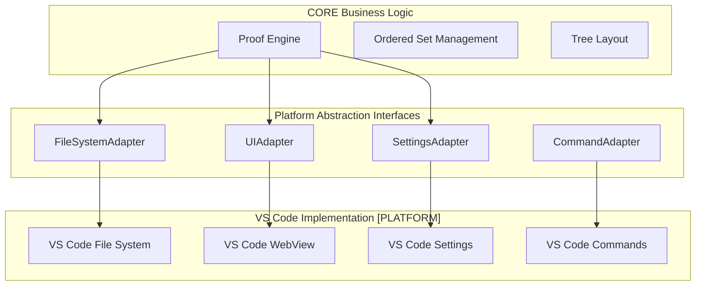

# VS Code Integration Strategy [PLATFORM]

## Executive Summary

This document describes how the [PLATFORM] layer implements Proof Editor on VS Code desktop. Through our platform abstraction architecture, VS Code becomes one of multiple supported platforms, with 90%+ of CORE functionality working identically across all platforms. We leverage VS Code's mature capabilities through standardized adapters while maintaining platform independence.

## Platform Layer Architecture

The [PLATFORM] layer provides concrete implementations of our abstract interfaces:



## Design Philosophy: Leverage Through Abstraction

### Core Principles
1. **Platform Independence**: CORE logic never directly calls VS Code APIs
2. **Adapter Pattern**: All VS Code features accessed through abstract interfaces
3. **Leverage Existing**: Use VS Code's mature capabilities through adapters
4. **User Familiarity**: Maintain VS Code UX patterns and conventions

### Strategic Benefits
- **Platform Portability**: Same CORE works on mobile, web, or standalone apps
- **Reduced Development**: Focus on proof logic, not infrastructure
- **Enterprise Features**: Inherit VS Code's security through adapters
- **User Familiarity**: VS Code users feel at home
- **Ecosystem Access**: Compatible with VS Code extension ecosystem

## VS Code Adapter Implementations [PLATFORM]

### SettingsAdapter Implementation

```typescript
class VSCodeSettingsAdapter implements SettingsAdapter {
  get<T>(key: string, defaultValue?: T): T {
    const config = vscode.workspace.getConfiguration('proofEditor');
    return config.get(key, defaultValue);
  }
  
  async set<T>(key: string, value: T): Promise<void> {
    const config = vscode.workspace.getConfiguration('proofEditor');
    await config.update(key, value, vscode.ConfigurationTarget.Global);
  }
  
  onChanged(callback: (key: string, value: any) => void): SettingsWatcher {
    const disposable = vscode.workspace.onDidChangeConfiguration(e => {
      if (e.affectsConfiguration('proofEditor')) {
        // Extract changed keys and notify
        callback(key, value);
      }
    });
    return { dispose: () => disposable.dispose() };
  }
}
```

**What We Leverage**: 
- VS Code's mature settings system with UI, sync, and profiles
- Workspace vs user settings scoping
- Settings schema validation and IntelliSense
- Automatic settings persistence and migration

### FileSystemAdapter Implementation

```typescript
class VSCodeFileSystemAdapter implements FileSystemAdapter {
  async readFile(path: string): Promise<string> {
    const uri = vscode.Uri.file(path);
    const data = await vscode.workspace.fs.readFile(uri);
    return Buffer.from(data).toString('utf8');
  }
  
  watchFile(path: string, callback: FileChangeCallback): FileWatcher {
    const watcher = vscode.workspace.createFileSystemWatcher(path);
    watcher.onDidChange(() => callback('modified'));
    watcher.onDidCreate(() => callback('created'));
    watcher.onDidDelete(() => callback('deleted'));
    return { dispose: () => watcher.dispose() };
  }
}
```

**What We Leverage**:
- File system operations with proper permissions
- File watching with efficient OS-level monitoring
- Workspace-relative path resolution
- Remote file system support (SSH, WSL, Docker)

### UIAdapter Implementation

```typescript
class VSCodeUIAdapter implements UIAdapter {
  async showMessage(message: string, type?: MessageType): Promise<void> {
    switch (type) {
      case 'error':
        vscode.window.showErrorMessage(message);
        break;
      case 'warning':
        vscode.window.showWarningMessage(message);
        break;
      default:
        vscode.window.showInformationMessage(message);
    }
  }
  
  createWebView(options: WebViewOptions): WebViewHandle {
    const panel = vscode.window.createWebviewPanel(
      'proofEditor',
      options.title,
      vscode.ViewColumn.One,
      {
        enableScripts: options.enableScripts,
        retainContextWhenHidden: options.retainContextWhenHidden
      }
    );
    
    return {
      set html(content: string) { panel.webview.html = content; },
      postMessage: (msg) => panel.webview.postMessage(msg),
      onDidReceiveMessage: (cb) => panel.webview.onDidReceiveMessage(cb),
      dispose: () => panel.dispose()
    };
  }
}
```

**What We Leverage**:
- WebView for custom visualization with security sandboxing
- Native VS Code notifications and dialogs
- Progress indicators and status bar
- Command palette integration

### CommandAdapter Implementation

```typescript
class VSCodeCommandAdapter implements CommandAdapter {
  registerCommand(id: string, handler: CommandHandler): CommandRegistration {
    const disposable = vscode.commands.registerCommand(
      `proofEditor.${id}`,
      handler
    );
    return { dispose: () => disposable.dispose() };
  }
  
  async executeCommand<T>(id: string, ...args: any[]): Promise<T> {
    return vscode.commands.executeCommand(`proofEditor.${id}`, ...args);
  }
  
  showCommandPalette(filter?: string): Promise<void> {
    return vscode.commands.executeCommand(
      'workbench.action.showCommands',
      filter ? `>Proof Editor: ${filter}` : '>Proof Editor: '
    );
  }
  
  registerKeybinding(keybinding: Keybinding): CommandRegistration {
    // VS Code keybindings are registered via package.json
    // This adapter tracks them for dynamic updates
    return this.keybindingManager.register(keybinding);
  }
}
```

**What We Leverage**:
- Command palette with fuzzy search
- Keybinding system with conflict detection
- Context-sensitive command enablement
- Command history and suggestions

### LSPAdapter Implementation

```typescript
class VSCodeLSPAdapter implements LSPAdapter {
  async startServer(config: LSPServerConfig): Promise<LSPServerHandle> {
    const serverOptions: ServerOptions = {
      command: config.command,
      args: config.args,
      transport: TransportKind.stdio
    };
    
    const clientOptions: LanguageClientOptions = {
      documentSelector: [{ scheme: 'file', language: 'proof' }],
      synchronize: {
        fileEvents: vscode.workspace.createFileSystemWatcher('**/*.proof')
      }
    };
    
    const client = new LanguageClient(
      config.id,
      config.name,
      serverOptions,
      clientOptions
    );
    
    await client.start();
    return { 
      id: config.id,
      dispose: async () => await client.stop()
    };
  }
  
  // Custom proof-specific requests
  async validateArgument(serverId: string, request: ValidateArgumentRequest) {
    const client = this.getClient(serverId);
    return client.sendRequest('proof/validate', request);
  }
}
```

**What We Leverage**:
- VS Code's Language Server Protocol client
- Automatic server lifecycle management
- Built-in diagnostics, hover, and completion UI
- Server output channel for debugging

## Platform vs CORE Separation

### What Lives in CORE (Platform-Independent)
- **Proof Data Model**: Ordered sets, atomic arguments, connections
- **Tree Layout Algorithms**: 2D positioning calculations  
- **Navigation Logic**: ProofPath query engine and traversal
- **Validation Logic**: Rule checking and inference (via LSP)
- **Document Structure**: Proof document serialization/parsing

### What Lives in [PLATFORM] Layer (VS Code-Specific)
- **WebView Rendering**: Canvas implementation for VS Code
- **File System Access**: Through VS Code workspace APIs
- **UI Integration**: Commands, menus, status bar
- **Settings Storage**: VS Code settings.json integration
- **Extension Packaging**: VS Code marketplace distribution

## Comparison: VS Code vs React Native Implementations

### File System Access
```typescript
// VS Code Implementation [PLATFORM]
class VSCodeFileSystemAdapter {
  async readFile(path: string): Promise<string> {
    const uri = vscode.Uri.file(path);
    const data = await vscode.workspace.fs.readFile(uri);
    return Buffer.from(data).toString('utf8');
  }
}

// React Native Implementation [PLATFORM]
class ReactNativeFileSystemAdapter {
  async readFile(path: string): Promise<string> {
    // Validate sandboxed path
    this.validatePath(path);
    return await RNFS.readFile(path, 'utf8');
  }
}

// CORE usage (same for both platforms)
class ProofDocument {
  constructor(private fileSystem: FileSystemAdapter) {}
  
  async load(path: string): Promise<void> {
    const content = await this.fileSystem.readFile(path);
    this.parse(content);
  }
}
```

### Command Execution
```typescript
// VS Code Implementation [PLATFORM]
class VSCodeCommandAdapter {
  showCommandPalette(): Promise<void> {
    return vscode.commands.executeCommand('workbench.action.showCommands');
  }
}

// React Native Implementation [PLATFORM]  
class ReactNativeCommandAdapter {
  showCommandPalette(): Promise<void> {
    // Show touch-optimized command palette
    return this.ui.showModal({
      component: 'CommandPalette',
      gestures: ['swipeDown', 'doubleTap']
    });
  }
}
```

### LSP Communication
```typescript
// VS Code Implementation [PLATFORM]
class VSCodeLSPAdapter {
  transport = 'stdio'; // Direct process communication
}

// React Native Implementation [PLATFORM]
class ReactNativeLSPAdapter {
  transport = 'websocket'; // Network communication to LSP server
}

## Features We Inherit Through Adapters

### Version Control (Through FileSystemAdapter + UIAdapter)
- **Git Integration**: File changes tracked automatically
- **Diff Viewing**: VS Code's diff viewer works with .proof files
- **Source Control Panel**: Standard Git workflow
- **Implementation**: No special code needed - files are files

### Collaboration (Through VS Code Extensions)
- **Live Share**: Works automatically with our WebView
- **Comments**: Extension-based commenting systems
- **Implementation**: Our adapters are Live Share compatible

### Accessibility (Through UIAdapter)
- **Screen Readers**: WebView content is accessible
- **High Contrast**: Themes apply to our rendering
- **Keyboard Navigation**: Full keyboard support
- **Implementation**: Follow WebView accessibility guidelines

### Search (Through FileSystemAdapter + VS Code APIs)  
- **Global Search**: VS Code searches .proof files
- **Quick Open**: Ctrl+P works for proof files
- **Find/Replace**: Standard text operations
- **Implementation**: Register .proof file type

## Enterprise Benefits Through Abstraction

### Security
- **Sandboxing**: WebView security model
- **File Permissions**: VS Code's file access controls
- **Remote Development**: SSH/WSL/Docker support
- **Implementation**: Inherit through proper adapter use

### Deployment
- **Extension Distribution**: VS Code marketplace
- **Settings Sync**: VS Code settings sync
- **Profiles**: VS Code workspace profiles
- **Implementation**: Standard extension packaging

### Compliance
- **Audit Trails**: Through VS Code's file system
- **Access Control**: OS-level permissions
- **Data Location**: Controlled by VS Code workspace
- **Implementation**: No custom security code needed

## Implementation Guidelines

### Prefer VS Code APIs
Always check if VS Code provides an API for functionality before building custom solutions.

**Good Examples:**
```typescript
// Use VS Code's settings API
const config = vscode.workspace.getConfiguration('proofEditor');
const fontSize = config.get<number>('fontSize', 12);

// Use VS Code's file watching API
const watcher = vscode.workspace.createFileSystemWatcher('**/*.proof');
watcher.onDidChange(uri => reloadProof(uri));

// Use VS Code's progress API
vscode.window.withProgress({
    location: vscode.ProgressLocation.Notification,
    title: "Validating proof..."
}, async (progress) => {
    await validateProof(progress);
});
```

**Avoid Custom Implementations:**
```typescript
// DON'T: Custom settings management
class CustomSettings {
    private settings: Map<string, any> = new Map();
    save() { /* custom persistence */ }
}

// DON'T: Custom file watching
setInterval(() => checkFileChanges(), 1000);

// DON'T: Custom progress indicators
showCustomProgressBar("Validating...");
```

### Design for VS Code Integration

#### Follow VS Code Patterns
- Use VS Code's command pattern for all user actions
- Adopt VS Code's settings schema conventions
- Follow VS Code's UI guidelines for consistency

#### Leverage Extension Points
- Use TreeDataProvider for custom tree views
- Implement CodeLensProvider for inline actions
- Use WebviewProvider for custom visualizations

#### Maintain Separation of Concerns
- Keep proof logic separate from VS Code integration code
- Use dependency injection to make code testable
- Design APIs that could work outside VS Code if needed

## Benefits Realization

### For Users
- **Familiar Experience**: No learning curve for VS Code users
- **Consistent Behavior**: Standard shortcuts and workflows work
- **Theme Consistency**: Proofs match user's preferred appearance
- **Extension Synergy**: Works with other VS Code extensions
- **Enterprise Features**: Inherits VS Code's security and compliance

### For Development Team
- **Faster Development**: Focus on proof-specific features only
- **Lower Maintenance**: Microsoft maintains the infrastructure
- **Proven Architecture**: Build on years of VS Code stability
- **Community Support**: Leverage VS Code's developer ecosystem
- **Future-Proof**: Automatically inherit VS Code improvements

### For Enterprise Customers
- **Security**: VS Code's enterprise security features
- **Deployment**: Familiar installation and management processes
- **Compliance**: Inherits VS Code's compliance certifications
- **Support**: Professional support through Microsoft channels
- **Integration**: Works with existing VS Code deployment infrastructure

## Success Metrics

### Technical Metrics
- **Code Reuse**: >70% of standard editor functionality inherited from VS Code
- **Development Speed**: 50% faster feature development compared to custom platform
- **Bug Rate**: Lower defect rate due to mature VS Code infrastructure
- **Performance**: Leverage VS Code's performance optimizations

### User Metrics
- **Learning Curve**: <30 minutes for VS Code users to become productive
- **Feature Adoption**: High adoption of VS Code features (shortcuts, themes, etc.)
- **User Satisfaction**: High satisfaction scores for familiar interface elements
- **Support Burden**: Lower support requests for standard functionality

## Future Considerations

### VS Code Evolution
- **Stay Current**: Regular updates to leverage new VS Code capabilities
- **API Changes**: Monitor VS Code API evolution and adapt accordingly
- **New Features**: Evaluate new VS Code features for proof editor integration
- **Platform Changes**: Adapt to VS Code platform architectural changes

### Extension Ecosystem
- **Complement Don't Compete**: Work with other extensions rather than replacing them
- **Standard Protocols**: Use LSP and DAP for interoperability
- **Community Contributions**: Enable community extensions for proof languages
- **Marketplace Optimization**: Optimize for VS Code marketplace discovery

This integration strategy ensures Proof Editor delivers maximum value by leveraging VS Code's strengths while focusing our development efforts on proof-specific innovations.