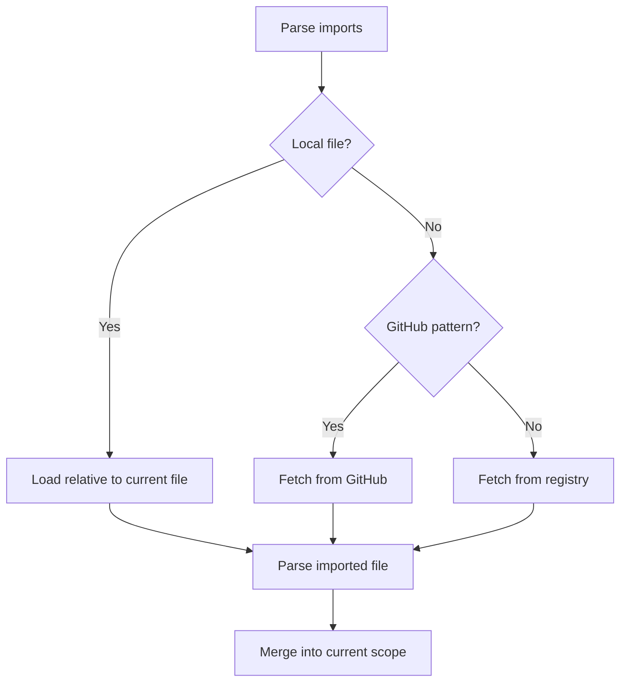

# Proof File Specification

## Overview

Proof Editor uses YAML files (`.proof` extension) to store logical proofs. The format prioritizes simplicity - most proofs need just a few lines.

## Minimal Valid Proof

```yaml
- [A, B]: [C]
- [C, D]: [E]
```

That's it! Two atomic arguments where the conclusion of the first (`[C]`) is the premise of the second.

## Connection Model

Arguments connect when they share the same Set (ordered list of statements).

### Implicit Connections (Automatic)

```yaml
- [All men are mortal, Socrates is a man]: [Socrates is mortal]
- [Socrates is mortal, All mortals die]: [Socrates will die]
```

The system detects that `[Socrates is mortal]` appears as both conclusion and premise, creating the connection automatically via string matching.

### Explicit Connections (Manual)

```yaml
- [All men are mortal, Socrates is a man]: &s_mortal [Socrates is mortal]
- [*s_mortal, All mortals die]: [Socrates will die]
```

Use anchors (`&`) and aliases (`*`) when:
- String variations exist ("Ground wet" vs "Ground is wet")
- You want guaranteed connections
- You're reusing statements multiple times

## Progressive Enhancement

### Level 1: Basic Proof

```yaml
- [P, Q]: [R]
- [R, S]: [T]
```

### Level 2: With Reusable Statements

```yaml
statements:
  - &all_mortal "All men are mortal"
  
proof:
  - [*all_mortal, Socrates is a man]: [Socrates is mortal]
  - [*all_mortal, Plato is a man]: [Plato is mortal]
```

Or with imports:

```yaml
imports:
  - ./shared/mortality-axioms.proof  # Contains common statements

proof:
  - [All men are mortal, Socrates is a man]: [Socrates is mortal]
```

### Level 3: With Metadata

```yaml
title: "Example Proof"
language: first-order-logic

proof:
  - premises: [P, Q]
    conclusions: [R]
    left: "(1)"  # Side text before implication line
    right: "MP"  # Side text after implication line
    confidence: 0.95
    
  - premises: [R, S]
    conclusions: [T]
    right: "∧E"  # Only right side text
```

### Level 4: Multiple Trees

```yaml
socrates:  # First tree
  - [All men are mortal, Socrates is a man]: [Socrates is mortal]
  
plato:  # Second tree (independent)
  - [All men are mortal, Plato is a man]: [Plato is mortal]
```

## Complete File Structure

All fields are optional except the proof itself:

```yaml
# Metadata
version: "1.0"
title: "My Proof"
description: "Optional description"
tags: [logic, example]

# Language specification
language: first-order-logic  # or: first-order-logic@^2.0.0
# Full form:
# language:
#   name: modal-logic
#   version: "^1.0.0"
#   source: "github:logic-tools/modal-logic-lsp"
#   config:
#     axiomSystem: S5

# Imports (local files or packages)
imports:
  - basic-logic@^1.0.0  # Package from registry
  - logic-tools/modal-logic@^2.0  # GitHub package (owner/repo)
  - ./lemmas/number-theory.proof  # Local file
  - ../shared/definitions.proof  # Relative path

# Custom characters (defined by language/packages, not here)

# Global statements
statements:
  - &premise "Shared premise"

# The actual proofs
main:
  - [*premise, Q]: [R]
```

## Additional Features

### Branching with Children

```yaml
- premises: [P]
  conclusions: &Q [Q]
  children:
    - [*Q, X]: [Y]  # Branch 1
    - [*Q, Z]: [W]  # Branch 2
```

### Side Text

Side text can appear on the left or right (or both) of the implication line:

```yaml
# Left side only
- premises: [P, Q]
  conclusions: [R]
  left: "(1)"

# Right side only  
- premises: [P, Q]
  conclusions: [R]
  right: "MP"

# Both sides
- premises: [P, Q]
  conclusions: [R]
  left: "Assumption"
  right: "∧I"
```

### Hover Text

Provide additional context that appears on hover:

```yaml
# Hover text for the entire atomic argument
- premises: [P → Q, P]
  conclusions: [Q]
  right: "MP"
  hover: "Modus Ponens: If P implies Q and P is true, then Q must be true"

# Hover on individual statements using maps
- premises: 
    - {text: "∀x P(x)", hover: "For all x, P holds"}
    - {text: "a ∈ U", hover: "a is in the universe of discourse"}
  conclusions: [{text: "P(a)", hover: "P holds for a specifically"}]
```

### Statement Composition

```yaml
statements:
  - &socrates "Socrates"
  - &man "is a man"
  
proof:
  - ["All men are mortal", "{*socrates} {*man}"]: ["{*socrates} is mortal"]
```

## Import Formats

```yaml
imports:
  # Package from default registry
  - package-name@^1.0.0
  
  # GitHub package (owner/repo pattern)
  - owner/repo@tag
  - owner/repo@^2.0.0
  
  # Local files (start with . or /)
  - ./local-file.proof
  - ../shared/lemmas.proof
  - /absolute/path/to/axioms.proof
```

## Import System

The import system allows you to share and reuse proofs, statements, and logical frameworks across files and projects.

### What Can Be Imported

#### 1. Other Proof Files
Import statements, lemmas, theorems, and complete proofs from other `.proof` files:

```yaml
imports:
  - ./lemmas/basic-arithmetic.proof
  - ../shared/axioms/peano.proof
```

**What gets exposed:**
- All statements defined in the `statements:` section
- All named proof trees (e.g., `theorem1:`, `lemma2:`)
- Transitively imported statements (imports of imports)

#### 2. Language Packages
Import formal language definitions with symbols and validation rules:

```yaml
imports:
  - first-order-logic@^2.0.0  # From registry
  - logic-tools/modal-logic    # From GitHub
```

**What language packages provide:**
- Character definitions (∀, ∃, →, ¬, etc.)
- Validation rules for that logical system
- Precedence and associativity rules
- Standard axioms and inference rules

#### 3. Library Packages
Import collections of common proof patterns and utilities:

```yaml
imports:
  - proof-patterns/induction@^1.0.0
  - math-proofs/number-theory
```

**What library packages provide:**
- Reusable proof templates
- Common lemmas and theorems
- Domain-specific statement collections
- Helper validations

### How Imports Work

#### Resolution Rules

1. **Local File Imports**
   - Paths starting with `./`, `../`, or `/` are file imports
   - Resolved relative to the current file's directory
   - Must have `.proof` extension (can be omitted in import)
   
   ```yaml
   imports:
     - ./lemmas/helper       # Resolves to ./lemmas/helper.proof
     - ../shared/axioms.proof  # Explicit extension
   ```

2. **Package Imports**
   - No path prefix = package from registry
   - `owner/repo` pattern = GitHub package
   - Version constraints follow semver
   
   ```yaml
   imports:
     - modal-logic@^2.0.0           # Registry package
     - proof-tools/classical@v1.0   # GitHub package
   ```

#### Import Loading Process



#### Referencing Imported Content

1. **Direct Reference** (when no conflicts):
   ```yaml
   imports:
     - ./axioms.proof  # Contains statement "All men are mortal"
   
   proof:
     - [All men are mortal, Socrates is a man]: [Socrates is mortal]
   ```

2. **Namespace Reference** (when disambiguation needed):
   ```yaml
   imports:
     - ./logic1.proof as L1
     - ./logic2.proof as L2
   
   proof:
     - [L1::axiom1, L2::axiom1]: [Combined result]
   ```

3. **Anchor Reference** (for specific statements):
   ```yaml
   imports:
     - ./shared.proof  # Exports &mortality anchor
   
   proof:
     - [*mortality, Socrates is a man]: [Socrates is mortal]
   ```

### Conflict Resolution

#### Duplicate Statement Names

When multiple imports define the same statement:

```yaml
# File: axioms1.proof
statements:
  - &identity "A = A"  # Version 1

# File: axioms2.proof  
statements:
  - &identity "∀x(x = x)"  # Version 2

# Your file:
imports:
  - ./axioms1.proof
  - ./axioms2.proof  # This "identity" wins (last import)

proof:
  - [identity]: [...]  # Uses "∀x(x = x)"
```

#### Precedence Rules

1. **Local > Imported**: Local definitions always win
   ```yaml
   imports:
     - ./common.proof  # Defines "P implies Q"
   
   statements:
     - "P implies Q"  # This local version takes precedence
   ```

2. **Last Import Wins**: Later imports override earlier ones
   ```yaml
   imports:
     - ./old-axioms.proof  # Defines axiom1
     - ./new-axioms.proof  # Also defines axiom1 (this wins)
   ```

3. **Explicit Wins**: Namespace/alias references are never ambiguous
   ```yaml
   imports:
     - ./logic1.proof as L1
     - ./logic2.proof as L2
   
   proof:
     - [L1::axiom, L2::axiom]: [...]  # No ambiguity
   ```

#### Disambiguation Strategies

1. **Import Aliases**:
   ```yaml
   imports:
     - ./classical-logic.proof as classical
     - ./intuitionistic-logic.proof as intuit
   
   proof:
     - [classical::excluded_middle]: [P or not P]
     # intuit::excluded_middle would not be valid
   ```

2. **Selective Import** (future feature):
   ```yaml
   imports:
     - from: ./large-library.proof
       include: [theorem1, lemma3, axiom_set_1]
   ```

3. **Re-export Control** (future feature):
   ```yaml
   imports:
     - ./private-lemmas.proof  # Not re-exported by default
   
   exports:
     - *  # Export everything including imports
     # OR
     - local  # Export only local definitions
   ```

### Import Syntax Details

#### Optional Imports

Use `?` suffix for imports that might not exist:

```yaml
imports:
  - ./optional-lemmas.proof?  # Doesn't fail if file missing
  - experimental-logic@^1.0.0?  # Doesn't fail if package unavailable
```

Use case: Development environments where some files might not be present yet.

#### Version Constraints

Follow npm-style semver for packages:

```yaml
imports:
  # Exact version
  - modal-logic@2.1.0
  
  # Minor updates allowed
  - first-order-logic@^1.2.0  # 1.2.0 <= version < 2.0.0
  
  # Patch updates only
  - proof-validator@~3.1.4  # 3.1.4 <= version < 3.2.0
  
  # Any version
  - experimental-package
  
  # Specific tag/branch (GitHub)
  - owner/repo@develop
  - owner/repo@feature/new-axioms
```

#### Path Types

```yaml
imports:
  # Relative paths (most common)
  - ./sibling.proof
  - ../parent/other.proof
  - ../../shared/common.proof
  
  # Absolute paths (not recommended - breaks portability)
  - /home/user/proofs/axioms.proof
  
  # Package paths (no ./ prefix)
  - standard-logic
  - math/number-theory
```

### Common Import Patterns

#### 1. Shared Axiom Sets

```yaml
# File: axioms/arithmetic.proof
statements:
  - &zero_identity "∀a: a + 0 = a"
  - &succ_def "∀a,b: S(a) + b = S(a + b)"

# File: theorems/addition.proof
imports:
  - ../axioms/arithmetic.proof

proof:
  - [*zero_identity]: [1 + 0 = 1]
```

#### 2. Lemma Libraries

```yaml
# File: lemmas/inequalities.proof
transitivity:
  - premises: [a < b, b < c]
    conclusions: &trans_result [a < c]

# File: main-proof.proof
imports:
  - ./lemmas/inequalities.proof

proof:
  - [x < y, y < z]: [x < z]  # Connects to imported lemma
```

#### 3. Multi-Language Support

```yaml
imports:
  - classical-logic@^2.0.0 as CL
  - intuitionistic-logic@^1.0.0 as IL

classical_proof:
  - [CL::LEM]: [P ∨ ¬P]  # Law of excluded middle

intuitionistic_proof:
  - [IL::premises]: [IL::conclusion]  # Different logical system
```

### Connection Model with Imports

#### Connections Across Import Boundaries

Imported statements can connect with local statements:

```yaml
# File: lemmas.proof
lemma1:
  - [A, B]: &shared_conclusion [C]

# File: main.proof  
imports:
  - ./lemmas.proof

theorem:
  - [*shared_conclusion, D]: [E]  # Connects to imported conclusion
```

#### Transitive Connections

Connections flow through multiple files:

```yaml
# File: base.proof
- [P]: &q [Q]

# File: middle.proof
imports: [./base.proof]
- [*q]: &r [R]

# File: final.proof
imports: [./middle.proof]
- [*r]: [S]  # Connected all the way back to P
```

### Security Considerations

#### Import Validation

The system validates imports before execution:

1. **Path Traversal Protection**: Cannot import outside project root
   ```yaml
   imports:
     - ../../../etc/passwd  # ERROR: Outside project
   ```

2. **Circular Import Detection**: Prevents infinite loops
   ```yaml
   # a.proof imports b.proof
   # b.proof imports a.proof
   # ERROR: Circular dependency detected
   ```

3. **Content Validation**: Imported files must be valid proof files
   ```yaml
   imports:
     - ./not-a-proof.txt  # ERROR: Invalid proof file
   ```

#### Trust Boundaries

1. **Local Files**: Trusted by default (in your project)
2. **Registry Packages**: Verified and signed
3. **GitHub Packages**: Trust based on repository reputation
4. **URL Imports**: Not supported for security reasons

### Performance Considerations

#### Import Caching

Imports are cached to avoid redundant parsing:

```yaml
# These files all import common.proof
imports:
  - ./proof1.proof  # Imports common.proof
  - ./proof2.proof  # Also imports common.proof
  - ./common.proof  # Directly imported

# common.proof is only parsed once
```

#### Lazy Loading

Large imports can be lazy-loaded:

```yaml
imports:
  - lazy: ./huge-theorem-database.proof
    # Only loads when actually referenced
```

#### Import Depth Limits

Default maximum import depth: 10 levels
- Prevents stack overflow from deep import chains
- Configurable in language server settings

### Best Practices

1. **Organize Imports Logically**:
   ```yaml
   imports:
     # Language definitions first
     - first-order-logic@^2.0.0
     
     # Common libraries
     - proof-patterns/induction
     
     # Project-specific files
     - ./shared/axioms.proof
     - ./lemmas/arithmetic.proof
   ```

2. **Use Consistent Naming**:
   ```yaml
   imports:
     - ./axioms/peano.proof as peano
     - ./axioms/zfc.proof as zfc
   ```

3. **Document Import Purpose**:
   ```yaml
   # For basic arithmetic operations
   imports:
     - ./arithmetic.proof
     
   # Provides modal logic operators
   imports:
     - modal-logic@^2.0.0
   ```

4. **Avoid Deep Import Chains**: Prefer direct imports over transitive dependencies

5. **Version Lock Important Dependencies**:
   ```yaml
   imports:
     - critical-logic@2.1.0  # Exact version for stability
     - helper-lib@^1.0.0     # Flexible for non-critical
   ```

## Key Points

1. **Order matters**: `[A, B]` ≠ `[B, A]`
2. **String matching is exact and case-sensitive**
3. **Use quotes for complex statements**: `"If P then Q"`
4. **Empty premises**: `[]` or omit the key
5. **All metadata fields are optional**
6. **Characters** (∀, ∃, →) come from language specs and imports
7. **Side text** uses `left:` and `right:` for text before/after the implication line
8. **Imports** can be packages or local `.proof` files
9. **Hover text** adds explanatory tooltips to arguments or individual statements
10. **Import precedence**: Local > Last Import > Earlier Imports
11. **Connections work across imports**: Imported statements connect naturally
12. **Optional imports** use `?` suffix for graceful failures
13. **Namespaces** prevent conflicts: `L1::axiom` vs `L2::axiom`

## Philosophy

Start simple. Add complexity only when needed. Most proofs work perfectly with just:

```yaml
- [Premise 1, Premise 2]: [Conclusion 1]
- [Conclusion 1, Premise 3]: [Conclusion 2]
```