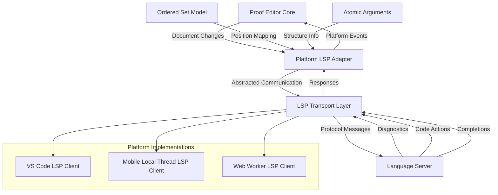

# Language Server Protocol (LSP) Integration

## Overview

Proof Editor uses the Language Server Protocol to provide language-specific features while maintaining a clean separation between the core platform and individual proof languages. This document defines how language servers integrate with the Proof Editor platform across different host environments (VS Code, React Native mobile apps, etc.), with special focus on physical tree operations and statement flow validation.

## Recommended Architecture

> **Note**: This represents a recommended implementation approach based on LSP integration requirements. Specific architectural decisions should be validated during the design phase.



## Position Mapping

The core challenge is mapping between Proof Editor's structured model and LSP's text-based position system.

### Document Serialization for LSP

The platform serializes the proof structure into a virtual text document:

```
# Atomic Argument: arg1
## Premises
1. All men are mortal
2. Socrates is a man
## Conclusions
1. Socrates is mortal
## Metadata
Rule: Modus Ponens

# Atomic Argument: arg2
...
```

### Position Mapping Protocol

```typescript
interface ProofPosition {
  argumentId: string;
  component: 'premise' | 'conclusion' | 'rule' | 'sideLabel';
  orderedSetId?: string;
  itemIndex?: number;
  characterOffset: number;
}

interface PositionMapping {
  proofToLsp(pos: ProofPosition): lsp.Position;
  lspToProof(pos: lsp.Position): ProofPosition;
}
```

## Extended LSP Capabilities

### Custom Requests

#### Validation Request
```typescript
// Client → Server
interface ValidateArgumentRequest {
  method: 'proof/validateArgument';
  params: {
    argumentId: string;
    premises: string[];
    conclusions: string[];
    rule?: string;
    context: ArgumentContext;
  };
}

// Server → Client
interface ValidateArgumentResponse {
  valid: boolean;
  diagnostics: Diagnostic[];
  suggestedRules?: string[];
}
```

#### Inference Completion
```typescript
// Client → Server
interface InferenceCompletionRequest {
  method: 'proof/completeInference';
  params: {
    premises: string[];
    partialConclusion?: string;
    context: ArgumentContext;
  };
}

// Server → Client
interface InferenceCompletionResponse {
  completions: {
    conclusion: string;
    rule: string;
    confidence: number;
  }[];
}
```

#### Structure Analysis
```typescript
// Client → Server
interface AnalyzeStructureRequest {
  method: 'proof/analyzeStructure';
  params: {
    treeRootId: string;
    includeMetrics: boolean;
    includePhysicalLayout?: boolean;
  };
}

// Server → Client
interface AnalyzeStructureResponse {
  openPremises: string[];
  openConclusions: string[];
  circularDependencies: string[][];
  statementFlowErrors: StatementFlowError[];
  physicalLayoutIssues?: LayoutValidationError[];
  metrics?: {
    depth: number;
    breadth: number;
    totalArguments: number;
    physicalSpread: { width: number; height: number };
  };
}

interface StatementFlowError {
  nodeId: string;
  type: 'missing-premise-input' | 'premise-mismatch' | 'invalid-flow';
  position?: number;
  expected?: string;
  actual?: string;
  message: string;
}

interface LayoutValidationError {
  type: 'node-overlap' | 'disconnected-layout' | 'poor-spacing';
  nodeIds: string[];
  severity: 'error' | 'warning' | 'suggestion';
  message: string;
  suggestedFix?: {
    action: 'auto-layout' | 'reposition' | 'resize';
    parameters: Record<string, any>;
  };
}
```

#### Tree Query Protocol
```typescript
// Client → Server
interface ProofQueryRequest {
  method: 'proof/query';
  params: {
    textDocument: TextDocumentIdentifier;
    query: string;  // ProofPath expression
    context?: {     // Optional starting node
      nodeId: string;
    };
  };
}

// Server → Client
interface ProofQueryResponse {
  results: ProofNode[];
  executionTime: number;  // Milliseconds
}

// Client → Server
interface ProofNavigateRequest {
  method: 'proof/navigate';
  params: {
    textDocument: TextDocumentIdentifier;
    from: NodeIdentifier;
    axis: NavigationAxis;
    steps?: number;  // For ancestor[n] navigation
  };
}

type NavigationAxis = 
  | 'parent' 
  | 'ancestor' 
  | 'proof-root'
  | 'premise-parent'
  | 'conclusion-child';

interface ProofNavigateResponse {
  target: ProofNode | null;
  path?: ProofNode[];  // For multi-step navigation
}
```

#### Physical Tree Operations
```typescript
// Client → Server
interface ValidateTreeStructureRequest {
  method: 'proof/validateTreeStructure';
  params: {
    textDocument: TextDocumentIdentifier;
    treeId: string;
    nodes: TreeNode[];
    layout?: TreeLayout;
  };
}

// Server → Client
interface ValidateTreeStructureResponse {
  valid: boolean;
  structureErrors: TreeStructureError[];
  layoutErrors?: LayoutValidationError[];
  suggestedFixes: TreeFixSuggestion[];
}

interface TreeStructureError {
  nodeId: string;
  type: 'missing-parent' | 'invalid-attachment' | 'circular-reference';
  message: string;
  relatedNodes?: string[];
}

interface TreeFixSuggestion {
  type: 'reattach-node' | 'remove-node' | 'add-missing-connection';
  nodeId: string;
  parameters: {
    targetParent?: string;
    position?: number;
    reason: string;
  };
}
```

#### Statement Flow Validation
```typescript
// Client → Server
interface ValidateStatementFlowRequest {
  method: 'proof/validateStatementFlow';
  params: {
    textDocument: TextDocumentIdentifier;
    parentNodeId: string;
    childNodeIds: string[];
    includeRecommendations?: boolean;
  };
}

// Server → Client
interface ValidateStatementFlowResponse {
  valid: boolean;
  flowErrors: StatementFlowError[];
  recommendations?: FlowRecommendation[];
  alternativeStructures?: AlternativeStructure[];
}

interface FlowRecommendation {
  type: 'add-intermediate-step' | 'reorder-premises' | 'split-conclusion';
  description: string;
  confidence: number; // 0-1
  suggestedArgument?: {
    premises: string[];
    conclusions: string[];
    rule: string;
  };
}

interface AlternativeStructure {
  description: string;
  confidence: number;
  structureChanges: {
    nodeId: string;
    newAttachment: {
      parentId: string;
      position: number;
    };
  }[];
}
```

#### Tree Layout Optimization
```typescript
// Client → Server
interface OptimizeTreeLayoutRequest {
  method: 'proof/optimizeLayout';
  params: {
    textDocument: TextDocumentIdentifier;
    treeId: string;
    algorithm: 'hierarchical' | 'force-directed' | 'layered' | 'circular';
    constraints?: {
      preserveRelativePositions?: boolean;
      minimumSpacing?: { x: number; y: number };
      maxWidth?: number;
      maxHeight?: number;
    };
  };
}

// Server → Client
interface OptimizeTreeLayoutResponse {
  layout: TreeLayout;
  metrics: {
    totalArea: number;
    averageSpacing: number;
    crossingCount: number;
    readabilityScore: number;
  };
  animationHints?: {
    nodeId: string;
    fromPosition: { x: number; y: number };
    toPosition: { x: number; y: number };
    duration: number;
  }[];
}

interface TreeLayout {
  nodes: Array<{
    nodeId: string;
    position: { x: number; y: number };
    size: { width: number; height: number };
  }>;
  connections: Array<{
    parentId: string;
    childId: string;
    position: number;
    path: { x: number; y: number }[];
  }>;
  bounds: {
    x: number;
    y: number;
    width: number;
    height: number;
  };
}
```

### Standard LSP Features

#### Text Document Synchronization
- Incremental sync for individual statement edits
- Full sync on structural changes (adding/removing arguments)
- Custom change notifications for reordering
- Tree structure synchronization for physical positioning
- Statement flow updates when tree structure changes

#### Diagnostics
- Syntax errors in logical notation
- Invalid inference rules
- Undefined references
- Circular reasoning detection
- Statement flow violations
- Tree structure inconsistencies
- Physical layout problems (overlapping nodes, poor spacing)

#### Code Completion
- Logical operators and quantifiers
- Previously used statements
- Valid inference rules
- Referenced theorems
- Contextual statement suggestions based on tree position
- Auto-completion for statement flow connections

#### Hover Information
- Rule explanations
- Symbol definitions
- Theorem statements
- Quick proof previews
- Tree structure information (parent/child relationships)
- Statement flow validation status

#### Code Actions
- Fix invalid syntax
- Apply inference rules
- Extract sub-proofs
- Introduce lemmas
- Repair statement flow errors
- Optimize tree layout
- Reattach disconnected nodes
- Split complex arguments

## Implementation Guidelines

### Language Server Requirements

1. **Stateless Operation**: Servers should not maintain document state
2. **Fast Response**: Validation should complete within 100ms
3. **Incremental Updates**: Support partial document validation
4. **Error Recovery**: Gracefully handle malformed input

### Platform Responsibilities

1. **Document Management**: Maintain authoritative document state
2. **Position Mapping**: Convert between model and text positions  
3. **Change Batching**: Aggregate related changes before sending
4. **Error Handling**: Gracefully degrade if LSP unavailable
5. **Tree Structure Coordination**: Synchronize physical tree changes with LSP
6. **Statement Flow Tracking**: Monitor statement flow integrity during edits
7. **Layout Management**: Coordinate spatial positioning with validation

### Communication Protocol

```typescript
interface ProofDocumentChange {
  type: 'structure' | 'content' | 'metadata' | 'layout';
  changes: Array<{
    argumentId: string;
    change: StructuralChange | ContentChange | MetadataChange | LayoutChange;
  }>;
}

interface StructuralChange {
  type: 'add' | 'remove' | 'reorder' | 'reattach';
  nodeId?: string;
  parentId?: string;
  position?: number;
  // ... change specifics
}

interface ContentChange {
  type: 'edit' | 'replace';
  orderedSetId: string;
  itemIndex?: number;
  text: string;
}

interface LayoutChange {
  type: 'move' | 'resize' | 'optimize';
  nodeId: string;
  position?: { x: number; y: number };
  size?: { width: number; height: number };
  algorithm?: string; // For optimization changes
}

// Extended change notifications for tree operations
interface TreeStructureChange {
  type: 'node-added' | 'node-removed' | 'node-reattached' | 'tree-restructured';
  treeId: string;
  affectedNodes: string[];
  newStructure?: TreeTopology;
}

interface TreeTopology {
  rootNodeId: string;
  nodes: Array<{
    nodeId: string;
    parentId?: string;
    position?: number;
    argumentId: string;
  }>;
}
```

## Language Server Examples

### First-Order Logic Server

Provides:
- Syntax validation for FOL notation
- Natural deduction rule checking
- Quantifier scope analysis
- Theorem database integration

### Modal Logic Server  

Provides:
- Modal operator validation
- Kripke semantics visualization hints
- Accessibility relation checking
- Modal theorem prover integration

### Type Theory Server

Provides:
- Type checking for terms
- Proof term generation
- Dependent type validation
- Tactic suggestions

## Local-First Architecture for Complete Offline Capability

Proof Editor uses a local-first LSP architecture to provide complete offline functionality across all platforms:

### Desktop Architecture (Local Process-Based)
- **Local LSP Servers**: Full-featured language servers run as local processes via stdio
- **Complete Offline**: All validation, inference, and analysis available without network
- **Process Spawning**: Desktop platforms spawn language server processes locally
- **Full VS Code Integration**: Leverages VS Code's built-in LSP client infrastructure

### Mobile Architecture (Local Thread-Based with JSI)
- **Local LSP Thread**: Complete validation and inference rules run in separate thread using JSI
- **Full Offline**: All functionality works without network connectivity
- **Thread Isolation**: LSP runs in isolated thread for performance and stability
- **JSI Communication**: High-performance JavaScript-native bridge for thread communication

### Consistent Offline Experience
- **No Network Dependencies**: All LSP processing happens locally on every platform
- **Identical Capabilities**: Same validation and analysis features across platforms
- **Platform-Optimized**: Local processes on desktop, local threads on mobile

This architecture ensures that users can construct and validate proofs on any platform with complete functionality, regardless of network connectivity.

## Transport Layer Abstraction

The LSP adapter supports multiple transport mechanisms to enable the local-first architecture across platforms:

### Transport Types

#### Standard I/O (stdio)
- **Desktop/VS Code**: Direct process communication for full offline capability
- **Mobile**: Not supported (requires process spawning)
- **Use case**: Local language server processes providing complete offline functionality

#### Thread-Based LSP
- **Desktop**: Not required (can use local stdio servers)
- **Mobile**: Local LSP implementation running in separate thread
- **Use case**: Full validation and inference with thread isolation

#### Thread Communication (Mobile Only)
- **Desktop/VS Code**: Not applicable (uses stdio)
- **Mobile**: Local LSP in separate thread via message passing
- **Use case**: Full offline LSP functionality with thread isolation

#### TCP Socket
- **Desktop/VS Code**: Alternative for network-based analysis servers
- **Mobile**: Not supported (local-only architecture)
- **Use case**: Network-based analysis servers (desktop only)

#### HTTP/REST
- **Desktop/VS Code**: Stateless enhancement services
- **Mobile**: Not supported (local-only architecture)
- **Use case**: Stateless language analysis services, proof checking APIs (desktop only)

### Configuration

Language servers are configured through the platform's settings system:

```json
{
  "proofEditor.languageServers": {
    "firstOrderLogic": {
      "id": "fol-server",
      "name": "First Order Logic Server", 
      "transport": "stdio",
      "command": "fol-server",
      "args": ["--stdio"],
      "languages": ["fol", "predicate-logic"],
      "availability": "desktop-only",
      "features": ["validation", "inference", "completion"]
    },
    "mobileThread": {
      "id": "mobile-thread",
      "name": "Mobile Local Thread LSP",
      "transport": "thread",
      "languages": ["fol", "propositional", "modal"],
      "availability": "mobile-only",
      "features": ["validation", "inference", "completion", "analysis"],
      "execution": "local-thread"
    },
  }
}
```

## Platform-Specific Implementations

### VS Code LSP Adapter

```typescript
class VSCodeLSPAdapter implements LSPAdapter {
  private clients = new Map<string, LanguageClient>();
  
  async startServer(config: LSPServerConfig): Promise<LSPServerHandle> {
    if (config.transport === 'stdio') {
      const serverOptions: ServerOptions = {
        command: config.command,
        args: config.args,
        options: { cwd: config.workingDirectory }
      };
      
      const client = new LanguageClient(
        config.id,
        config.name,
        serverOptions,
        this.getClientOptions()
      );
      
      await client.start();
      this.clients.set(config.id, client);
      
      return { id: config.id, dispose: () => client.stop() };
    }
    
    // Handle other transport types...
  }
}
```

### React Native LSP Adapter

```typescript
class ReactNativeLSPAdapter implements LSPAdapter {
  private threads = new Map<string, LSPThread>();
  
  async startServer(config: LSPServerConfig): Promise<LSPServerHandle> {
    if (config.transport === 'thread') {
      const thread = new ThreadLSPConnection({
        serverPath: config.serverPath,
        capabilities: config.capabilities
      });
      
      await thread.start();
      this.threads.set(config.id, thread);
      
      return {
        id: config.id,
        dispose: () => thread.terminate()
      };
    }
    
    throw new Error(`Unsupported transport: ${config.transport}`);
  }
  
  async sendRequest<T>(serverId: string, method: string, params: any): Promise<T> {
    const thread = this.threads.get(serverId);
    if (!thread) {
      throw new Error(`Server ${serverId} not connected`);
    }
    
    return await thread.sendRequest(method, params);
  }
}
```

### Mobile-Specific Considerations

#### Thread LSP Connection
```typescript
class ThreadLSPConnection {
  private worker: Worker;
  private requestId = 0;
  private pendingRequests = new Map<number, { resolve: Function; reject: Function }>();
  
  constructor(private config: { serverPath: string; capabilities: string }) {}
  
  async start(): Promise<void> {
    return new Promise((resolve, reject) => {
      this.worker = new Worker(this.config.serverPath);
      
      this.worker.onmessage = (event) => this.handleMessage(event);
      this.worker.onerror = (error) => reject(error);
      
      // Initialize with capabilities
      this.worker.postMessage({
        type: 'initialize',
        capabilities: this.config.capabilities
      });
      
      resolve();
    });
  }
  
  async sendRequest<T>(method: string, params: any): Promise<T> {
    const id = ++this.requestId;
    const request = {
      jsonrpc: '2.0',
      id,
      method,
      params
    };
    
    return new Promise((resolve, reject) => {
      this.pendingRequests.set(id, { resolve, reject });
      this.worker.postMessage(request);
      
      // Timeout after 30 seconds
      setTimeout(() => {
        if (this.pendingRequests.has(id)) {
          this.pendingRequests.delete(id);
          reject(new Error('Request timeout'));
        }
      }, 30000);
    });
  }
  
  private handleMessage(event: MessageEvent): void {
    const message = event.data;
    
    if (message.id && this.pendingRequests.has(message.id)) {
      const { resolve, reject } = this.pendingRequests.get(message.id)!;
      this.pendingRequests.delete(message.id);
      
      if (message.error) {
        reject(new Error(message.error.message));
      } else {
        resolve(message.result);
      }
    }
  }
  
  terminate(): void {
    this.worker.terminate();
  }
}
```

## Performance Considerations

### Debouncing
- Validation requests debounced by 300ms during typing
- Immediate validation on structural changes
- Batch position mappings for efficiency

### Caching
- Cache position mappings per document version
- Reuse validation results for unchanged arguments
- Invalidate caches on structural changes

### Mobile Optimizations
- **Thread-based LSP**: Full functionality with local thread isolation
- **Memory management**: Efficient thread communication and resource sharing
- **CPU optimization**: Background processing without blocking UI thread
- **Complete offline mode**: All LSP features available without network
- **Battery efficiency**: Optimized thread scheduling for power savings

### Local Processing Architecture
- **Desktop**: Full LSP features via local stdio servers
- **Mobile**: Full LSP features via local thread execution
- **Consistent offline**: All platforms provide complete functionality without network
- **No remote dependencies**: LSP processing is entirely local on all platforms
- **Platform-appropriate architecture**: Local servers on desktop, local threads on mobile

## Testing Language Servers

### Test Harness
The platform provides a test harness for language server development:

```typescript
interface TestCase {
  input: ProofDocument;
  expectedDiagnostics: Diagnostic[];
  expectedCompletions?: CompletionItem[];
}

class LanguageServerTestHarness {
  async runTests(server: string, tests: TestCase[]): Promise<TestResults>;
}
```

### Compliance Tests
All language servers must pass core compliance tests:
- Position mapping accuracy
- Change notification handling  
- Performance benchmarks
- Error recovery scenarios

## Physical Tree Integration Details

### Tree Structure Synchronization

The LSP integration must maintain consistency between the logical document model and physical tree representation:

```typescript
class TreeSynchronizationManager {
  async synchronizeTreeStructure(
    treeId: string, 
    structuralChanges: TreeStructureChange[]
  ): Promise<SyncResult> {
    // 1. Validate structural changes against current tree state
    const validationResult = await this.validateStructuralChanges(structuralChanges);
    if (!validationResult.valid) {
      return { success: false, errors: validationResult.errors };
    }
    
    // 2. Apply changes to tree structure
    const updatedTree = this.applyStructuralChanges(treeId, structuralChanges);
    
    // 3. Notify LSP of structure changes
    await this.notifyLSPOfTreeChanges(treeId, updatedTree);
    
    // 4. Validate statement flow in new structure
    const flowValidation = await this.validateStatementFlow(updatedTree);
    
    return {
      success: true,
      updatedTree,
      flowValidation,
      layoutSuggestions: flowValidation.layoutOptimizations
    };
  }
  
  private async validateStructuralChanges(
    changes: TreeStructureChange[]
  ): Promise<ValidationResult> {
    // Ensure changes don't create cycles, orphaned nodes, etc.
    for (const change of changes) {
      if (change.type === 'node-reattached') {
        if (this.wouldCreateCycle(change.nodeId, change.newParentId)) {
          return {
            valid: false,
            errors: [{
              type: 'circular-dependency',
              message: `Reattaching ${change.nodeId} to ${change.newParentId} would create a cycle`
            }]
          };
        }
      }
    }
    
    return { valid: true, errors: [] };
  }
}
```

### Statement Flow Validation Integration

Integrate statement flow validation into the LSP workflow:

```typescript
class StatementFlowLSPHandler {
  async handleStatementFlowValidation(
    request: ValidateStatementFlowRequest
  ): Promise<ValidateStatementFlowResponse> {
    const { parentNodeId, childNodeIds } = request.params;
    
    // Get current tree structure
    const tree = await this.getTreeStructure(request.params.textDocument.uri);
    const parentNode = tree.getNode(parentNodeId);
    const childNodes = childNodeIds.map(id => tree.getNode(id));
    
    // Validate statement flow
    const flowResult = await this.languageServer.validateStatementFlow({
      parentNode,
      childNodes,
      treeLayout: tree.layout,
      document: tree.document
    });
    
    // Generate recommendations if requested
    let recommendations: FlowRecommendation[] = [];
    if (request.params.includeRecommendations && !flowResult.valid) {
      recommendations = await this.generateFlowRecommendations(
        parentNode, 
        childNodes, 
        flowResult.errors
      );
    }
    
    return {
      valid: flowResult.valid,
      flowErrors: flowResult.errors,
      recommendations,
      alternativeStructures: await this.suggestAlternativeStructures(
        parentNode, 
        childNodes, 
        flowResult.errors
      )
    };
  }
  
  private async generateFlowRecommendations(
    parentNode: TreeNode,
    childNodes: TreeNode[],
    errors: StatementFlowError[]
  ): Promise<FlowRecommendation[]> {
    const recommendations: FlowRecommendation[] = [];
    
    for (const error of errors) {
      if (error.type === 'missing-premise-input') {
        // Suggest adding an intermediate step
        recommendations.push({
          type: 'add-intermediate-step',
          description: `Add an argument that concludes "${error.expected}"`,
          confidence: 0.8,
          suggestedArgument: await this.suggestIntermediateArgument(
            error.expected,
            parentNode
          )
        });
      } else if (error.type === 'premise-mismatch') {
        // Suggest reordering or modifying premises
        recommendations.push({
          type: 'reorder-premises',
          description: `Reorder premises to match expected flow`,
          confidence: 0.6
        });
      }
    }
    
    return recommendations;
  }
}
```

### Layout Optimization Integration

Provide intelligent layout optimization through LSP:

```typescript
class TreeLayoutOptimizer {
  async optimizeLayout(
    request: OptimizeTreeLayoutRequest
  ): Promise<OptimizeTreeLayoutResponse> {
    const { treeId, algorithm, constraints } = request.params;
    
    // Get current tree structure and layout
    const currentTree = await this.getTreeWithLayout(treeId);
    
    // Apply optimization algorithm
    const optimizedLayout = await this.applyLayoutAlgorithm(
      currentTree, 
      algorithm, 
      constraints
    );
    
    // Calculate layout metrics
    const metrics = this.calculateLayoutMetrics(optimizedLayout);
    
    // Generate animation hints for smooth transitions
    const animationHints = this.generateAnimationHints(
      currentTree.layout, 
      optimizedLayout
    );
    
    return {
      layout: optimizedLayout,
      metrics,
      animationHints
    };
  }
  
  private async applyLayoutAlgorithm(
    tree: TreeWithLayout,
    algorithm: string,
    constraints?: any
  ): Promise<TreeLayout> {
    switch (algorithm) {
      case 'hierarchical':
        return this.applyHierarchicalLayout(tree, constraints);
      case 'force-directed':
        return this.applyForceDirectedLayout(tree, constraints);
      case 'layered':
        return this.applyLayeredLayout(tree, constraints);
      default:
        throw new Error(`Unknown layout algorithm: ${algorithm}`);
    }
  }
  
  private calculateLayoutMetrics(layout: TreeLayout): any {
    const totalArea = layout.bounds.width * layout.bounds.height;
    const nodePositions = layout.nodes.map(n => n.position);
    const averageSpacing = this.calculateAverageSpacing(nodePositions);
    const crossingCount = this.countConnectionCrossings(layout.connections);
    const readabilityScore = this.calculateReadabilityScore(layout);
    
    return {
      totalArea,
      averageSpacing,
      crossingCount,
      readabilityScore
    };
  }
}
```

## Future Extensions

### Proof Automation
- Automated proof search
- Tactic application
- Proof simplification
- Counter-example generation
- Automated tree structure optimization

### Collaborative Features
- Shared validation state
- Conflict resolution for concurrent edits
- Proof review annotations
- Change attribution
- Collaborative tree editing with conflict resolution

### Advanced Analysis
- Proof complexity metrics
- Style checking
- Best practice suggestions
- Learning recommendations
- Physical layout analysis and optimization
- Statement flow pattern recognition